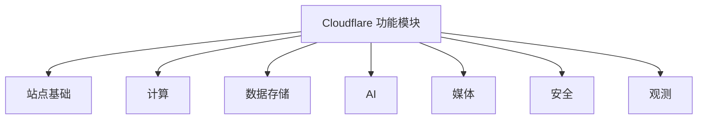

# Cloudflare Playbook

Vibe coding 时代的 Cloudflare 实战手册——用 AI 写代码，用 Cloudflare 免费部署到全球。

在线阅读：[cloudflare-playbook.chendahuang.top](https://cloudflare-playbook.chendahuang.top/)

## 全景图



## 目录

- [1. Cloudflare 功能模块](#1-cloudflare-功能模块)
- [2. AI 编程工作流](#2-ai-编程工作流)
- [3. 开发与部署](#3-开发与部署)
- [4. 免费额度](#4-免费额度)
- [5. $5 套餐](#5-5-套餐)
- [6. 开源项目](#6-开源项目)
- [7. 常见坑](#7-常见坑)
- [8. 国内访问](#8-国内访问)
- [9. 排查问题](#9-排查问题)
- [10. 完整案例](#10-完整案例)
- [官方资源](#官方资源)

## 1. Cloudflare 功能模块

Cloudflare 的能力可以按站点基础、计算、数据存储、AI、媒体、安全、观测七类理解。每个模块说清楚什么时候你会用到、坑在哪。

### 站点基础

#### DNS
权威 DNS 服务，负责把域名指向网站、API、邮箱等资源。

你买了域名之后，通常先把 NS（Name Server）改到 Cloudflare，让 Cloudflare 接管这个域名的解析。之后 A、AAAA、CNAME、MX、TXT 这些记录都在这里配，子域名、邮箱验证、CNAME flattening、DNSSEC 也都属于这一层。做项目时先把 DNS 搞对，后面的 Pages、Workers、R2 自定义域名才接得上。

#### SSL/TLS
浏览器到 Cloudflare、Cloudflare 到源站之间的 HTTPS 加密。

HTTPS 那把小锁主要由这里管。接入 Cloudflare 后，边缘证书通常会自动签发和续期；如果你还有自己的源站，就要注意加密模式：`Full (strict)` 要求源站证书有效，`Flexible` 只加密浏览器到 Cloudflare 这一段，容易引出跳转循环和安全误判。普通静态站和 Workers 项目基本不用折腾证书链；有自建源站时才需要认真看这里。

#### Cache / CDN
静态资源、页面和部分响应的全球边缘缓存。

Cloudflare 会在边缘节点缓存适合缓存的内容，让用户从更近的位置拿文件，不必每次回源站。静态资源、图片、构建后的 JS/CSS 最适合走缓存；登录后的个人数据、实时接口、带权限的响应不要乱缓存。需要精细控制时，用 Cache Rules 配路径、Header、TTL 和绕过规则。

#### Rules
重定向、缓存、Header、源站、配置覆盖的规则系统。

想把旧域名 301 到新域名、给某些路径加安全 Header、控制缓存策略、改写 URL、把不同路径转到不同源站，优先看 Rules。它适合处理边缘层的请求策略；只有当逻辑需要读写数据库、调用外部 API、按业务状态判断时，才应该写 Worker。

### 计算

#### Workers
Cloudflare 的 serverless 运行时，用来跑 JS/TS、Wasm、部分 Python 等后端逻辑。

这是 vibe coding 里最常用的计算层。AI 生成的 Hono API、鉴权接口、Webhook、BFF、MCP Server、轻量 AI 编排，基本都可以放到 Workers。它适合短请求和高并发边缘逻辑；图片处理、大文件转码、长时间任务、原生系统依赖不要硬塞进普通 Worker，应该考虑 Workflows、Queues、R2、Containers 或外部服务。

#### Workers Static Assets
Worker 项目里的静态资源托管，把前端文件和 Worker 代码作为一个整体部署。

AI 生成 Vite、React、Vue、Svelte、静态文档站或带 API 的前端项目时，这个很顺：HTML/CSS/JS/图片作为静态资源托管，`/api` 之类的动态逻辑走 Worker。默认请求命中静态文件时不执行 Worker；找不到静态文件时才交给 Worker 处理。前后端强绑定、想用一套 Worker 配置管理路由和 API 时，用它比拆成两套服务更清楚。

#### Pages
面向前端项目的部署平台，主打 Git 集成、预览部署和静态站发布。

连上 GitHub/GitLab 后，push 就能构建和发布，适合官网、博客、文档站、活动页、原型页面。Pages Functions 本质上也是 Workers 能力；如果你要的是“前端 + API + 多个绑定”一体化项目，现在更推荐看 Workers Static Assets。已有 Pages 项目、依赖预览部署和 Git 工作流时，继续用 Pages 也没问题。

#### Durable Objects
有状态对象，适合需要强一致协调、会话状态和 WebSocket 的场景。

Workers 本身是无状态的，每次请求可能落到不同地方；但聊天房间、协作画板、在线游戏房间、计数器、Agent 会话，都需要一个“同一时间说了算”的地方。Durable Objects 的每个实例可以代表一个房间、用户、文档或 Agent，带私有持久化存储，也能处理 WebSocket。它不是拿来存所有业务表的通用数据库；它更像“某个实体的状态和协调中心”。

#### Workflows
持久化的多步骤任务，用来跑会失败、会等待、会重试的流程。

AI 生成的业务经常不是一次请求能做完：先调 API，再写库，再发邮件，再等人工确认，最后发布结果。Workflows 把流程拆成 durable steps，自动保留状态、支持 sleep、等待外部事件和失败重试。订单处理、数据管道、用户生命周期邮件、AI 审核流都适合；普通同步 API 不需要它。

#### Queues
异步消息队列，用来保证任务投递、削峰、批处理和重试。

有些事不该让用户等：发邮件、处理上传文件、写审计日志、批量同步数据、触发后台生成。把消息放进 Queues，消费者 Worker 再慢慢处理，可以批量、延迟、重试，也可以接死信队列。需要立刻返回最终结果的接口别用队列；队列适合“我先收下，后台处理”的任务。

#### Containers
在 Cloudflare 上跑容器，适合 Workers 跑不了的语言、库和长进程。

如果 AI 生成的项目依赖系统库、长时间进程、传统 HTTP 服务、原生二进制，Workers 运行时可能不合适，这时 Containers 是更自然的选择。它和 Workers 是配套关系：Worker 可以负责边缘入口和路由，容器承接重后端。代价是启动、资源和计费都比普通 Workers 重；轻 API 不要一上来就容器化。

#### Cron Triggers
按 cron 表达式定时触发 Worker 的计划任务。

每小时同步一次数据、每天清理一次 D1、定时刷新缓存、周期性检查第三方 API，都可以用 Cron Triggers。它只负责“到点触发一次 Worker”；如果触发后要跑很多步骤、等待人工审批、失败后恢复上下文，就把真正流程放到 Workflows。

### 数据存储

#### D1
Cloudflare 托管的 serverless SQL 数据库，语法接近 SQLite。

AI 生成应用时，用户、订单、文章、配置这些结构化数据可以优先放 D1。它和 Workers、Pages 绑定很自然，也能用 Drizzle ORM 或直接 SQL。要注意的是：D1 更适合中小型应用和边缘应用的关系数据，不是 Postgres 的完整替代品。查询要建索引，别让一次 SELECT 扫完整张表；高并发写入、复杂事务、Postgres/MySQL 特性需求明显时，用 Hyperdrive 连外部数据库更稳。

#### KV
全球分布式键值存储，适合读多写少、低延迟读取的数据。

配置、短链映射、feature flag、缓存结果、边缘读取的小块 JSON，都适合 KV。它的重点是“全球读快”，不是“写完立刻所有地方一致”。库存、余额、秒杀名额、实时计数这种需要强一致的东西不要放 KV；这类状态要用 D1 或 Durable Objects。

#### R2
S3 兼容对象存储，用来存文件、图片、视频、附件、备份和数据集。

vibe coding 里一碰到用户上传、图片托管、导出文件、备份文件，先想到 R2。它兼容 S3 API，很多现成 SDK 和工具能直接接。R2 的重点是对象，不是表；文件元数据、权限、业务关系放 D1，文件本体放 R2。要做图片变换或视频播放，再配 Images、Stream 或 Worker 处理。

#### Hyperdrive
连接外部 Postgres/MySQL 的边缘连接池和查询加速层。

如果数据库已经在 Supabase、Neon、RDS、自建 Postgres/MySQL，不想迁移，但 Worker 访问数据库又怕连接慢、连接数爆掉，就用 Hyperdrive。它在 Cloudflare 边缘做连接池，也可以缓存查询结果，减少每次跨区域连库的成本。它不是一个新数据库；它是“让 Workers 更好地连你已有数据库”的中间层。

#### Vectorize
Cloudflare 的向量数据库，用来存 embedding 并做相似度检索。

做 RAG、语义搜索、相似推荐时会用到它：先把文档切块，转成 embedding，存进 Vectorize；用户提问时再查最相近的向量，把相关文本喂给 LLM。Vectorize 存的是向量和元数据，不是原始文件仓库；原文可以放 R2 或 D1。它不是只有 Paid 才能用，Free 和 Paid 都有对应额度，具体看最新 pricing。

#### DO Storage
Durable Objects 自带的持久化存储，跟某个对象实例绑定。

每个 Durable Object 都可以有自己的存储，用来保存这个对象的状态，比如房间成员、协作文档快照、Agent 会话、连接状态、计数器。它的价值是“单实体强一致 + 本地状态”，不是拿来替代 D1 做全局报表，也不是拿来存大量文件。

#### Secrets Store
集中管理密钥和敏感配置。

API Key、Webhook secret、数据库密码、第三方服务 token，不应该写在代码里，也不应该散落在每个项目配置里。Secrets Store 适合把这些敏感值集中管理，再绑定给 Workers 等服务使用。普通项目也可以先用 Worker secrets；团队协作、多个服务共享密钥、需要审计和轮换时，再看 Secrets Store。

#### Pipelines
把事件流和日志持续写入目标存储的数据管道。

当你有持续产生的数据，比如应用事件、行为日志、分析事件，需要稳定写到 R2 等地方做后续分析，就看 Pipelines。它更像数据基础设施，不是普通业务数据库。小项目刚上线不一定需要；等到日志、事件、数据湖这些词真的出现时再引入。

### AI

#### Workers AI
Cloudflare 的 serverless AI 推理平台。

你可以从 Worker、Pages 或 REST API 调用 Cloudflare 托管的模型，做 LLM、embedding、文本分类、语音转文字、图片理解等任务。它的好处是部署和鉴权简单，和 Workers、Vectorize、AI Gateway 组合顺。要注意模型列表和能力会变化，不要假设所有 OpenAI/Anthropic 的能力这里都有；复杂推理、多模态高级能力或强模型需求，可能还是要接外部模型。

#### AI Gateway
AI API 的统一网关，负责观测、缓存、限流和成本控制。

同时用 OpenAI、Anthropic、Workers AI、Groq、Mistral 这类 provider 时，不要让代码里散落一堆 API 调用，先接 AI Gateway。它能记录请求、看延迟和错误、做缓存、限流、重试、fallback，也能帮你控制花费。做 AI 应用时，这一层非常值钱：它不是模型本身，而是模型调用的控制台和保险丝。

#### Vectorize
向量数据库，见数据存储。

AI 问答系统的检索层。原文放 R2 或 D1，embedding 放 Vectorize，查询时先检索再交给模型回答。

#### AI Search
Cloudflare 托管的 AI 搜索能力。

如果你想快速给网站、文档、知识库加语义搜索和问答体验，可以看 AI Search。它比自己手动拼 Workers AI + Vectorize + crawler 更省事，但灵活度也更受产品边界影响。想完全掌控切块、索引、召回和回答逻辑，就自己用 Workers AI + Vectorize 搭。

#### Agents SDK
构建有状态 AI Agent 的框架，底层基于 Durable Objects。

做多轮对话、工具调用、Agent 记忆、实时 WebSocket、定时任务时，用 Agents SDK 比自己手写状态管理舒服。每个 Agent 可以有自己的状态和存储，适合客服助手、个人助理、自动化机器人、协作型 AI 工具。只是简单调一次 LLM，就不需要上 Agents SDK。

### 媒体

#### Images
图片托管、优化、变体和边缘转换服务。

如果项目里有用户头像、商品图、封面图、内容配图，Images 可以负责上传、存储、压缩、裁剪、格式转换和按需生成不同尺寸。R2 更像通用文件桶，适合存原始对象；Images 更像图片交付管线，适合直接面向页面展示。只存少量静态图片时，用静态资源或 R2 就够；图片量大、尺寸多、要自动优化时再看 Images。

#### Stream
视频存储、编码、播放和分发服务。

上传视频后，Stream 负责转码、生成自适应码流、托管播放器和全球分发，适合课程、产品演示、UGC 视频、会员内容。它解决的是“让视频稳定播放”，不是简单存一个 mp4 文件。只是给用户下载原始视频，用 R2 更直接；要网页内播放、转码、多清晰度和观看体验，就用 Stream。

#### Realtime
实时音视频和低延迟通信能力。

这一组对应 Dashboard 里的 Realtime，包括 RealtimeKit、TURN 服务器、无服务器 SFU、MoQ 中继等能力。做多人会议、语音房、直播连麦、实时互动时会碰到它。普通 WebSocket 协作先看 Workers + Durable Objects；真正涉及音视频链路、NAT 穿透、SFU 转发和低延迟媒体传输时，再进入 Realtime。

#### Browser Rendering
在 Workers 里调用无头浏览器进行渲染、截图和自动化。

需要把网页转成截图、生成 PDF、跑页面渲染检查、抓取自己可访问页面的最终 DOM 时，可以用 Browser Rendering。它适合“需要真实浏览器环境”的任务，不适合普通 HTML 拼接，也不应该拿来绕过登录、付费墙或网站限制。能用服务端模板直接生成的内容，不必上浏览器渲染。

### 安全

#### Turnstile
Cloudflare 的验证码替代方案，用来判断请求是不是来自真实用户。

登录、注册、评论、表单、试用申请都能接 Turnstile。它的思路不是逼用户选图，而是尽量在后台判断风险，必要时才让用户交互。接入时前端放 widget，后端校验 token；只在前端放组件但后端不验，等于没接。

#### Access
Zero Trust 里的应用访问控制，给内部工具和后台加身份验证。

你做了一个 admin 后台、内部数据看板、临时运维工具，不想自己写登录系统，就用 Access。它会在请求进源站或 Worker 前先做身份验证和策略判断，可以接 Google、GitHub、SAML、OIDC 等身份源。对 vibe coding 的内部工具来说，这是最省事的“先挡在门口”的方案。

#### WAF
Web 应用防火墙，在请求到达应用前拦截常见攻击。

WAF 可以用托管规则、自定义规则、速率限制等方式处理 SQL 注入、XSS、恶意扫描、异常路径、已知漏洞利用。AI 生成的代码可能有低级安全问题，WAF 能做一层边缘兜底，但不能替代代码修复：鉴权、权限校验、参数校验还是应用自己要做好。

#### Rate Limiting
按路径、IP、Header、请求特征限制访问频率。

登录接口、短信验证码、公开 API、AI 调用入口、上传接口，都应该考虑限流。它能防止恶意刷接口、爬虫吃光额度、单个 IP 打爆 Worker。限流不是业务权限系统；它解决“访问太频繁”，不解决“这个人有没有权限”。

#### DDoS 防护
Cloudflare 网络层和应用层的 DDoS 防护。

Cloudflare 会在边缘网络自动吸收和缓解大量攻击流量，HTTP 层也有对应的检测和规则。大多数小项目不需要专门配置它；真正被打时，重点是确认域名已代理到 Cloudflare、源站 IP 没暴露、缓存和 WAF 策略没有把正常用户误伤。

#### API Shield
面向 API 的安全能力集合，包括 schema 校验、mTLS、发现和滥用检测。

有正式公开 API、移动端 API、合作方 API 时，可以用 API Shield 做 OpenAPI schema 校验、客户端证书、API 发现和风险分析。不符合 schema 的请求可以在边缘直接拦掉，减少打到 Worker 或源站的垃圾流量。它偏正式 API 治理，小项目早期不一定要上；接口稳定、调用方变多之后价值更明显。

### 观测

#### Log Explorer
Cloudflare Dashboard 里的日志搜索工具。

线上请求出问题时，先看这里。Log Explorer 可以按时间、路径、状态码、Ray ID、服务类型等条件搜索日志，用来判断错误发生在 Cloudflare 边缘、Worker 代码、缓存规则、WAF，还是源站。它适合临时排查；长期留存和外部分析交给 Logpush。

#### Trace
模拟请求经过 Cloudflare 配置后的处理路径。

你想知道一个 URL 会命中哪些规则、是否走缓存、是否触发 Worker、是否被安全规则影响，就用 Trace。它适合验证配置为什么这样生效，不是完整的应用 APM。遇到“为什么这个路径没有按预期跳转/缓存/转发”时，Trace 比肉眼翻规则更靠谱。

#### Logpush
把 Cloudflare 日志持续推送到外部目的地。

需要长期留存日志、接入 SIEM、放到 R2/S3/BigQuery/Splunk 等系统分析时，用 Logpush。它解决的是“日志要出 Cloudflare，进入我的数据系统”。小项目不用一开始就配；等你真的需要合规审计、长期趋势、跨系统排查时再上。

#### Web Analytics
隐私友好的站点访问和前端性能分析。

看页面访问量、来源、国家地区、设备、Web Vitals 和前端性能时用它。它不依赖传统第三方广告追踪模型，也可以通过 JS snippet 接到非 Cloudflare 代理的网站。官网、文档站、博客、产品页都适合先接这个，复杂增长分析再考虑专门分析工具。

#### Observability
Workers 和 Pages 的运行观测入口。

API 上线后，要看请求量、错误率、延迟、异常日志、部署版本表现，就来这里。Workers Logs、Invocation Logs、metrics、traces 都属于这条线。它回答“代码运行得怎么样”；Log Explorer 更偏“请求和边缘层发生了什么”。

#### Analytics Engine
Workers 里的自定义指标和事件分析引擎。

如果你想在 Worker 里写入业务事件，比如按钮点击、接口耗时、模型调用成本、用户行为，再用 SQL 聚合分析，就看 Analytics Engine。它适合高基数事件分析，不适合当事务数据库，也不适合存需要逐条强一致查询的业务记录。

---

## 2. AI 编程工作流

> 持续更新中。将覆盖：Cloudflare 相关 skill 的安装与组合、MCP server 配置、Rules 文件（CLAUDE.md / .cursorrules）编写，以及不同类型项目的工具链搭配方案。

---

## 3. 开发与部署

> 持续更新中。

---

## 4. 免费额度

以下数字来自 [Workers 定价页](https://developers.cloudflare.com/workers/platform/pricing/)、[Limits 文档](https://developers.cloudflare.com/workers/platform/limits/) 和各服务自己的 pricing/limits 页，按 2026 年 6 月的政策核对。免费额度有两种行为：**达到上限报错**（Workers/D1/KV/DO/Queues/Hyperdrive）和**超出按量计费**（R2），下表会标明。

### 计算

| 服务 | 免费额度 | 超出后 | 关键限制 |
| --- | --- | --- | --- |
| Workers | 10 万请求/天，CPU 10ms/请求 | 报错 Error 1027，不收费 | Worker 大小 3 MB（gzip 后），50 子请求/请求，100 个 Worker/账号 |
| Pages 静态 | 无限请求，500 次构建/月（1 个并发） | — | 单站点 20,000 文件，单文件 25 MiB，100 自定义域名 |
| Pages Functions | 同 Workers（共享 Workers 配额） | 同 Workers | 按 Workers 计费，不是独立产品 |
| Workers Static Assets | 静态资源请求免费且无限；动态请求走 Workers 配额 | 动态部分同 Workers | 20,000 文件/Worker，单文件 25 MiB |

### 数据与存储

| 服务 | 免费额度 | 超出后 | 关键限制 |
| --- | --- | --- | --- |
| D1 | 5 GB 存储，500 万行读取/天，10 万行写入/天 | 报错，需升级 Paid | `rows_read` 是扫描行数不是返回行数；加索引能省很多 |
| KV | 1 GB 存储，10 万读取/天，1000 写入/天 | 报错，需升级 Paid | 单 key 25 MiB；同一 key 写入 1 次/秒；最终一致不是强一致 |
| R2 | 10 GB 存储，100 万 A 类操作/月，1000 万 B 类操作/月 | **按标准价计费**：$0.015/GB-月、$4.50/M A 类、$0.36/M B 类 | 出口流量永久免费；R2 免费额度和 Workers 计划无关 |
| Durable Objects | 10 万请求/天，13,000 GB-s/天 | 报错，需升级 Paid | Free 只能用 SQLite 后端；KV 后端必须 Paid |
| Queues | 1 万操作/天 | 报错，需升级 Paid | 单消息 128 KB；Free 保留 24h，Paid 可配最长 14 天 |
| Hyperdrive | 10 万查询/天 | 报错，需升级 Paid（Paid 无限） | 连接已有的外部 Postgres/MySQL，不是 Cloudflare 的数据库 |

### 网络与安全

| 服务 | 免费额度 | 说明 |
| --- | --- | --- |
| DNS | 无限 | 所有计划都包含 |
| SSL/TLS | 无限 | 自动证书 |
| CDN / Cache | 无限 | 静态资源缓存不额外计费 |
| WAF | 基础规则集 | 付费版有更多规则和自定义 |
| Turnstile | 无限 | 验证码完全免费，无月度上限 |
| Access | 50 用户免费 | 超过需要 Cloudflare One 订阅 |
| DDoS 防护 | 无限 | 所有计划默认开启，不可关 |
| Email Routing | 无限 | 收信路由免费；发信走 Email Service / Workers |

### AI

| 服务 | 免费额度 | 超出后 |
| --- | --- | --- |
| Workers AI | 每天 10,000 Neurons（Free 和 Paid 都有） | Free 报错；Paid 按 $0.011/千 Neurons |
| AI Gateway | 免费 | 作为代理层不额外收费 |
| Vectorize | 5000 万查询维度/月，1000 万存储维度 | Free 和 Paid 都有免费额度；Paid 超出后按量计费 |

### 容易踩到的平台限制

这些不在定价页上，但在 [Limits 文档](https://developers.cloudflare.com/workers/platform/limits/) 里写得很清楚，Free 和 Paid 都适用：

| 限制 | Free | Paid |
| --- | --- | --- |
| 单 Worker 内存 | 128 MB | 128 MB |
| Worker 大小（gzip 后） | 3 MB | 10 MB |
| Worker 启动时间 | 1 秒 | 1 秒 |
| 同时打开的子请求连接 | 6 | 6 |
| 单请求日志大小 | 256 KB | 256 KB |
| 每账号 Worker 数 | 100 | 500 |
| Cron Triggers/账号 | 5 | 250 |
| 静态资源文件数/Worker | 20,000 | 100,000 |
| 请求 body 大小 | 100 MB | 100 MB（受 Cloudflare 计划限制，非 Workers 计划） |

> 数字来自 Cloudflare 官方文档，可能随时调整。部署前核对 [Workers 定价页](https://developers.cloudflare.com/workers/platform/pricing/) 和 [Limits 文档](https://developers.cloudflare.com/workers/platform/limits/)。

---

## 5. $5 套餐

Workers Paid Plan 每月 $5，是一次性开通费用，包含一组月度额度，超出后按量计费。**和 Cloudflare 的 Free/Pro/Business 计划是分开的**，可以同时持有。

### 包含的额度（按月）

| 服务 | Free | Paid ($5/月) 包含 | 超出后 |
| --- | --- | --- | --- |
| Workers 请求 | 10 万/天 | 1000 万/月 | $0.30/百万请求 |
| Workers CPU 时间 | 10ms/请求 | 3000 万 ms/月 | $0.02/百万 CPU ms |
| 单请求 CPU 上限 | 10ms | 5 分钟（默认 30s，可调） | — |
| Workers Logs | 20 万事件/天，保留 3 天 | 2000 万事件/月，保留 7 天 | $0.60/百万事件 |
| Workers Logpush | 不可用 | 1000 万请求/月 | $0.05/百万请求 |
| KV 读取 | 10 万/天 | 1000 万/月 | $0.50/百万 |
| KV 写入 | 1000/天 | 100 万/月 | $5.00/百万 |
| KV 存储 | 1 GB | 1 GB | $0.50/GB-月 |
| D1 行读取 | 500 万/天 | 250 亿/月 | $0.001/百万行 |
| D1 行写入 | 10 万/天 | 5000 万/月 | $1.00/百万行 |
| D1 存储 | 5 GB | 5 GB | $0.75/GB-月 |
| Durable Objects 请求 | 10 万/天 | 100 万/月 | $0.15/百万 |
| Durable Objects 时长 | 1.3 万 GB-s/天 | 40 万 GB-s/月 | $12.50/百万 GB-s |
| Queues 操作 | 1 万/天 | 100 万/月 | $0.40/百万操作 |
| Workers AI Neurons | 1 万/天 | 1 万/天（和 Free 相同） | $0.011/千 Neurons |
| Vectorize 查询维度 | 5000 万/月 | 5000 万/月 | $0.01/百万 |
| Hyperdrive 查询 | 10 万/天 | 无限 | — |
| Containers | 不可用 | 25 GiB-时内存、375 vCPU-分、200 GB-时盘 | 按量 |

几个关键点：

- **R2 的免费额度和 Workers 计划无关**。所有人都能用 10 GB 存储 + 100 万 A 类 + 1000 万 B 类操作，不管买不买 $5 套餐。超出按 $0.015/GB-月、$4.50/M A 类、$0.36/M B 类算。
- **Workers Paid 不收出口流量费**。所有数据传输（egress）免费，这点和 S3、Vercel、AWS 明显不同。
- **Pages 静态请求永远免费无限**。只有 Pages Functions 走 Workers 配额。
- **静态资源请求不计入 Workers 请求配额**，即使跑在 Workers Static Assets 上。
- **Workers AI 的 1 万 Neurons/天 在 Free 和 Paid 一样**。Paid 的好处是超出后能继续用并按量付费，Free 超出直接报错。
- **Durable Objects 的 SQLite 存储计费 2026 年 1 月才开**，之前是免费的。

### 计费示例（来自官方定价页）

| 场景 | 月请求 | 平均 CPU | 月账单 |
| --- | --- | --- | --- |
| 1500 万请求，7ms CPU/请求 | 1500 万 | 7ms | **$8.00**（$5 + $1.50 请求 + $1.50 CPU） |
| 1 亿请求，7ms CPU/请求 | 1 亿 | 7ms | **$45.40**（$5 + $27 请求 + $13.40 CPU） |
| 1500 万请求，80% 是静态资源 | 1500 万 | — | **$5.00**（静态资源请求免费且无限） |
| Cron 每小时跑 1 次，每次 3 分钟 CPU | 720 | 3 分钟 | **$6.99**（$5 + $1.99 CPU） |

> 静态资源请求免费是 Workers Static Assets 的关键优势：只要把前端放在 Static Assets 上，只有真正调用 Worker 的动态请求才计费。

### 什么时候值

- 请求量超过免费额度（日均超过 10 万请求）
- 需要更长的 CPU 时间（处理大文件、复杂计算、AI 推理、SSR）
- 需要完整的 Workers Logs 排查问题（7 天保留 vs 3 天）
- 需要用 Durable Objects 的 KV 后端、Workers Logpush、Containers
- 项目已经有真实用户，需要稳定性保障

### 什么时候不值

- 个人博客、文档站 — Pages 静态请求免费无限
- 早期验证阶段 — 先跑通再付费
- 只有静态内容 — Pages 完全够
- 只用 R2 存文件 — R2 免费额度和 $5 套餐无关，不买也能用

### 怎么防账单失控

在 `wrangler.jsonc` 里加 CPU 上限，单次请求超过就会被强制终止，不会因为一个 bug 把额度吃光：

```json
{
  "limits": {
    "cpu_ms": 30000
  }
}
```

或者在 dashboard 里 **Workers & Pages** > 选 Worker > **Settings** > **CPU Limits** 设置。

---

## 6. 开源项目

下面按用途整理了一些可以拿来参考或直接部署的开源项目。官方也维护了两个值得关注的仓库：

- [cloudflare/templates](https://github.com/cloudflare/templates) — 官方起步模板，覆盖 Worker、D1、R2、Queues、AI 等常见组合
- [cloudflare/agents](https://github.com/cloudflare/agents) — 官方 Agent 示例集合，基于 Agents SDK 和 Durable Objects

### 博客、文档和 CMS

| 项目 | Cloudflare 组合 | 可借鉴点 |
| --- | --- | --- |
| [openRin/Rin](https://github.com/openRin/Rin) | Pages、Workers、D1、R2 | 边缘原生博客和文章管理 |
| [microfeed/microfeed](https://github.com/microfeed/microfeed) | Cloudflare 自托管 CMS | 多内容类型发布 |
| [SonicJs-Org/sonicjs](https://github.com/SonicJs-Org/sonicjs) | Workers、D1、R2、Hono | Headless CMS 架构 |

### 图床、文件和 R2

| 项目 | Cloudflare 组合 | 可借鉴点 |
| --- | --- | --- |
| [G4brym/R2-Explorer](https://github.com/G4brym/R2-Explorer) | Workers、R2、KV | R2 Web 管理界面 |
| [ling-drag0n/CloudPaste](https://github.com/ling-drag0n/CloudPaste) | Workers、多存储 | 文件分享和 WebDAV |
| [yestool/imgUU](https://github.com/yestool/imgUU) | Astro SSR、D1、R2 | 图床和 GitHub 登录 |

### 邮箱和验证码

| 项目 | Cloudflare 组合 | 可借鉴点 |
| --- | --- | --- |
| [cloudflare/agentic-inbox](https://github.com/cloudflare/agentic-inbox) | Workers、R2、Email、Agents SDK | AI 邮箱客户端 |
| [maillab/cloud-mail](https://github.com/maillab/cloud-mail) | Cloudflare 邮箱服务 | 自托管邮箱能力 |
| [dreamhunter2333/cloudflare_temp_email](https://github.com/dreamhunter2333/cloudflare_temp_email) | D1、邮件、前后端 | 临时邮箱 |

### 短链、API 和 Webhook

| 项目 | Cloudflare 组合 | 可借鉴点 |
| --- | --- | --- |
| [xyTom/Url-Shorten-Worker](https://github.com/xyTom/Url-Shorten-Worker) | Workers | 短链接服务 |
| [ccbikai/Sink](https://github.com/ccbikai/Sink) | Cloudflare 全栈 | 短链和分析面板 |
| [cloudflare/workers-oauth-provider](https://github.com/cloudflare/workers-oauth-provider) | Workers | OAuth Provider |

### 监控和分析

| 项目 | Cloudflare 组合 | 可借鉴点 |
| --- | --- | --- |
| [lyc8503/UptimeFlare](https://github.com/lyc8503/UptimeFlare) | Workers | 可用性监控 |
| [eidam/cf-workers-status-page](https://github.com/eidam/cf-workers-status-page) | Workers、Cron、KV | 状态页 |
| [benvinegar/counterscale](https://github.com/benvinegar/counterscale) | Workers、D1 | Web Analytics |

### AI、Agent 和 RAG

| 项目 | Cloudflare 组合 | 可借鉴点 |
| --- | --- | --- |
| [cloudflare/agents](https://github.com/cloudflare/agents) | Durable Objects、Agents SDK | Agent 示例集合 |
| [cloudflare/vibesdk](https://github.com/cloudflare/vibesdk) | Cloudflare 全栈 | AI 编程平台 |
| [RihanArfan/chat-with-pdf](https://github.com/RihanArfan/chat-with-pdf) | NuxtHub、Workers AI、Vectorize | PDF 问答 |

---

## 7. 常见坑

> 持续更新中。

---

## 8. 国内访问

> 持续更新中。

---

## 9. 排查问题

> 持续更新中。

---

## 10. 完整案例

> 持续更新中。按应用类型分类：静态站 / API / 全栈应用 / Agent / 图床等。

---

## 官方资源

| 资源 | 用法 |
| --- | --- |
| [Workers Best Practices](https://developers.cloudflare.com/workers/best-practices/workers-best-practices/) | 查 Workers 官方最佳实践 |
| [Workers Examples](https://developers.cloudflare.com/workers/examples/) | 找单点功能示例 |
| [cloudflare/templates](https://github.com/cloudflare/templates) | 找官方起步模板 |
| [Cloudflare Pricing](https://developers.cloudflare.com/workers/platform/pricing/) | 查最新定价和免费额度 |
