# Cloudflare 实战手册

AI 编程时代的 Cloudflare 实战手册——用 AI 写代码，用 Cloudflare 部署到全球。

在线阅读：[chendahuang.com/playbook/cloudflare](https://chendahuang.com/playbook/cloudflare/)

## 全景图

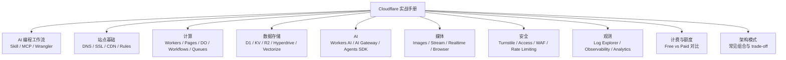

## 目录

- [1. AI 编程工作流](#1-ai-编程工作流)
- [2. Cloudflare 功能模块](#2-cloudflare-功能模块)
- [3. 计费与额度](#3-计费与额度)
- [4. 开源项目](#4-开源项目)
- [5. 避坑指南](#5-避坑指南)
- [6. 国内访问](#6-国内访问)
- [7. Cloudflare Agents](#7-cloudflare-agents)
- [8. 域名](#8-域名)
- [官方资源](#官方资源)

## 1. AI 编程工作流

先给 AI 配好 Cloudflare 的"说明书"和"工具箱"，配完之后你想怎么问就怎么问——Cloudflare 有什么、边界在哪、该怎么写，AI 自己会查。这本手册的剩下部分是给你查漏补缺的，不用从头读到尾。

如果想让它快速了解全貌，把 llm.txt 喂给它（见下方"把这本手册喂给 AI"）。

### 安装 Skill 和 MCP

Cloudflare 官方维护了一套 Agent Skills（[cloudflare/skills](https://github.com/cloudflare/skills)），支持 Claude Code、Cursor、OpenCode、OpenAI Codex、Pi 等主流 agent。装上之后 AI 就知道 Cloudflare 怎么开发，不会把你当成在写普通 Node.js 项目。

**Claude Code：**

```text
/plugin marketplace add cloudflare/skills
/plugin install cloudflare@cloudflare
```

**Cursor：**

从 Cursor Marketplace 安装，或通过 Settings > Rules > Add Rule > Remote Rule (Github) 添加 `cloudflare/skills`。

**通用方案（OpenCode、OpenAI Codex、Pi 等）：**

```bash
npx skills add https://github.com/cloudflare/skills
```

**手动安装：**

Clone [cloudflare/skills](https://github.com/cloudflare/skills) 仓库，把 skill 文件夹复制到对应 agent 的目录：

| Agent | Skill 目录 |
| --- | --- |
| Claude Code | `~/.claude/skills/` |
| Cursor | `~/.cursor/skills/` |
| OpenCode | `~/.config/opencode/skills/` |
| OpenAI Codex | `~/.codex/skills/` |
| Pi | `~/.pi/agent/skills/` |

### 装完之后 AI 多了什么

**Skills（说明书）** — 上下文匹配时自动加载：

| Skill | 覆盖范围 |
| --- | --- |
| cloudflare | 平台全景：Workers/Pages/存储/AI/网络/安全/IaC |
| agents-sdk | 有状态 AI agent、调度、RPC、MCP server、流式聊天 |
| durable-objects | 状态协调、WebSocket、SQLite、alarms |
| sandbox-sdk | 安全代码执行、code interpreter |
| wrangler | 部署和管理 Workers/KV/R2/D1/Queues/Workflows |
| building-mcp-server-on-cloudflare | 远程 MCP server 构建 |
| building-ai-agent-on-cloudflare | AI agent 构建 |

**MCP Servers（连接器）** — 插件安装后自动注册：

| MCP Server | 用途 |
| --- | --- |
| cloudflare-docs | 查询官方文档（日常必开） |
| cloudflare-api | 管理账号资源、zone、设置（要上线、改配置时开） |
| cloudflare-bindings | 构建 Workers 应用 |
| cloudflare-builds | 查看 Workers 构建记录 |
| cloudflare-observability | 查看日志和分析（排查问题时开） |

**Commands（命令）：**

- `/cloudflare:build-agent` — 用 Agents SDK 构建 AI agent
- `/cloudflare:build-mcp` — 构建 MCP server

**Wrangler（命令行工具）** — Skill 和 MCP 都是帮助 AI 理解，真正跑起来和部署靠 Wrangler：

```bash
npm i -D wrangler@latest
npx wrangler dev      # 本地开发
npx wrangler deploy   # 部署上线
npx wrangler tail     # 实时日志
```

### 把这本手册喂给 AI

如果你想让 AI 快速了解 Cloudflare 全貌，把下面这行发给它：

```text
阅读 https://chendahuang.com/playbook/cloudflare/llm.txt 了解 Cloudflare 平台全貌，然后帮我……
```

这个文件是本手册的纯文本版，涵盖功能模块、架构模式、计费、避坑指南。AI 读完就能结合 Skill 和 MCP 帮你干活。

### 新项目从零开始

如果连项目都还没建：

```bash
npm create cloudflare@latest -- my-worker
```

跟着提示选，建完进去装 Wrangler、装 Skill，开始让 AI 写。

### 线上出问题时喂给 AI 什么

AI 能自己开 Observability MCP 看日志、开 Browser MCP 看 Dashboard，但它不知道你这边看到的现象。让它排查线上问题前，把这些贴给它：

- 出问题的完整 URL。
- 发生时间和时区。
- HTTP 状态码（`522`、`1101` 这种）。
- 响应头里的 `cf-ray` 或 Ray ID——Cloudflare 定位这次请求的唯一线索。
- 是否只在某个地区、运营商、浏览器、登录态出现。
- 最近一次部署 commit 和 Cloudflare deployment/version。
- 是否命中缓存、WAF、Rate Limiting、Access 或 Worker。

本地快速拿响应头：

```bash
curl -I https://example.com/path
```

错误码不知道属于哪一层时，看第 5 节开头的错误码索引表。

### 常见架构模式

以下是 Cloudflare 上最常见的几种架构组合，每种附适用场景和取舍说明。

**模式一：Worker + D1 + R2（全栈应用）**

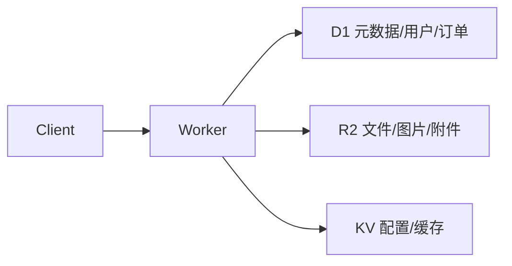

适用场景：SaaS 原型、内容管理、API 服务。D1 存结构化数据和业务关系，R2 存文件本体，KV 缓存高频读取的配置。这是 AI 编程生成全栈项目时最自然的组合。

取舍：D1 不是 Postgres，复杂事务和高并发写入场景需要考虑 Hyperdrive 连外部数据库。

**模式二：Workers Static Assets + Worker（前后端一体）**

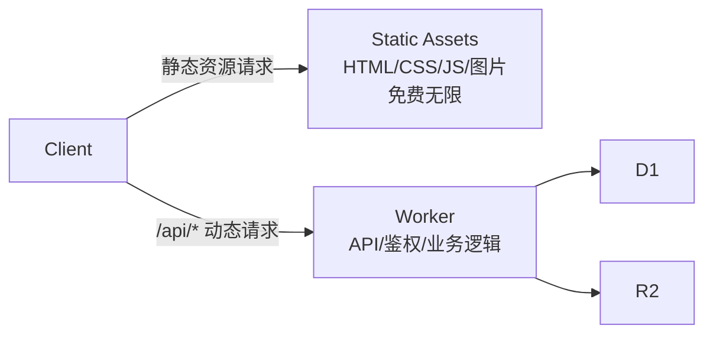

适用场景：React/Vue/Svelte 前端 + API 后端。静态资源请求免费且不计入 Workers 配额，只有动态请求消耗 Worker 额度。

取舍：前后端强绑定在同一个 Worker 项目中，适合小团队和快速迭代；大型团队可能需要拆分独立服务。

**模式三：Worker + Durable Objects + WebSocket（实时协作）**

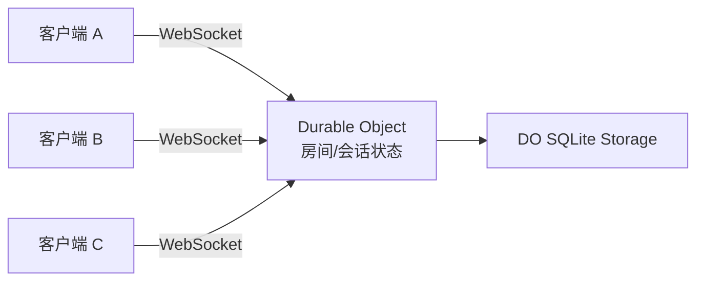

适用场景：聊天室、协作编辑、在线游戏、实时看板。Durable Objects 提供单实例强一致性和 WebSocket 支持，Hibernation 模式可以大幅降低长连接成本。

取舍：单个 DO 约 500-1000 req/s 上限，高并发需要按实体分片。不适合做通用数据库。

**模式四：Worker + Queues + Workflows（异步处理）**

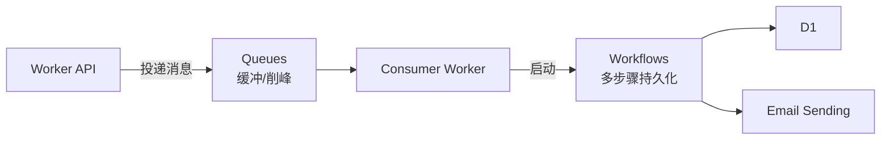

适用场景：订单处理、数据管道、AI 审核流、用户生命周期邮件。Queues 做入口缓冲和削峰，Workflows 处理多步骤流程，某一步失败只重试该步。

取舍：架构复杂度较高，简单的同步 API 不需要引入这套机制。

**模式五：Worker + AI Gateway + 外部模型（AI 应用）**

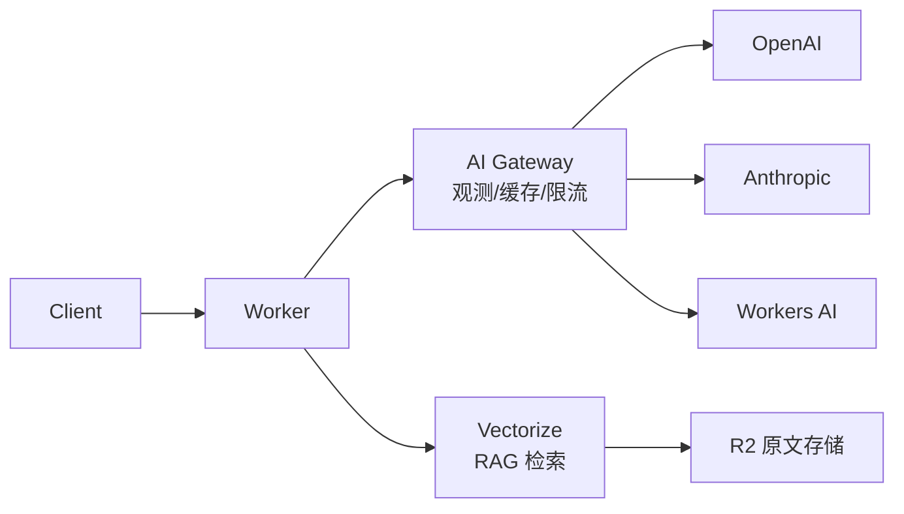

适用场景：AI 聊天、RAG 问答、多模型路由。AI Gateway 统一管理多个模型 provider 的调用、缓存和成本，Vectorize 做语义检索，R2 存原始文档。

取舍：Workers AI 的模型能力有限，复杂推理和多模态场景仍需外部模型。

### AI 编程 Cloudflare 常见翻车点

AI 生成 Cloudflare 代码时，最容易犯的错误不是语法问题，而是不了解 Cloudflare 运行时的特殊约束。以下是高频翻车点和对应的正确做法：

**1. 用 Node.js 思维写 Worker**

AI 经常生成 `require('fs')`、`express()`、`http.createServer()` 等 Node.js 代码。Workers 不是 Node.js，没有文件系统和原生 HTTP 服务器。正确做法是使用 Web 标准 API（`fetch`、`Request`、`Response`）和 Hono 等 Workers 原生框架。

**2. 把 binding 当环境变量**

AI 可能生成 `process.env.MY_KV` 来访问 KV 或 D1。Cloudflare 的 binding 通过 `env` 参数传入，正确写法是 `env.MY_KV.get(key)` 或 `env.DB.prepare(sql)`。

**3. 忽略浮动 Promise**

AI 生成的代码经常有未 `await` 的异步调用（如 `KV.put()`、`fetch()`），在 Workers 里这会导致操作被静默丢弃。每个异步操作要么 `await`，要么传给 `ctx.waitUntil()`。

**4. 全局变量存请求状态**

AI 可能在模块顶层声明 `let cache = {}` 做缓存。Workers 会复用 isolate，全局变量在不同请求之间共享，会导致数据泄漏。请求级数据必须通过函数参数或 `env` 传递。

**5. 不知道 Static Assets 请求免费**

AI 可能把所有请求都路由到 Worker 处理，不知道 Workers Static Assets 的静态资源请求是免费且不计入配额的。正确做法是让静态文件直接由 Static Assets 处理，只有 `/api` 等动态请求走 Worker。

**6. 用 REST API 调自家 R2**

AI 可能生成通过 `api.cloudflare.com` REST API 访问 R2 的代码。从 Worker 内应该使用 R2 binding（`env.MY_BUCKET.get(key)`），零网络跳、零认证、零额外延迟。

**给 AI 的提示词建议**：在开始编码前，把以下约束告诉 AI，可以显著减少翻车：

```text
这是 Cloudflare Workers 项目，请注意：
- 使用 Web 标准 API（fetch/Request/Response），不要用 Node.js API
- 通过 env 参数访问 binding（KV/D1/R2/Queues），不要用 process.env
- 所有异步操作必须 await 或 ctx.waitUntil()，不要留浮动 Promise
- 不要在模块顶层声明可变状态，Workers 会复用 isolate
- 用 Hono 框架处理路由，用 Drizzle ORM 操作 D1
```

---

## 2. Cloudflare 功能模块

Cloudflare 的能力可以按站点基础、计算、数据存储、AI、媒体、安全、观测七类理解。每个模块说清楚什么时候你会用到、坑在哪。

### 站点基础

#### DNS
权威 DNS 服务，负责把域名指向网站、API、邮箱等资源。

你买了域名之后，通常先把 NS（Name Server）改到 Cloudflare，让 Cloudflare 接管这个域名的解析。之后 A、AAAA、CNAME、MX、TXT 这些记录都在这里配，子域名、邮箱验证、CNAME flattening、DNSSEC 也都属于这一层。做项目时先把 DNS 配置正确，后面的 Pages、Workers、R2 自定义域名才接得上。

#### SSL/TLS
浏览器到 Cloudflare、Cloudflare 到源站之间的 HTTPS 加密。

HTTPS 那把小锁主要由这里管。接入 Cloudflare 后，边缘证书通常会自动签发和续期；如果你还有自己的源站，就要注意加密模式：`Full (strict)` 要求源站证书有效，`Flexible` 只加密浏览器到 Cloudflare 这一段，容易引出跳转循环和安全误判。普通静态站和 Workers 项目基本不用折腾证书链；有自建源站时才需要认真看这里。

#### Cache / CDN
静态资源、页面和部分响应的全球边缘缓存。

Cloudflare 会在边缘节点缓存适合缓存的内容，让用户从更近的位置拿文件，不必每次回源站。静态资源、图片、构建后的 JS/CSS 最适合走缓存；登录后的个人数据、实时接口、带权限的响应不要乱缓存。需要精细控制时，用 Cache Rules 配路径、Header、TTL 和绕过规则。

#### Rules
重定向、缓存、Header、源站、配置覆盖的规则系统。

想把旧域名 301 到新域名、给某些路径加安全 Header、控制缓存策略、改写 URL、把不同路径转到不同源站，优先看 Rules。它适合处理边缘层的请求策略；只有当逻辑需要读写数据库、调用外部 API、按业务状态判断时，才应该写 Worker。

### 计算

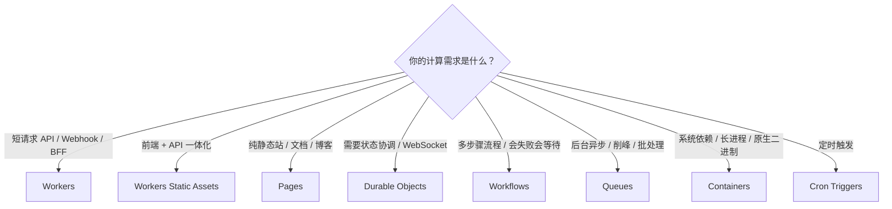

#### Workers
Cloudflare 的 serverless 运行时，用来跑 JS/TS、Wasm、部分 Python 等后端逻辑。

这是 AI 编程里最常用的计算层。AI 生成的 Hono API、鉴权接口、Webhook、BFF、MCP Server、轻量 AI 编排，基本都可以放到 Workers。它适合短请求和高并发边缘逻辑；图片处理、大文件转码、长时间任务、原生系统依赖不要硬塞进普通 Worker，应该考虑 Workflows、Queues、R2、Containers 或外部服务。

#### Workers Static Assets
Worker 项目里的静态资源托管，把前端文件和 Worker 代码作为一个整体部署。

AI 生成 Vite、React、Vue、Svelte、静态文档站或带 API 的前端项目时，这个很顺：HTML/CSS/JS/图片作为静态资源托管，`/api` 之类的动态逻辑走 Worker。默认请求命中静态文件时不执行 Worker；找不到静态文件时才交给 Worker 处理。前后端强绑定、想用一套 Worker 配置管理路由和 API 时，用它比拆成两套服务更清楚。

#### Pages
面向前端项目的部署平台，主打 Git 集成、预览部署和静态站发布。

连上 GitHub/GitLab 后，push 就能构建和发布，适合官网、博客、文档站、活动页、原型页面。Pages Functions 本质上也是 Workers 能力；如果你要的是“前端 + API + 多个绑定”一体化项目，现在更推荐看 Workers Static Assets。已有 Pages 项目、依赖预览部署和 Git 工作流时，继续用 Pages 也没问题。

#### Durable Objects
有状态对象，适合需要强一致协调、会话状态和 WebSocket 的场景。

Workers 本身是无状态的，每次请求可能落到不同地方；但聊天房间、协作画板、在线游戏房间、计数器、Agent 会话，都需要一个“同一时间说了算”的地方。Durable Objects 的每个实例可以代表一个房间、用户、文档或 Agent，带私有持久化存储，也能处理 WebSocket。它不是拿来存所有业务表的通用数据库；它更像“某个实体的状态和协调中心”。

#### Workflows
持久化的多步骤任务，用来跑会失败、会等待、会重试的流程。

AI 生成的业务经常不是一次请求能做完：先调 API，再写库，再发邮件，再等人工确认，最后发布结果。Workflows 把流程拆成 durable steps，自动保留状态、支持 sleep、等待外部事件和失败重试。订单处理、数据管道、用户生命周期邮件、AI 审核流都适合；普通同步 API 不需要它。

#### Queues
异步消息队列，用来保证任务投递、削峰、批处理和重试。

有些事不该让用户等：发邮件、处理上传文件、写审计日志、批量同步数据、触发后台生成。把消息放进 Queues，消费者 Worker 再慢慢处理，可以批量、延迟、重试，也可以接死信队列。需要立刻返回最终结果的接口别用队列；队列适合“我先收下，后台处理”的任务。

#### Containers
在 Cloudflare 上跑容器，适合 Workers 跑不了的语言、库和长进程。

如果 AI 生成的项目依赖系统库、长时间进程、传统 HTTP 服务、原生二进制，Workers 运行时可能不合适，这时 Containers 是更自然的选择。它和 Workers 是配套关系：Worker 可以负责边缘入口和路由，容器承接重后端。代价是启动、资源和计费都比普通 Workers 重；轻 API 不要一上来就容器化。

#### Cron Triggers
按 cron 表达式定时触发 Worker 的计划任务。

每小时同步一次数据、每天清理一次 D1、定时刷新缓存、周期性检查第三方 API，都可以用 Cron Triggers。它只负责“到点触发一次 Worker”；如果触发后要跑很多步骤、等待人工审批、失败后恢复上下文，就把真正流程放到 Workflows。

### 数据存储

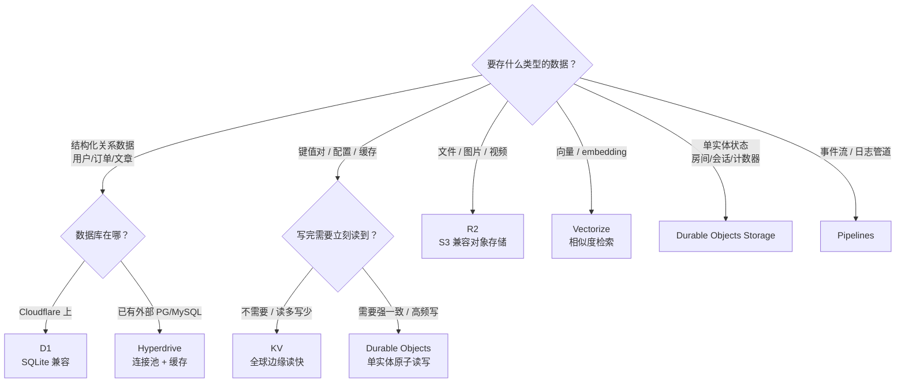

#### D1
Cloudflare 托管的 serverless SQL 数据库，语法接近 SQLite。

AI 生成应用时，用户、订单、文章、配置这些结构化数据可以优先放 D1。它和 Workers、Pages 绑定很自然，也能用 Drizzle ORM 或直接 SQL。要注意的是：D1 更适合中小型应用和边缘应用的关系数据，不是 Postgres 的完整替代品。查询要建索引，别让一次 SELECT 扫完整张表；高并发写入、复杂事务、Postgres/MySQL 特性需求明显时，用 Hyperdrive 连外部数据库更稳。

#### KV
全球分布式键值存储，适合读多写少、低延迟读取的数据。

配置、短链映射、feature flag、缓存结果、边缘读取的小块 JSON，都适合 KV。它的重点是“全球读快”，不是“写完立刻所有地方一致”。库存、余额、秒杀名额、实时计数这种需要强一致的东西不要放 KV；这类状态要用 D1 或 Durable Objects。

#### R2
S3 兼容对象存储，用来存文件、图片、视频、附件、备份和数据集。

AI 编程里一碰到用户上传、图片托管、导出文件、备份文件，先想到 R2。它兼容 S3 API，很多现成 SDK 和工具能直接接。R2 的重点是对象，不是表；文件元数据、权限、业务关系放 D1，文件本体放 R2。要做图片变换或视频播放，再配 Images、Stream 或 Worker 处理。

#### Hyperdrive
连接外部 Postgres/MySQL 的边缘连接池和查询加速层。

如果数据库已经在 Supabase、Neon、RDS、自建 Postgres/MySQL，不想迁移，但 Worker 访问数据库又怕连接慢、连接数爆掉，就用 Hyperdrive。它在 Cloudflare 边缘做连接池，也可以缓存查询结果，减少每次跨区域连库的成本。它不是一个新数据库；它是“让 Workers 更好地连你已有数据库”的中间层。

#### Vectorize
Cloudflare 的向量数据库，用来存 embedding 并做相似度检索。

做 RAG、语义搜索、相似推荐时会用到它：先把文档切块，转成 embedding，存进 Vectorize；用户提问时再查最相近的向量，把相关文本喂给 LLM。Vectorize 存的是向量和元数据，不是原始文件仓库；原文可以放 R2 或 D1。它不是只有 Paid 才能用，Free 和 Paid 都有对应额度，具体看最新 pricing。

#### DO Storage
Durable Objects 自带的持久化存储，跟某个对象实例绑定。

每个 Durable Object 都可以有自己的存储，用来保存这个对象的状态，比如房间成员、协作文档快照、Agent 会话、连接状态、计数器。它的价值是“单实体强一致 + 本地状态”，不是拿来替代 D1 做全局报表，也不是拿来存大量文件。

#### Secrets Store
集中管理密钥和敏感配置。

API Key、Webhook secret、数据库密码、第三方服务 token，不应该写在代码里，也不应该散落在每个项目配置里。Secrets Store 适合把这些敏感值集中管理，再绑定给 Workers 等服务使用。普通项目也可以先用 Worker secrets；团队协作、多个服务共享密钥、需要审计和轮换时，再看 Secrets Store。

#### Pipelines
把事件流和日志持续写入目标存储的数据管道。

当你有持续产生的数据，比如应用事件、行为日志、分析事件，需要稳定写到 R2 等地方做后续分析，就看 Pipelines。它更像数据基础设施，不是普通业务数据库。小项目刚上线不一定需要；等到日志、事件、数据湖这些词真的出现时再引入。

### AI

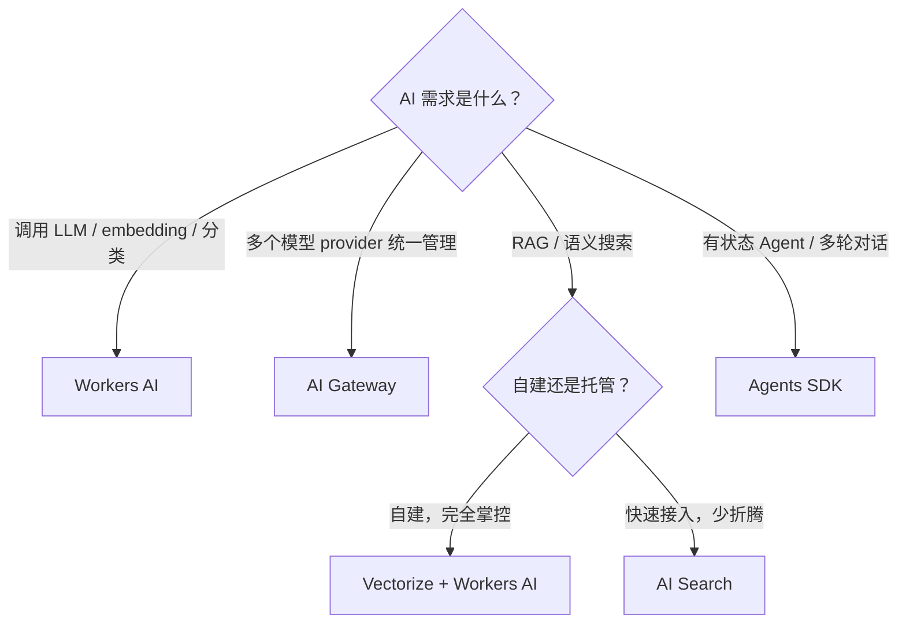

#### Workers AI
Cloudflare 的 serverless AI 推理平台。

你可以从 Worker、Pages 或 REST API 调用 Cloudflare 托管的模型，做 LLM、embedding、文本分类、语音转文字、图片理解等任务。它的好处是部署和鉴权简单，和 Workers、Vectorize、AI Gateway 组合顺。要注意模型列表和能力会变化，不要假设所有 OpenAI/Anthropic 的能力这里都有；复杂推理、多模态高级能力或强模型需求，可能还是要接外部模型。

#### AI Gateway
AI API 的统一网关，负责观测、缓存、限流和成本控制。

同时用 OpenAI、Anthropic、Workers AI、Groq、Mistral 这类 provider 时，不要让代码里散落一堆 API 调用，先接 AI Gateway。它能记录请求、看延迟和错误、做缓存、限流、重试、fallback，也能帮你控制花费。做 AI 应用时，这一层非常值钱：它不是模型本身，而是模型调用的控制台和保险丝。

#### Vectorize
向量数据库，见数据存储。

AI 问答系统的检索层。原文放 R2 或 D1，embedding 放 Vectorize，查询时先检索再交给模型回答。

#### AI Search
Cloudflare 托管的 AI 搜索能力。

如果你想快速给网站、文档、知识库加语义搜索和问答体验，可以看 AI Search。它比自己手动拼 Workers AI + Vectorize + crawler 更省事，但灵活度也更受产品边界影响。想完全掌控切块、索引、召回和回答逻辑，就自己用 Workers AI + Vectorize 搭。

#### Agents SDK
构建有状态 AI Agent 的框架，底层基于 Durable Objects。

做多轮对话、工具调用、Agent 记忆、实时 WebSocket、定时任务时，用 Agents SDK 比自己手写状态管理舒服。每个 Agent 可以有自己的状态和存储，适合客服助手、个人助理、自动化机器人、协作型 AI 工具。只是简单调一次 LLM，就不需要上 Agents SDK。

### 媒体

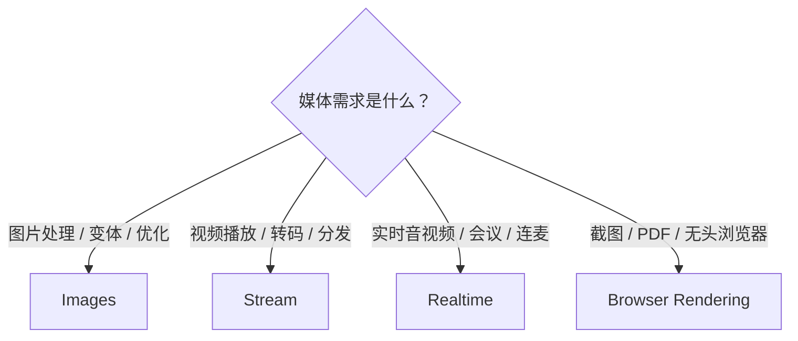

#### Images
图片托管、优化、变体和边缘转换服务。

如果项目里有用户头像、商品图、封面图、内容配图，Images 可以负责上传、存储、压缩、裁剪、格式转换和按需生成不同尺寸。R2 更像通用文件桶，适合存原始对象；Images 更像图片交付管线，适合直接面向页面展示。只存少量静态图片时，用静态资源或 R2 就够；图片量大、尺寸多、要自动优化时再看 Images。

#### Stream
视频存储、编码、播放和分发服务。

上传视频后，Stream 负责转码、生成自适应码流、托管播放器和全球分发，适合课程、产品演示、UGC 视频、会员内容。它解决的是“让视频稳定播放”，不是简单存一个 mp4 文件。只是给用户下载原始视频，用 R2 更直接；要网页内播放、转码、多清晰度和观看体验，就用 Stream。

#### Realtime
实时音视频和低延迟通信能力。

这一组对应 Dashboard 里的 Realtime，包括 RealtimeKit、TURN 服务器、无服务器 SFU、MoQ 中继等能力。做多人会议、语音房、直播连麦、实时互动时会碰到它。普通 WebSocket 协作先看 Workers + Durable Objects；真正涉及音视频链路、NAT 穿透、SFU 转发和低延迟媒体传输时，再进入 Realtime。

#### Browser Rendering
在 Workers 里调用无头浏览器进行渲染、截图和自动化。

需要把网页转成截图、生成 PDF、跑页面渲染检查、抓取自己可访问页面的最终 DOM 时，可以用 Browser Rendering。它适合“需要真实浏览器环境”的任务，不适合普通 HTML 拼接，也不应该拿来绕过登录、付费墙或网站限制。能用服务端模板直接生成的内容，不必上浏览器渲染。

### 安全

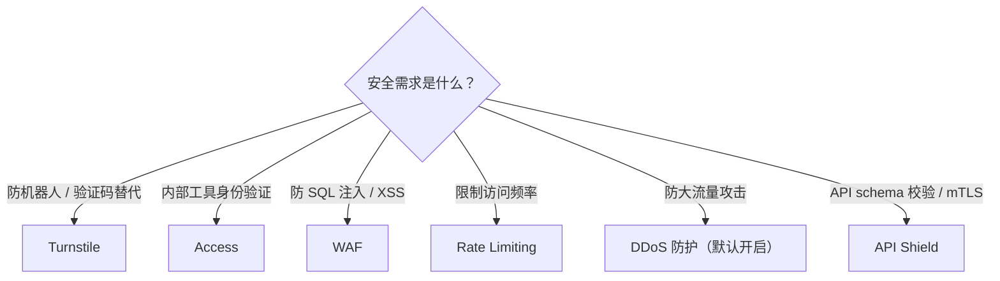

#### Turnstile
Cloudflare 的验证码替代方案，用来判断请求是不是来自真实用户。

登录、注册、评论、表单、试用申请都能接 Turnstile。它的思路不是逼用户选图，而是尽量在后台判断风险，必要时才让用户交互。接入时前端放 widget，后端校验 token；只在前端放组件但后端不验，等于没接。

#### Access
Zero Trust 里的应用访问控制，给内部工具和后台加身份验证。

你做了一个 admin 后台、内部数据看板、临时运维工具，不想自己写登录系统，就用 Access。它会在请求进源站或 Worker 前先做身份验证和策略判断，可以接 Google、GitHub、SAML、OIDC 等身份源。对 AI 编程 的内部工具来说，这是最省事的“先挡在门口”的方案。

#### WAF
Web 应用防火墙，在请求到达应用前拦截常见攻击。

WAF 可以用托管规则、自定义规则、速率限制等方式处理 SQL 注入、XSS、恶意扫描、异常路径、已知漏洞利用。AI 生成的代码可能有低级安全问题，WAF 能做一层边缘兜底，但不能替代代码修复：鉴权、权限校验、参数校验还是应用自己要做好。

#### Rate Limiting
按路径、IP、Header、请求特征限制访问频率。

登录接口、短信验证码、公开 API、AI 调用入口、上传接口，都应该考虑限流。它能防止恶意刷接口、爬虫吃光额度、单个 IP 打爆 Worker。限流不是业务权限系统；它解决“访问太频繁”，不解决“这个人有没有权限”。

#### DDoS 防护
Cloudflare 网络层和应用层的 DDoS 防护。

Cloudflare 会在边缘网络自动吸收和缓解大量攻击流量，HTTP 层也有对应的检测和规则。大多数小项目不需要专门配置它；真正被打时，重点是确认域名已代理到 Cloudflare、源站 IP 没暴露、缓存和 WAF 策略没有把正常用户误伤。

#### API Shield
面向 API 的安全能力集合，包括 schema 校验、mTLS、发现和滥用检测。

有正式公开 API、移动端 API、合作方 API 时，可以用 API Shield 做 OpenAPI schema 校验、客户端证书、API 发现和风险分析。不符合 schema 的请求可以在边缘直接拦掉，减少打到 Worker 或源站的异常流量。它偏正式 API 治理，小项目早期不一定要上；接口稳定、调用方变多之后价值更明显。

### 观测

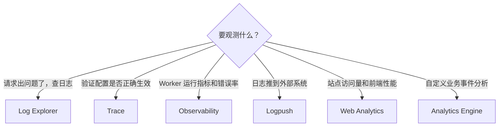

#### Log Explorer
Cloudflare Dashboard 里的日志搜索工具。

线上请求出问题时，先看这里。Log Explorer 可以按时间、路径、状态码、Ray ID、服务类型等条件搜索日志，用来判断错误发生在 Cloudflare 边缘、Worker 代码、缓存规则、WAF，还是源站。它适合临时排查；长期留存和外部分析交给 Logpush。

#### Trace
模拟请求经过 Cloudflare 配置后的处理路径。

你想知道一个 URL 会命中哪些规则、是否走缓存、是否触发 Worker、是否被安全规则影响，就用 Trace。它适合验证配置为什么这样生效，不是完整的应用 APM。遇到“为什么这个路径没有按预期跳转/缓存/转发”时，Trace 比肉眼翻规则更靠谱。

#### Logpush
把 Cloudflare 日志持续推送到外部目的地。

需要长期留存日志、接入 SIEM、放到 R2/S3/BigQuery/Splunk 等系统分析时，用 Logpush。它解决的是“日志要出 Cloudflare，进入我的数据系统”。小项目不用一开始就配；等你真的需要合规审计、长期趋势、跨系统排查时再上。

#### Web Analytics
隐私友好的站点访问和前端性能分析。

看页面访问量、来源、国家地区、设备、Web Vitals 和前端性能时用它。它不依赖传统第三方广告追踪模型，也可以通过 JS snippet 接到非 Cloudflare 代理的网站。官网、文档站、博客、产品页都适合先接这个，复杂增长分析再考虑专门分析工具。

#### Observability
Workers 和 Pages 的运行观测入口。

API 上线后，要看请求量、错误率、延迟、异常日志、部署版本表现，就来这里。Workers Logs、Invocation Logs、metrics、traces 都属于这条线。它回答“代码运行得怎么样”；Log Explorer 更偏“请求和边缘层发生了什么”。

#### Analytics Engine
Workers 里的自定义指标和事件分析引擎。

如果你想在 Worker 里写入业务事件，比如按钮点击、接口耗时、模型调用成本、用户行为，再用 SQL 聚合分析，就看 Analytics Engine。它适合高基数事件分析，不适合当事务数据库，也不适合存需要逐条强一致查询的业务记录。

---

## 3. 计费与额度

以下数字来自 [Workers 定价页](https://developers.cloudflare.com/workers/platform/pricing/)、[Limits 文档](https://developers.cloudflare.com/workers/platform/limits/) 和各产品自己的 pricing/limits 页，按 2026 年 6 月的政策核对。

先记住一个判断方式：Cloudflare 的“免费”不是一种口径。有的服务达到 Free 上限后直接报错，有的服务 Free 可用、Paid 后继续按量计费，有的服务不按用量计费，而是跟随域名套餐、Zero Trust 计划或单独产品开通。

### 先搞懂额度怎么算

看下面的表格之前，先记住五条规则：

**1. 额度按不同级别算。** 有的按账号（Workers 10 万请求/天 = 全账号所有 Worker 共享），有的按域名（Email Routing 一个域名一套规则），有的按站点（Pages 静态请求无限是每个站点都无限）。多建几个 Worker 不会多出几份 10 万。

**2. 按天和按月不能直接换算。** Workers、D1、KV 是 /天，R2、Vectorize 是 /月。/天 的额度有峰值压力——某一天爆了就报错，不会等到月底。估算月用量时不能简单 ×30。

**3. 有些服务共享同一个池。** Workers、Pages Functions、Workflows、Cron 触发后的请求共享同一个 10 万/天。不是各给 10 万。

**4. 超出后有两种结果，这是最重要的安全线。**
- **报错型（不会扣钱）**：Workers、D1、KV、Queues、Durable Objects、Workers AI — 超了直接返回错误，不产生费用。
- **自动收费型（会扣钱）**：R2 — 超出 10 GB 存储后按 $0.015/GB 自动计费，没有开关可以关。不绑信用卡就不会扣，但额度用完就停。

**5. 额度不一定能叠加。** R2 的 10 GB 和 Workers $5 套餐完全无关，买了 $5 R2 额度也不会变。Workers AI 的 1 万 Neurons/天 在 Free 和 Paid 也一样。

### 免费能扛多少真实量

以下按常见项目类型估算，帮助判断免费额度是否够用：

| 典型场景 | 免费额度是否充足 | 可承载规模参考 |
| --- | --- | --- |
| 静态博客 / 文档站 | 充足 | Pages 静态请求免费无限；Workers Static Assets 静态资源请求同样免费无限 |
| 独立 SaaS 原型（注册 + 登录 + CRUD） | 充足（验证阶段） | 日活 1000 用户、每人每天 10 次请求 ≈ 1 万请求/天，远低于 10 万/天上限 |
| 图床 / 文件分享 | 起步阶段充足 | R2 10 GB ≈ 1 万张 1 MB 图片；D1 元数据可存数十万条 |
| 短链服务 | 小规模充足 | KV 1 GB ≈ 100 万条 1KB 映射；10 万读取/天 可扛中低流量 |
| AI 聊天 / RAG | 很快撞墙 | Workers AI 1 万 Neurons/天 ≈ 几十到几百次对话（取决于模型），demo 够用，上量必升 Paid |
| 域名邮箱（收信转发） | 无限免费 | Email Routing 不限收信量，`[email protected]` 转发到 Gmail 随便收 |
| Webhook 接收器 | 充足 | Workers 10 万请求/天 接 GitHub / Stripe webhook 绰绰有余 |
| 定时任务（Cron） | 小规模可用 | Free 仅 5 个 Cron/账号，每个任务 CPU 10ms，只能做轻量任务 |
| 本地服务暴露到公网 | 无限免费 | Cloudflare Tunnel 替代 ngrok，不限流量 |

### $0 能搭出什么

以下组合在免费额度内可长期运行，不产生费用：

> **域名邮箱 + 博客 + API + 数据库 + 文件存储 = $0/月**
>
> Email Routing（收信）+ Pages 或 Workers Static Assets（静态站）+ Workers（API）+ D1（5 GB 数据库）+ R2（10 GB 文件）+ KV（1 GB 缓存）+ Web Analytics（访问统计）+ Tunnel（本地调试）。
>
> 这套组合够一个独立开发者跑博客 + 小工具 + SaaS 原型，只要不超出额度，永久 $0。唯一要注意 R2 超出 10 GB 会自动收费，其他服务超了只是报错。

### 一句话看懂 Free vs Paid ($5/月)

- **新解锁**：Containers、Email Sending、Workers Logpush — Free 完全没有
- **额度提升**：Workers 请求 10 万/天 → 1000 万/月；单请求 CPU 10ms → 5 分钟；Workers Logs 保留 3 天 → 7 天
- **上限提升**：Worker 数 100 → 500；Cron 5 → 250；subrequests 50 → 10,000；Worker 包大小 3 MB → 10 MB
- **AI 行为变化**：Workers AI 仍是 1 万 Neurons/天，但 Paid 超出后能继续用并按量付费（Free 会报错停止）
- **关键区别**：Free 下超额度会报错停止、不扣钱；Paid 下超额度会**自动按量计费**，没有硬开关

### 计算

| 服务 | 免费额度 | 超出后 | 关键限制 |
| --- | --- | --- | --- |
| Workers | 10 万请求/天，CPU 10ms/请求 | 报错 Error 1027，不收费 | Worker 大小 3 MB（gzip 后），50 子请求/请求，100 个 Worker/账号 |
| Workflows | 10 万 invocation/天（共享 Workers 请求），CPU 10ms/invocation，1 GB 状态存储 | 报错，需升级 Paid；Paid 后按 Workers 请求、CPU 和存储计费 | 等待、sleep、空闲时不计 CPU；Free 默认保留状态 3 天 |
| Pages 静态 | 无限请求，500 次构建/月（1 个并发） | — | 单站点 20,000 文件，单文件 25 MiB，100 自定义域名 |
| Pages Functions | 同 Workers（共享 Workers 配额） | 同 Workers | 按 Workers 计费，不是独立产品 |
| Workers Static Assets | 静态资源请求免费且无限；动态请求走 Workers 配额 | 动态部分同 Workers | 20,000 文件/Worker，单文件 25 MiB |
| Durable Objects | 10 万请求/天，13,000 GB-s/天 | 报错，需升级 Paid | Free 只能用 SQLite 后端；KV 后端必须 Paid |
| Queues | 1 万操作/天 | 报错，需升级 Paid | 单消息 128 KB；Free 保留 24h，Paid 可配最长 14 天 |
| Cron Triggers | 5 个/账号 | 需要 Workers Paid 提升到 250 个/账号 | 触发后的代码仍按 Workers 请求和 CPU 计 |
| Containers | Free 不可用 | 需要 Workers Paid，包含 25 GiB-时内存、375 vCPU-分、200 GB-时磁盘 | 适合 Workers 跑不了的长进程和原生依赖 |

### 数据与存储

| 服务 | 免费额度 | 超出后 | 关键限制 |
| --- | --- | --- | --- |
| D1 | 5 GB 存储，500 万行读取/天，10 万行写入/天 | 报错，需升级 Paid | `rows_read` 是扫描行数不是返回行数；加索引能省很多 |
| KV | 1 GB 存储，10 万读取/天，1000 写入/天 | 报错，需升级 Paid | 单 key 25 MiB；同一 key 写入 1 次/秒；最终一致不是强一致 |
| R2 | 10 GB 存储，100 万 A 类操作/月，1000 万 B 类操作/月 | **按标准价计费**：$0.015/GB-月、$4.50/M A 类、$0.36/M B 类 | 出口流量永久免费；R2 免费额度和 Workers 计划无关 |
| Hyperdrive | 10 万查询/天 | 报错，需升级 Paid（Paid 无限） | 连接已有的外部 Postgres/MySQL，不是 Cloudflare 的数据库 |
| Vectorize | 3000 万查询维度/月，500 万存储维度 | Free 内用于原型；Paid 后超出按量计费 | 按“向量数量 × 维度”算，不按文档条数算 |
| DO Storage | SQLite 后端：500 万行读取/天，10 万行写入/天，5 GB 总存储 | 报错，需升级 Paid | 和 Durable Objects 绑定；SQLite 存储计费从 2026 年 1 月开始 |
| Secrets Store | 账号级密钥管理能力，不是用量型数据库 | 按绑定服务和权限体系使用 | 用来集中管理密钥；不要把 API Key 写进代码 |
| Pipelines | Streams、SQL transforms、Sinks 各 1 GB/月 | Free 超出不可继续按量；Paid 包含 50 GB/月，之后按 GB 计费 | 写入 R2 或 R2 Data Catalog 时，对应存储费用另算 |

### 网络与安全

| 服务 | Free 口径 | 说明 |
| --- | --- | --- |
| DNS | 所有计划包含 | 常规 DNS 查询不单独计费 |
| SSL/TLS | 所有计划包含 | Universal SSL 自动签发；高级证书和企业能力另算 |
| Cache / CDN | 所有计划包含 | 静态资源缓存不额外计费；高级缓存策略随计划变化 |
| Rules | 基础规则可用 | Redirect、Cache、Configuration、Transform 等规则按类型和套餐有数量差异 |
| WAF | 基础防护可用 | 托管规则、自定义规则、Bot 等高级能力随套餐变化 |
| Rate Limiting | 基础限流能力可用 | 规则数量和高级匹配能力随套餐变化 |
| Turnstile | 免费无限 | 验证码替代方案，不按月度挑战次数收费 |
| Access | 50 用户免费 | 超过需要 Cloudflare One 订阅 |
| DDoS 防护 | 所有计划默认开启 | L3/L4/L7 防护不是按请求单独计费 |
| API Shield | 按安全能力开放 | Schema 校验、mTLS、API Discovery 等能力要看当前计划 |
| Email Routing | 免费，收信无限 | 域名邮箱收信转发到外部邮箱；每域名 200 条路由规则，单邮件 25 MiB |
| Email Sending | Free 不可用 | 需 Workers Paid：3000 封/月包含，超出 $0.35/千封；发到已验证目标地址在所有 plan 免费 |
| Tunnel | 免费，无限 | 把本地服务安全暴露到公网，替代 ngrok；需安装 cloudflared |
| Workers Builds | 免费 | Git 推送自动构建部署 Worker，无需本地装 Wrangler |

### AI

| 服务 | 免费额度 | 超出后 |
| --- | --- | --- |
| Workers AI | 每天 10,000 Neurons（Free 和 Paid 都有） | Free 报错；Paid 按 $0.011/千 Neurons |
| AI Gateway | 核心能力免费；持久日志 Free 为 10 万条总量 | Paid 每个 gateway 1000 万条日志；Logpush 只在 Paid 可用 |
| Vectorize | 3000 万查询维度/月，500 万存储维度 | Paid 包含 5000 万查询维度/月、1000 万存储维度，超出按量 |
| AI Search | Open beta 期免费；Free：100 个实例、2 万查询/月、每天最多抓取 500 页 | Paid 查询不限量；Workers AI 和 AI Gateway 用量仍单独计 |
| Agents SDK | 没有单独免费额度 | 按底层 Workers、Durable Objects、D1、Vectorize、Workers AI 等资源计费 |

### 媒体

| 服务 | 免费额度 | 超出后 | 关键限制 |
| --- | --- | --- | --- |
| Images | 5000 次 unique transformations/月 | Free 新转换返回 9422，不自动收费；Paid 后 $0.50/1000 次 | Images 内置存储和交付只在 Images Paid 可用 |
| Stream | 没有固定免费分钟包 | 存储 $5/1000 分钟；交付 $1/1000 分钟 | 上传和编码免费；按视频时长计，不按文件大小计 |
| Realtime | SFU + TURN 合计 1000 GB/月免费 | $0.05/GB | 只按 Cloudflare 边缘到客户端的流量计费 |
| Browser Run | 10 分钟/天，Browser Sessions 最多 3 个并发浏览器 | Paid 包含 10 小时/月和 10 个并发浏览器，之后按量 | Quick Actions 只计浏览器时间；Browser Sessions 还计并发浏览器 |

### 观测与日志

| 服务 | 免费额度 | 超出后 | 关键限制 |
| --- | --- | --- | --- |
| Workers Logs / Observability | 20 万事件/天，保留 3 天 | Paid 包含 2000 万事件/月，保留 7 天；超出 $0.60/百万事件 | 用来排查 Worker 和 Pages Functions 运行问题 |
| Workers Logpush | Free 不可用 | Paid 包含 1000 万请求/月，之后 $0.05/百万请求 | 把 Workers Trace Events 推到外部目的地 |
| Log Explorer | 独立日志产品，不按 Workers Free 额度 | 按 Log Explorer 计费页核对 | 适合跨产品查日志，不等同于 Workers Logs |
| Web Analytics | 免费使用 | — | 看站点访问、来源和 Web Vitals，不依赖传统第三方追踪 |
| Analytics Engine | 10 万 data points/天，1 万 read queries/天 | Paid 包含 1000 万 data points/月、100 万 read queries/月 | 当前官方说明为暂不计费，价格信息用于提前估算 |
| Trace | Dashboard 排查工具 | — | 用来模拟请求命中规则、缓存、Worker、安全策略的路径 |

### 容易踩到的平台限制

这些不一定都写在定价表里，但在 [Limits 文档](https://developers.cloudflare.com/workers/platform/limits/) 或对应产品 limits 页里写得很清楚，Free 和 Paid 都适用：

| 限制 | Free | Paid |
| --- | --- | --- |
| 单 Worker 内存 | 128 MB | 128 MB |
| Subrequests/请求 | 50 | 10,000 |
| Cache API calls/请求 | 50 | 1,000 |
| 环境变量数量/Worker | 64 | 128 |
| Worker 大小（gzip 后） | 3 MB | 10 MB |
| Worker 启动时间 | 1 秒 | 1 秒 |
| 同时打开的子请求连接 | 6 | 6 |
| 单请求日志大小 | 256 KB | 256 KB |
| 每账号 Worker 数 | 100 | 500 |
| Cron Triggers/账号 | 5 | 250 |
| 静态资源文件数/Worker | 20,000 | 100,000 |
| 请求 body 大小 | 100 MB | 100 MB（受 Cloudflare 计划限制，非 Workers 计划） |
| DNS 记录数/域名 | 1,000 | 1,000（Enterprise 默认 3,500） |

> 最后核对：2026-06-22。数字来自 Cloudflare 官方文档，可能随时调整。部署前以官方页面为准：[Workers 定价页](https://developers.cloudflare.com/workers/platform/pricing/)、[Limits 文档](https://developers.cloudflare.com/workers/platform/limits/)、[R2 Pricing](https://developers.cloudflare.com/r2/pricing/)、[Images Pricing](https://developers.cloudflare.com/images/pricing/)、[Stream Pricing](https://developers.cloudflare.com/stream/pricing/)、[Realtime Pricing](https://developers.cloudflare.com/realtime/sfu/pricing/)、[Browser Run Pricing](https://developers.cloudflare.com/browser-run/pricing/)、[AI Search Limits & Pricing](https://developers.cloudflare.com/ai-search/platform/limits-pricing/)、[Email Service Pricing](https://developers.cloudflare.com/email-service/platform/pricing/)、[Email Service Limits](https://developers.cloudflare.com/email-service/platform/limits/)。

---

### Paid ($5/月) 完整额度对比

> 表格"超出后"列有价格的服务 = **自动按量计费**（会扣钱）；写"不单独收费"或"—"的 = 不会额外扣费。R2 不在此表，它和 $5 套餐无关，见下方"需要特别注意"。

| 服务 | Free | Paid ($5/月) 包含 | 超出后 |
| --- | --- | --- | --- |
| Workers 请求 | 10 万/天 | 1000 万/月 | $0.30/百万请求 |
| Workers CPU 时间 | 10ms/请求 | 3000 万 ms/月 | $0.02/百万 CPU ms |
| 单请求 CPU 上限 | 10ms | 5 分钟（默认 30s，可调） | — |
| Cron / Queue CPU 上限 | 10ms | Queue Consumer 15 分钟；Cron 30 秒（间隔 < 1 小时）或 15 分钟（间隔 >= 1 小时） | 长任务仍要控制成本和失败重试 |
| Workers Logs | 20 万事件/天，保留 3 天 | 2000 万事件/月，保留 7 天 | $0.60/百万事件 |
| Workers Logpush | 不可用 | 1000 万请求/月 | $0.05/百万请求 |
| Workflows 请求和 CPU | 同 Workers 请求和 CPU | 同 Workers 请求和 CPU | 不单独收步骤调用费 |
| Workflows 存储 | 1 GB | 1 GB | $0.20/GB-月 |
| KV 读取 | 10 万/天 | 1000 万/月 | $0.50/百万 |
| KV 写入 | 1000/天 | 100 万/月 | $5.00/百万 |
| KV 存储 | 1 GB | 1 GB | $0.50/GB-月 |
| D1 行读取 | 500 万/天 | 250 亿/月 | $0.001/百万行 |
| D1 行写入 | 10 万/天 | 5000 万/月 | $1.00/百万行 |
| D1 存储 | 5 GB | 5 GB | $0.75/GB-月 |
| Durable Objects 请求 | 10 万/天 | 100 万/月 | $0.15/百万 |
| Durable Objects 时长 | 1.3 万 GB-s/天 | 40 万 GB-s/月 | $12.50/百万 GB-s |
| DO SQLite Storage | 500 万行读取/天，10 万行写入/天，5 GB | 250 亿行读取/月，5000 万行写入/月，5 GB | 读取 $0.001/百万行，写入 $1/百万行，存储 $0.20/GB-月 |
| Queues 操作 | 1 万/天 | 100 万/月 | $0.40/百万操作 |
| Workers AI Neurons | 1 万/天 | 1 万/天（和 Free 相同，但 Paid 超出后能继续用） | $0.011/千 Neurons |
| AI Gateway 持久日志 | 10 万条总量 | 每个 gateway 1000 万条 | 核心网关免费；高级能力按对应产品计 |
| AI Gateway Logpush | 不可用 | 1000 万请求/月 | $0.05/百万请求 |
| AI Search 查询 | 2 万/月 | 不限量（open beta） | Workers AI 和 AI Gateway 另算 |
| AI Search 实例 | 100 个/账号 | 5000 个/账号 | open beta 期免费 |
| AI Search 文件和抓取 | 每实例 10 万文件；每天最多抓取 500 页 | 每实例 100 万文件，hybrid search 为 50 万；抓取不限量 | 单文件最大 4 MB |
| Vectorize 查询维度 | 3000 万/月 | 5000 万/月 | $0.01/百万 |
| Vectorize 存储维度 | 500 万 | 1000 万 | $0.05/1 亿 |
| Hyperdrive 查询 | 10 万/天 | 无限 | — |
| Pipelines | Streams / SQL transforms / Sinks 各 1 GB/月 | Streams 不限量；SQL transforms 和 Sinks 各 50 GB/月 | SQL transforms $0.04/GB；Sinks 按格式 $0.03-$0.06/GB |
| Analytics Engine | 10 万 data points/天，1 万 read queries/天 | 1000 万 data points/月，100 万 read queries/月 | 当前暂不计费，官方价格用于提前估算 |
| Browser Run | 10 分钟/天，3 并发浏览器 | 10 小时/月，10 并发浏览器 | $0.09/小时；并发浏览器 $2/个 |
| Containers | 不可用 | 25 GiB-时内存、375 vCPU-分、200 GB-时盘 | 按量 |
| Containers 出口流量 | 不可用 | 北美/欧洲 1 TB；大洋洲、韩国、台湾 500 GB；其他地区 500 GB | 超出按地区 $0.025-$0.05/GB |
| Email Sending | 不可用 | 3000 封/月 | $0.35/千封（发到已验证目标地址免费，不计入额度） |

> 最后核对：2026-06-22。以 [Workers 定价页](https://developers.cloudflare.com/workers/platform/pricing/) 为准。

### 需要特别注意

- **R2 的免费额度和 Workers 计划无关**。所有人都能用 10 GB 存储 + 100 万 A 类 + 1000 万 B 类操作，不管买不买 $5 套餐。超出按 $0.015/GB-月、$4.50/M A 类、$0.36/M B 类算。R2 没有"停止计费"开关，也没有可靠的 per-service 用量告警，是整个 Cloudflare 里最容易意外扣费的服务。
- **买 $5 套餐 = 失去 Free 的自动刹车**。Free 下 Workers 请求超 10 万/天会返回 1024 错误、不扣钱；Paid 下超 1000 万/月会自动按量计费。这是升级时最容易忽略的代价。
- **静态资源请求永远免费无限**，即使跑在 Workers Static Assets 上也不计入 Workers 请求配额。Pages 静态请求同理，只有 Pages Functions 走 Workers 配额。
- **Service Bindings 不额外计请求费**。一个 Worker 通过 Service Binding 调另一个 Worker，不会因为内部拆分多收一次请求费。
- **Durable Objects 的 SQLite 存储从 2026 年 1 月开始计费**，按 D1 类似的 rows read / rows written / storage 口径算。
- **Images、Stream、Realtime 不是 Workers Paid 套餐的一部分**。它们有自己的免费额度或独立价格，不要和 $5 套餐混在一起算。

### 计费示例

| 场景 | 月请求 | 平均 CPU | 月账单 |
| --- | --- | --- | --- |
| 1500 万请求，7ms CPU/请求 | 1500 万 | 7ms | **$8.00**（$5 + $1.50 请求 + $1.50 CPU） |
| 1 亿请求，7ms CPU/请求 | 1 亿 | 7ms | **$45.40**（$5 + $27 请求 + $13.40 CPU） |
| 1500 万请求，80% 是静态资源 | 1500 万 | — | **$5.00**（静态资源请求免费且无限） |
| Cron 每小时跑 1 次，每次 3 分钟 CPU | 720 | 3 分钟 | **$6.99**（$5 + $1.99 CPU） |

独立开发者更常见的量级举例：

| 场景 | 月用量 | 月账单 |
| --- | --- | --- |
| 博客 + 小 API：50 万请求，3ms CPU | 50 万请求 | **$5.00**（远在 1000 万额度内） |
| 小 SaaS：200 万请求，10ms CPU，D1 读写 1000 万行 | 200 万请求 | **$5.00**（额度内，D1 读写也在 250 亿/5000 万内） |
| 偶尔用 AI：每天 5000 Neurons | ~15 万 Neurons/月 | **$5.00**（在 1 万/天免费额度内） |
| R2 存 15 GB 图片 | 15 GB 存储 | **$5.00 + $0.075 R2**（R2 和 $5 套餐分开算，超出 10 GB 按 $0.015/GB） |
| R2 存 50 GB + 200 万 A 类操作 | 50 GB / 200 万 A 类 | **$5.00 + $0.60 R2**（存储 $0.60 + A 类 $0.45 + B 类约 $0） |

> 静态资源请求免费是 Workers Static Assets 的关键优势：只要把前端放在 Static Assets 上，只有真正调用 Worker 的动态请求才计费。

### 什么时候升级

**建议升级的场景**：
- 日均请求超过 10 万，Free 已经开始报错
- 需要更长的 CPU 时间（处理大文件、复杂计算、AI 推理、SSR）
- 需要更高的平台上限（Worker 包大小、subrequests、Cron Triggers）
- 需要用 Containers、Email Sending、Durable Objects KV 后端、Workers Logpush
- 项目已经有真实用户，需要 7 天的 Workers Logs 来排查问题

**暂不需要升级的场景**：
- 个人博客、文档站 — Pages 静态请求免费无限
- 早期验证阶段 — 先跑通再付费
- 只用 R2 存文件 — R2 免费额度和 $5 套餐无关

### 成本控制

升级到 Paid 后最大的变化是：**Free 下超额度会报错停止，Paid 下超额度会自动扣费**。需要主动设防，风险分三档：

**高风险：R2（和 $5 套餐无关，但会出现在同一张账单上）**
- R2 没有"停止计费"开关，超出 10 GB 自动按 $0.015/GB 扣
- Cloudflare 的 Usage Based Billing 通知需要 Pro 计划（$20/月）或更高，$5 套餐用户用不了
- 定期查看 dashboard：**R2** > 选 bucket > **Metrics** 标签，或用 GraphQL Analytics API 编程查询（`r2StorageAdaptiveGroups` 数据集）

**中风险：按量计费的服务（Workers 请求/CPU、Workers AI、Containers、Email Sending）**
- 这些服务超额度后自动按量计费，没有总消费上限
- **设 CPU 上限防单次请求爆掉**：在 `wrangler.jsonc` 里加

```json
{
  "limits": {
    "cpu_ms": 30000
  }
}
```

  或者在 dashboard 里 **Workers & Pages** > 选 Worker > **Settings** > **CPU Limits** 设置。单次请求超过会被强制终止，不会因为一个 bug 把额度吃光。

- **Workers AI 监控**：https://dash.cloudflare.com/?to=/:account/ai/workers-ai 可看每日 Neurons 用量。超 1 万/天会自动按 $0.011/千 Neurons 扣，没有开关
- **Email Sending**：3000 封/月免费额度，超出 $0.35/千封。发到已验证目标地址不计入额度

**低风险：报错型服务（D1、KV、Queues、Durable Objects、Vectorize）**
- 这些在 $5 套餐下超额度后仍会报错停止，不会自动扣费（除非用量极大进入按量区间）

### 如何升级或取消

- **升级**：dashboard → **Workers & Pages** → 右侧 **Manage Plans** 或 **Subscriptions** → 选 Workers Paid
- **取消**：同一入口降回 Free。当月已付的 $5 不退，下月不再扣
- 降级后：Workers 请求回到 10 万/天（报错型），Containers/Email Sending/Logpush 停止可用

---

## 4. 开源项目

想自己搭网盘、图床、临时邮箱、短链或状态页，但不想从零写？这里按用途整理了一批跑在 Cloudflare 上的开源项目，每个附一句点评。标「推荐」的是同类里优先看的那个。想找更多没收录的，拉到本节末尾看发现入口。

### 官方仓库和模板

- [cloudflare/templates](https://github.com/cloudflare/templates)（推荐）：官方模板总库，`npm create cloudflare@latest` 或 Dashboard 直接创建。重点看 `d1-template`、`r2-explorer-template`、`durable-chat-template`、`llm-chat-app-template`、`react-router-hono-fullstack-template`、`saas-admin-template`、`workflows-starter-template`、`containers-template`。
- [cloudflare/agents](https://github.com/cloudflare/agents)：官方 Agents SDK 示例，核心是 Durable Objects 承载有状态 Agent，会话、状态、存储和生命周期都值得看。
- [cloudflare/vibesdk](https://github.com/cloudflare/vibesdk)：官方 AI web app generator，适合研究"AI 编程平台自己怎么部署在 Cloudflare 上"。
- [cloudflare/moltworker](https://github.com/cloudflare/moltworker)：OpenClaw 跑在 Cloudflare Sandbox 的实验项目，适合看 Containers/Sandbox 和 AI assistant 怎么组合；偏实验，不适合作为普通项目起步模板。
- [cloudflare/workers-sdk](https://github.com/cloudflare/workers-sdk)：Wrangler 所在仓库，查 CLI、构建和部署生态。
- [cloudflare/workerd](https://github.com/cloudflare/workerd)：Workers 背后的开源运行时，适合理解 runtime 边界。
- [cloudflare/wrangler-action](https://github.com/cloudflare/wrangler-action)：GitHub Actions 部署 Workers 的官方 Action。
- [cloudflare/deploy.workers.cloudflare.com](https://github.com/cloudflare/deploy.workers.cloudflare.com)：官方 Deploy to Cloudflare Workers 按钮实现。
- [cloudflare/workers-rs](https://github.com/cloudflare/workers-rs)：Rust 写 Workers 的官方路线。
- [syumai/workers](https://github.com/syumai/workers)：Go HTTP server 跑在 Workers 上的代表项目。

### 内容站、博客和 CMS

- [microfeed/microfeed](https://github.com/microfeed/microfeed)（推荐 CMS）：自托管轻量 CMS，用 Pages、R2、D1、Zero Trust 组织内容、媒体、RSS 和 JSON feed，适合看"内容系统怎么 Cloudflare 原生化"。
- [openRin/Rin](https://github.com/openRin/Rin)（推荐博客）：基于 Pages、Workers、D1、R2 的边缘原生博客，后台、图片、文章和部署路径都比较完整。
- [SonicJs-Org/sonicjs](https://github.com/SonicJs-Org/sonicjs)：Edge-native Headless CMS，技术栈是 Workers、Hono、D1、R2、HTMX，适合看 CMS 后台和内容 API。
- [IchimaruGin728/Gins-Blog](https://github.com/IchimaruGin728/Gins-Blog)：Astro + Workers + D1 + R2 + KV + Vectorize 的博客，适合看 AI 搜索和全家桶组合。
- [gdtool/cloudflare-workers-blog](https://github.com/gdtool/cloudflare-workers-blog)：Workers + KV 的经典轻量博客，适合学习最小实现。
- [joyance-professional/cf-comment](https://github.com/joyance-professional/cf-comment)：Workers 单文件评论系统，适合给静态站补评论、回复、点赞和后台。
- [souvenp/memos-worker](https://github.com/souvenp/memos-worker)：Cloudflare 驱动的笔记和知识库，适合看轻量内容管理、附件和公开分享。

### 图床、网盘和 R2 文件

- [ling-drag0n/CloudPaste](https://github.com/ling-drag0n/CloudPaste)（推荐网盘）：Workers + Workflows + D1 架构，支持文件管理、文本分享、WebDAV、多存储后端和预览。想做"自己的轻量网盘"优先看它。
- [G4brym/R2-Explorer](https://github.com/G4brym/R2-Explorer)（推荐 R2 管理）：把 R2 bucket 做成类似 Google Drive 的管理界面；不是完整网盘，更像 R2 控制台增强。
- [MarSeventh/CloudFlare-ImgBed](https://github.com/MarSeventh/CloudFlare-ImgBed)（推荐图床）：基于 Cloudflare 的文件/图床方案，支持多存储通道，适合做公开图片和个人文件托管。
- [yestool/imgUU](https://github.com/yestool/imgUU)：Astro SSR + D1 + R2 + GitHub 登录的图床，适合看登录、图片元数据和对象存储怎么分工。
- [WangQueXL/PixR2](https://github.com/WangQueXL/PixR2)：Workers + R2 多入口图片管理平台，适合看 R2-first 图床。
- [cf-pages/Telegraph-Image](https://github.com/cf-pages/Telegraph-Image)：Pages + Telegraph 的图片托管方案，社区使用多，但更依赖 Telegraph，不是 R2 最佳范式。
- [lyonbot/cf-drop](https://github.com/lyonbot/cf-drop)：Workers + R2 + D1 的临时文件投递工具，适合做轻量文件传输助手。
- [joyance-professional/cf-files-sharing](https://github.com/joyance-professional/cf-files-sharing)：Workers + D1 + R2 的密码文件分享工具，适合看权限和大小文件分流。
- [yclgkd/ZeroLink](https://github.com/yclgkd/ZeroLink)：端到端加密的秘密传递工具，适合看 Workers、Durable Objects、R2 在安全分享场景里的组合；安全类项目要先看威胁模型再部署。

### 邮箱和验证码

- [dreamhunter2333/cloudflare_temp_email](https://github.com/dreamhunter2333/cloudflare_temp_email)（推荐临时邮箱）：用 Cloudflare 免费服务搭临时邮箱，D1 存数据，支持前后端、附件、IMAP/SMTP、Telegram Bot，社区使用面很大。
- [maillab/cloud-mail](https://github.com/maillab/cloud-mail)（推荐完整邮箱）：基于 Cloudflare 的响应式邮箱服务，支持邮件发送、附件收发、R2 存附件、Workers AI 识别验证码，适合研究"Cloudflare 邮箱产品化"。
- [beilunyang/moemail](https://github.com/beilunyang/moemail)：Next.js + Cloudflare 技术栈的临时邮箱，文档和部署教程比较完整。
- [oiov/vmail](https://github.com/oiov/vmail)：只需域名即可部署的临时邮箱，D1 保存数据，支持多域名后缀和开放 API。
- [TBXark/mail2telegram](https://github.com/TBXark/mail2telegram)：Email Routing Worker 把邮件转到 Telegram，适合做通知和验证码转发。
- [TooonyChen/AuthInbox](https://github.com/TooonyChen/AuthInbox)：多邮箱验证码接收和提取平台，适合看邮件解析、后台管理和通知。
- [bestruirui/Alle](https://github.com/bestruirui/Alle)：AI 邮件聚合客户端，适合看 Workers + Next.js 在邮件识别和分类上的用法。

### 短链接

- [miantiao-me/Sink](https://github.com/miantiao-me/Sink)（推荐）：100% 跑在 Cloudflare 上的短链接系统，带分析、控制台、过期、密码和安全提示页，适合当短链项目最佳实践。
- [crazypeace/Url-Shorten-Worker](https://github.com/crazypeace/Url-Shorten-Worker)：Workers + KV 的经典短链，适合学习最小可用短链、KV 映射和管理页。
- [x-dr/short](https://github.com/x-dr/short)：Pages 短链，适合极简场景。
- [Ai-Yolo/CloudflareWorker-KV-UrlShort](https://github.com/Ai-Yolo/CloudflareWorker-KV-UrlShort)：Workers + KV 短链，适合看自定义首页和菜单式短链。
- [PIKACHUIM/CFWorkerUrls](https://github.com/PIKACHUIM/CFWorkerUrls)：Worker 短链跳转服务，适合看 URL 跳转和 STUN 场景。

### 网站统计、监控和状态页

- [benvinegar/counterscale](https://github.com/benvinegar/counterscale)（推荐统计）：自托管 Web Analytics，主要依赖 Workers 和 Analytics Engine，适合替代轻量 Umami/Plausible 场景。
- [lyc8503/UptimeFlare](https://github.com/lyc8503/UptimeFlare)（推荐状态页）：Workers 驱动的 uptime monitoring 和状态页，已迁移到 D1，支持全球地理位置检查，部署路径清楚。
- [eidam/cf-workers-status-page](https://github.com/eidam/cf-workers-status-page)：Workers + Cron Triggers + KV 的经典状态页，适合看早期 Workers 状态页架构。
- [bentleypark/aiwatch](https://github.com/bentleypark/aiwatch)：AI 服务状态监控，适合看 AI 服务可用性、延迟和事件分析。
- [brancogao/webhook-debugger](https://github.com/brancogao/webhook-debugger)：Workers + D1 的 Webhook 调试工具，支持签名验证、历史记录和重放。
- [brancogao/redirect-checker](https://github.com/brancogao/redirect-checker)：HTTP 重定向链分析器，适合做 API-first 小工具。

### D1、KV、R2 管理工具

- [DataflareApp/dataflare](https://github.com/DataflareApp/dataflare)（推荐多产品管理）：覆盖 D1、R2、KV、R2 SQL、Analytics Engine，适合集中管理 Cloudflare 数据产品。
- [outerbase/studio](https://github.com/outerbase/studio)（推荐 D1 GUI）：支持 Cloudflare D1，并提供 Deploy to Cloudflare，适合需要浏览器数据库 GUI 的场景。
- [JacobLinCool/d1-manager](https://github.com/JacobLinCool/d1-manager)：D1 Web UI 和 API，支持多数据库、表记录管理和 AI 查询辅助。
- [som3canadian/Cloudflare-KV-Manager](https://github.com/som3canadian/Cloudflare-KV-Manager)：KV Web 管理界面和 Python 小工具，适合补 KV 控制台体验。
- [G4brym/workers-qb](https://github.com/G4brym/workers-qb)：零依赖 Workers query builder，适合写 D1/Workers 项目时减少手写 SQL 拼接。

### 认证、密码和安全

- [zpg6/better-auth-cloudflare](https://github.com/zpg6/better-auth-cloudflare)（推荐鉴权）：把 Better Auth 和 Workers、D1、Hyperdrive、KV、R2、地理位置能力接起来，适合 Next.js、Hono 等 Cloudflare 全栈项目。
- [shuaiplus/nodewarden](https://github.com/shuaiplus/nodewarden)：跑在 Workers 上的 Bitwarden-compatible server，支持 R2 或 KV 附件。密码类项目要先看备份、访问控制和迁移策略，再考虑生产使用。
- [ValueMelody/melody-auth](https://github.com/ValueMelody/melody-auth)：面向 Workers 和 Node.js 的 OAuth/认证系统，适合看独立 Auth 服务。
- [nap0o/2fauth-worker](https://github.com/nap0o/2fauth-worker)：Workers/Docker 双模式 2FA/TOTP 管理系统，适合看 PWA、离线验证码和多通道备份。

### AI、LLM 和 Agent

> 官方项目（cloudflare/agents、cloudflare/vibesdk、cloudflare/moltworker）见上方"官方仓库和模板"。

- [smigolsmigol/llmkit](https://github.com/smigolsmigol/llmkit)：Workers + Durable Objects 的 AI API gateway，重点是成本跟踪、预算、限流和多 provider。
- [TBXark/ChatGPT-Telegram-Workers](https://github.com/TBXark/ChatGPT-Telegram-Workers)：Telegram ChatGPT Bot 的经典 Workers 项目，适合入门 Bot + Worker。
- [huarzone/Text2img-Cloudflare-Workers](https://github.com/huarzone/Text2img-Cloudflare-Workers)：Cloudflare AI + Workers 的文生图服务。
- [thun888/whisper_cloudflare](https://github.com/thun888/whisper_cloudflare)：部署在 Cloudflare 上的 Whisper 音频转写工具。
- [Ryce/keepmyclaw](https://github.com/Ryce/keepmyclaw)：Workers + D1 + R2 的 AI 代理加密云备份工具，适合看 AI workspace 备份。
- [fatwang2/gitpush](https://github.com/fatwang2/gitpush)：Workflows、Workers AI 和 Email Routing 组合的 GitHub 更新订阅工具。
- [TerryFYL/metareview](https://github.com/TerryFYL/metareview)：Pages + Workers AI + KV 的医学 Meta 分析平台，适合看垂直领域 AI 工具怎么落在 Cloudflare 上。

### Hono、API 和 SaaS Starter

- [honojs/hono](https://github.com/honojs/hono)（推荐 API 框架）：不是 Cloudflare 专属项目，但已经是 Workers API 生态的核心框架，适合做 REST API、Webhook、MCP Server 和 BFF。
- [supermemoryai/cloudflare-saas-stack](https://github.com/supermemoryai/cloudflare-saas-stack)（推荐 SaaS 骨架）：把 Cloudflare D1、Pages、鉴权、样式、存储打包成可部署 SaaS 骨架，适合做产品原型。
- [supermemoryai/backend-api-kit](https://github.com/supermemoryai/backend-api-kit)：Hono + Workers + D1 + Drizzle 的可变现 API 后端模板。
- [ifindev/fullstack-next-cloudflare](https://github.com/ifindev/fullstack-next-cloudflare)：Next.js 15 + Workers + D1 + R2 + Better Auth，适合看 Next.js 全栈怎么迁到 Cloudflare。
- [alwaysnomads/better-hono](https://github.com/alwaysnomads/better-hono)：Hono + Better Auth + Drizzle + Workers 的轻量 starter。
- [cloudflare/templates](https://github.com/cloudflare/templates) 里的 `react-router-hono-fullstack-template`、`react-postgres-fullstack-template`、`saas-admin-template`：官方全栈模板优先级高于低星个人 starter。

### 网络和开发工具

这类不一定是"可部署应用"，但对 Cloudflare 开发很有帮助。

- [XIU2/CloudflareSpeedTest](https://github.com/XIU2/CloudflareSpeedTest)：Cloudflare CDN 延迟和速度测试工具，适合网络排查，不适合当应用模板。
- [WisdomSky/Cloudflared-web](https://github.com/WisdomSky/Cloudflared-web)：cloudflared CLI 的 Web UI 封装，适合管理 Tunnel。
- [cloudflare/workers-sdk](https://github.com/cloudflare/workers-sdk)：Wrangler、Miniflare 等开发工具源头。
- [cloudflare/workerd](https://github.com/cloudflare/workerd)：Workers runtime，适合理解兼容性边界。
- [alexpota/deploy-mcp](https://github.com/alexpota/deploy-mcp)：AI 助手可读的部署状态追踪器，支持 Cloudflare Pages 场景。
- [nicepkg/shotog](https://github.com/nicepkg/shotog)：Workers 上的 OG image 生成 API，适合做边缘截图/图片生成小服务。
- [jiacai2050/edgebin](https://github.com/jiacai2050/edgebin)：类似 httpbin 的边缘 HTTP 测试服务。

### 想找更多

这里不是全量清单。想继续挖，看这几个入口：

- [zhuima/awesome-cloudflare](https://github.com/zhuima/awesome-cloudflare)：中文入口，项目多。
- [irazasyed/awesome-cloudflare](https://github.com/irazasyed/awesome-cloudflare)：英文综合清单，偏 Workers recipes 和教程。
- [ghostwriternr/awesome-cloudflare](https://github.com/ghostwriternr/awesome-cloudflare)：Developer Platform 入口，覆盖 Workers、D1、R2、Pages、AI。
- [lukeed/awesome-cloudflare-workers](https://github.com/lukeed/awesome-cloudflare-workers)：Workers 早期生态清单，适合查历史项目。
- GitHub topic：[cloudflare-workers](https://github.com/topics/cloudflare-workers)、[cloudflare-pages](https://github.com/topics/cloudflare-pages)、[cloudflare-d1](https://github.com/topics/cloudflare-d1)、[cloudflare-r2](https://github.com/topics/cloudflare-r2)。

---

## 5. 避坑指南

下面按产品列踩坑点和原理。如果你手上有个错误码不知道属于哪一层，先查这张表定位，再翻对应条目深读：

| 错误码 | 层 | 第一眼看什么 | 跳到哪条深读 |
| --- | --- | --- | --- |
| `1016` | DNS / origin | 源站 DNS 记录是否正确、NS 是否切到 Cloudflare | 配置与工具 #4（Custom Domain vs Routes） |
| `520`–`524` | 源站 | 源站是否健康、是否在跑、超时配置 | 第 1 节源站相关模块 |
| `525` / `526` | TLS | SSL/TLS 模式、源站证书是否有效 | 第 1 节 SSL/TLS |
| `1020` | 安全 | Security Events、WAF 规则 | 第 1 节 WAF |
| `1101` | Worker 代码 | Workers Logs 看异常堆栈 | Workers 运行时 |
| `1102` | Worker CPU | 拆任务或挪 Workflows | Workers 运行时 #1 |
| `1027` | 额度 | 用量看板、考虑升级 | 第 3 节 |

AI 看到 5xx 容易直接去改 Worker 代码，但 `522` 是源站问题、`1020` 是 WAF 拦截、`1027` 是额度耗尽——改代码都救不了。喂上下文时把错误码归属哪层一起告诉它。

### Workers 运行时

1. **为什么 Worker 跑着跑着就被杀了？**

   Worker 跑在 Cloudflare 的 V8 isolate 里，运行时间有两种计时方式，搞混了就会踩坑。第一种是 CPU 时间，只算代码真正在执行的时间——你在等 `fetch()` 返回、等 D1 查询结果、等 R2 读取的时候都不算在内。Free 每请求 10ms，Paid 默认 30 秒、可以通过 `limits.cpu_ms` 调到 5 分钟，超了会返回 `1102` 错误。第二种是 wall time，就是真实经过的时间，按调用类型有不同上限：HTTP 请求没有限制，但 Cron 触发器、Queue consumer、Durable Object alarm 都是 15 分钟封顶，超了直接被强杀。

   如果你有重活——解析大 JSON、生成 PDF、处理图片——别想塞在一个请求里。拆成多次请求，或者挪到 Queues 做后台批处理。要是需要跑几十分钟到几小时的长流程，用 [Workflows](https://developers.cloudflare.com/workflows/)：它把任务拆成多步，每步独立持久化，某一步失败只重试那一步，不用从头再来。

   来源：[Workers limits](https://developers.cloudflare.com/workers/platform/limits/)

2. **为什么 `arrayBuffer()` 会让 Worker OOM？**

   Worker 的 128 MB 内存是按 isolate 分配的，不是每请求单独 128 MB——并发请求共享这一块内存。当你 `await response.text()` 或 `arrayBuffer()` 把一个大 response body 整个缓存进内存，几个并发请求同时这么干，isolate 就撑爆了。还有一个容易忽略的限制：同时等待响应头的出站连接最多 6 个（fetch、KV、R2、Queues、Cache API、TCP connect、出站 WebSocket 都算），响应头到了才释放名额。

   大 body 要用流式透传：`return new Response(object.body, ...)`，数据流过 Worker 但不缓存在内存里。如果不需要 body（比如只关心状态码），调 `response.body.cancel()` 释放内存。并发 fetch 别一次开七八个，批处理改用 KV bulk、Queues `sendBatch` 或 R2 `list`。

   来源：[Workers limits](https://developers.cloudflare.com/workers/platform/limits/)

3. **为什么部署被拒、冷启动慢？**

   Worker 的包大小有限制：压缩后 Free 3 MB、Paid 10 MB，压缩前 64 MB。启动时间必须小于 1 秒——也就是执行 global scope 的时间，否则部署直接被拒，报错误 10021。元凶通常是顶层重初始化：大 schema 解析、顶层 query DB、打包进去的二进制或静态资产。这些东西放在顶层，每次冷启动都要跑一遍，既拖慢启动又撑大包。

   解决办法是把配置、二进制、静态资产挪到 KV、R2、D1 或 Workers Static Assets，用 Service Bindings 把大 Worker 拆成几个小的，顶层只做轻量初始化。

   来源：[Workers limits](https://developers.cloudflare.com/workers/platform/limits/)

4. **为什么日志和缓存写入偶尔丢失？**

   如果你有一个 Promise 既没 `await`、也没 `return`、也没传给 `ctx.waitUntil()`，它就是"浮动 Promise"。运行时会在它完成前终结 isolate，结果静默丢失——不会报错，就是没了。典型症状：webhook 偶发性没发出去、缓存写入偶发性失败、生产 bug 复现不了。

   规则很简单：响应依赖结果就 `await`，不依赖就用 `ctx.waitUntil()`。最好开 ESLint 的 `no-floating-promises` 规则或 oxlint 对应规则，在编译期就拦住，别等生产出怪事。

   来源：[Workers best practices](https://developers.cloudflare.com/workers/best-practices/workers-best-practices/)

5. **为什么 A 用户的数据被下一个请求读到了？**

   Workers 会复用 isolate 来处理多个请求，模块级用 `let` 声明的变量在下一个请求里还在。这会导致用户数据泄漏——A 用户的 `X-User-Id` 被下一个请求读到、状态错乱，甚至抛 `Cannot perform I/O on behalf of a different request`。还有一个隐蔽的坑：binding 改动后 Cloudflare 可能复用旧 isolate，`let client ??= new Client(env.KEY)` 会拿到旧 secret 而不是新的。

   请求级数据走函数参数或 `env` 传递，每请求 `new Client(env.MY_SECRET)` 新建客户端。如果需要跨函数共享 binding，用 `import { env } from "cloudflare:workers"`，但注意顶层不能做 I/O——`env.KV.get` 在顶层会报错，`env.SECRET` 读值没问题。

   来源：[Workers best practices](https://developers.cloudflare.com/workers/best-practices/workers-best-practices/)

6. **`ctx.waitUntil()` 有什么坑？**

   两个容易踩的坑。第一个是解构丢 `this` 绑定：`const { waitUntil } = ctx` 这样写，运行时会抛 `Illegal invocation`，必须写成 `ctx.waitUntil(...)`。第二个是时间限制：响应发出或客户端断开后最多 30 秒，超时的后台任务会被砍掉。如果你有更长的后台任务要跑，别指望 `waitUntil`，改用 Queues 或 Workflows。

   来源：[Workers limits](https://developers.cloudflare.com/workers/platform/limits/)

7. **为什么 subrequest 比我代码里的 fetch 多？**

   subrequest 就是任何 `fetch()` 调用，或对 R2、KV、D1、Queues 的任何一次调用。Free 每调用 50 个 subrequest，Paid 10,000 个（可调到 10M）。容易忽略的是重定向链——每一跳都算一个 subrequest，你以为发了一个 fetch，实际走了 5 跳就是 5 个 subrequest，不知不觉就撞上限。

   跨 Worker 调用走 Service Bindings 而不是公网 fetch，能省 subrequest。

   来源：[Workers limits](https://developers.cloudflare.com/workers/platform/limits/)

8. **为什么 Workers Logs 里有的请求没日志？**

   单请求的 log 数据有 256 KB 上限，包括所有 `console.log`、异常、请求元数据和 headers。超了之后，该请求后续的 log 全部丢弃——不是截断，是不再记录。所以你会看到有些请求的日志像是被切了一半。

   建议开 `observability.enabled` + `logs.head_sampling_rate`（设 1 全捕，高流量调低）+ `traces.enabled` + `traces.head_sampling_rate: 0.01`。日志用 `console.log(JSON.stringify({...}))` 结构化写，才能在 Dashboard 里搜索和过滤。

   来源：[Workers limits](https://developers.cloudflare.com/workers/platform/limits/)、[Workers Observability](https://developers.cloudflare.com/workers/observability/)

9. **`passThroughOnException()` 能当错误处理用吗？**

   不能。它是 fail-open 机制——Worker 抛未捕获异常时，不返回错误，而是把请求透传到 origin。迁移期有用（旧 origin 还在，Worker 挂了至少能 fallback），但长期用会隐藏 bug、让调试变难——你以为 Worker 在处理请求，其实异常了直接透传，问题被盖住了。

   正确做法是显式 `try/catch` + 结构化错误响应，`console.error` 记日志后返回 500。

   来源：[Workers best practices](https://developers.cloudflare.com/workers/best-practices/workers-best-practices/)

### D1

1. **为什么查询只返回一条却烧了几百万 rows_read？**

   D1 的计费按 `rows_read` 算——这是数据库引擎扫描的行数，不是你最终拿到的行数。如果你有一张 100 万行的表，做了个没有索引的 `WHERE` 查询，数据库得从头扫到尾找匹配的行，哪怕最后只返回一条，这次查询也烧了 100 万 rows_read。免费额度每天 5M rows_read，几次全表扫描就爆了；Paid 是每月 25B + $0.001 / 百万行。

   怎么发现问题？每次查询的返回结果里有 `meta.rows_read` 字段，直接能看到这次扫描了多少行。行大小和列数都不影响计数，只看扫描行数。如果你看到单次查询经常扫几千行以上，就该加索引或改查询了。

   索引建在高频谓词列上；多列索引按"左前缀"设计查询，比如 `(customer_id, date)` 索引只查 `date` 是不命中的，必须先带 `customer_id`；冷数据可以用部分索引 `WHERE order_status != 6` 过滤掉大头。用 `EXPLAIN QUERY PLAN` 看执行计划，确认走的是 `USING INDEX <name>` 而不是全表扫描。

   来源：[D1 索引最佳实践](https://developers.cloudflare.com/d1/best-practices/use-indexes/)、[D1 计费](https://developers.cloudflare.com/d1/platform/pricing/)

2. **D1 索引机制是什么？**

   D1 底层是 SQLite 引擎，索引在写入时自动维护，不需要手动刷新。`INTEGER PRIMARY KEY` 和 `ROWID` 这类默认主键不需要额外建索引。建完索引后跑一次 `PRAGMA optimize`（内部会跑 `ANALYZE`），让查询规划器拿到统计信息，生成最优执行计划。

   索引不能直接改，只能删了重建。写索引列会让每次写入多 1 行 rows_written，但这部分开销几乎总是被 rows_read 的节省抵消——一个查询从扫 100 万行变成扫 10 行，省下来的远多于写入多出的那点。

   来源：[D1 索引最佳实践](https://developers.cloudflare.com/d1/best-practices/use-indexes/)

3. **为什么写查询失败了不重试？**

   D1 只对**只读**查询自动重试，最多 2 次。**写查询遇到瞬态错误会直接失败**，常见的瞬态错误消息有 `Network connection lost`、`storage caused object to be reset`、`reset because its code was updated`。这些不是你的代码问题，是底层存储层的临时抖动。

   写操作需要自己写重试逻辑：指数退避 + jitter，上限 5 次左右就够了。别一失败就立刻重试，那样只会加重负载。

   来源：[D1 重试查询](https://developers.cloudflare.com/d1/best-practices/retry-queries/)

4. **开了读副本为什么读到旧值？**

   开启读副本后，D1 会在各区域自动建只读副本，读请求可以就近走副本，延迟更低。但副本的复制是异步的，可能落后于 primary。如果你刚写完立刻读，直接 `env.DB.prepare()` 查可能读到旧值——用户看到的就是"我明明提交了怎么没显示"。

   **必须用 Sessions API** 来保证一致性。`env.DB.withSession("first-primary")` 强制这个 session 的第一次查询走 primary，适合需要立刻读到最新写入的场景；`withSession("first-unconstrained")` 允许第一次查询走副本，但保证 session 内的 monotonic reads——同一 session 不会读到比上一次更旧的数据；`withSession(bookmark)` 可以从上一次 session 的位置继续。

   实践做法是把 `session.getBookmark()` 写回响应头 `x-d1-bookmark`，客户端下次请求时带回，这样跨请求也能保持一致性。`meta.served_by_region` 和 `served_by_primary` 可以观测到底走了哪个副本。

   来源：[D1 读副本](https://developers.cloudflare.com/d1/best-practices/read-replication/)

5. **导入导出有什么限制？**

   `wrangler d1 execute --file` 导入单文件上限 5 GiB，更大的要拆分多次导入。虚拟表（FTS5 全文索引表）不能直接导出，需要先删掉、导出数据、再重建。JS 的 Number 只有 52 位精度，`int64` 的大数会丢精度，如果 your schema 有大整数要注意。遇到 `Statement too long` 错误，把 1000 行的 INSERT 拆成多段 250 行的。

   来源：[D1 limits](https://developers.cloudflare.com/d1/platform/limits/)

### KV

1. **为什么 KV 写了新值，过一会儿还读到旧的？**

   KV 是最终一致的边缘存储。写入操作到你写入的那个地点通常是立刻可见的，但**其他位置可能要等 60 秒甚至更久**才能读到新值。更隐蔽的是，**负查找（key 不存在）也会被缓存**——如果你查过一个 key 发现它不存在，之后即使创建了它，同样要等 60 秒才能读到。所以把 KV 当成原子读写存储来用必然会出问题：写完立刻读、读不到再写、写完又读不到，死循环。

   如果你的场景需要写完立刻读到新值，KV 不合适，考虑用 D1 或 Durable Objects。

   来源：[How KV works](https://developers.cloudflare.com/kv/reference/how-kv-works/)

2. **为什么高频写同一个 key 被限流了？**

   KV 对同一个 key 的写入限速是 1 次 / 秒，Free 和 Paid 都一样。如果你拿 KV 当 Redis 用，做一个高频计数器或者频繁更新同一个 key 的状态，很快就会被限流。写密集场景（同一个 key 每秒写几十次）应该走 Durable Objects——它能处理单 key 的高频写入和原子读写。

   来源：[KV limits](https://developers.cloudflare.com/kv/platform/limits/)

3. **为什么 `cacheTtl` 反而让更新看不到？**

   `cacheTtl` 的最小值是 30 秒，默认 60 秒。一旦某个 key 在某个区域以某个 `cacheTtl` 被读过，它就会被缓存在那个区域直到 TTL 过期或被驱逐，**不会因为别处写了新值就主动失效**。这意味着写频繁、又要求很快看到更新的场景，`cacheTtl` 不仅帮不上忙，反而拖累——你写了新值，但读到的还是缓存的旧值，得等 TTL 过期才更新。

   来源：[How KV works](https://developers.cloudflare.com/kv/reference/how-kv-works/)

4. **为什么读 1000 个 key 撞上限了？**

   单次 Worker 调用对外部服务的操作数上限是 1000，KV 的 bulk get 最多一次拿 100 个 key，响应 size 上限 25 MB（超了返回 413）。如果你的 Worker 在一次调用里要读超过 1000 个 key，就会撞操作数上限。

   解决办法是用 bulk read——一次 bulk get 算 1 个操作而不是 100 个。另一个技巧是把相关的冷热 key 合并成一个"super key"对象，让冷 key 跟热 key 一起被缓存，减少读取次数。但更新 super key 时要注意加锁避免竞争。

   来源：[KV limits](https://developers.cloudflare.com/kv/platform/limits/)

5. **什么场景不该用 KV？**

   官方明确说"write-heavy Redis 型"工作负载不适合 KV——也就是同一个 key 每秒要写几十上百次的场景。具体来说，余额、库存、订单状态、实时计数、任何需要原子读写的场景，都不要放 KV。这些场景用 D1（关系查询、事务）或 Durable Objects（单 key 原子读写、实时状态）。

   KV 适合的是读多写少的场景：配置、用户偏好、白 / 黑名单、缓存、静态资产。这些数据写得不频繁，但读得很多，KV 的边缘缓存优势能充分发挥。

   来源：[How KV works](https://developers.cloudflare.com/kv/reference/how-kv-works/)

### R2

1. **文件元数据和权限该怎么存？**

   R2 自带 `customMetadata` 可以在对象上挂一些元数据，但它不适合结构化查询。比如"查某用户最近 10 个文件"、"按大小排序"、"按权限过滤"——这些用 R2 的 `list` 翻页是做不了的。`list` 只能按 key 前缀翻页，没法按其他字段查询或排序。

   正确的做法是文件 body 存 R2，元数据存 D1。D1 里建一张表，字段包括 R2 key、owner、created_at、size、contentType、权限等。查询走 D1（带索引、可分页排序），拿到 R2 key 后再回 R2 取 body。

   来源：[R2 Workers API](https://developers.cloudflare.com/r2/api/workers/workers-api-reference/)

2. **为什么不要从 Worker 内用 REST API 调 R2？**

   这是官方明确列出的反模式：从 Worker 内用 REST API（`api.cloudflare.com/.../r2/...`）调自家的 R2。这样做多了一跳认证（要验 Cloudflare API token）、多了一跳网络（Worker → 公网 → R2 API → R2 存储），延迟和成本都上去了。

   R2 binding 是进程内引用——Worker 和 R2 存储在同一台机器上，零网络跳、零认证、零额外延迟。用 `env.MY_BUCKET.get(key)` 就行，别绕公网。

   来源：[Workers best practices](https://developers.cloudflare.com/workers/best-practices/workers-best-practices/#use-bindings-for-cloudflare-services-not-rest-apis)

3. **三种访问模式怎么选？**

   R2 有三种访问模式，适合不同场景。**Worker binding 流式透传**：适合要业务逻辑或鉴权的场景，Worker 验证权限后 `return new Response(object.body, ...)` 把 body 流式透传给客户端。**S3 API presigned URL**：适合大文件客户端直传直读，客户端拿签名后直接跟 R2 交互，省 Worker CPU 和 subrequest；要注意管理签名过期和 key 泄露风险。**public bucket**：适合纯公开静态资产，无鉴权需求，直接公开读。

   大文件走 Worker 代理会吃 Worker 的 128 MB 内存和 CPU 时间，流式透传可以缓解但不完美。如果文件很大又不需要鉴权，优先考虑 presigned URL 或 public bucket。

   来源：[R2 Workers API](https://developers.cloudflare.com/r2/api/workers/workers-api-reference/)

4. **`list()` 分页有什么坑？**

   R2 的 `put()` 和 `delete()` 是强一致的——Promise resolve 后，全球任意后续读都能看到新状态。但 `list()` 有个容易踩的坑：它返回最多 1000 条，但可能返回更少以减压。判断是否还有下一页要用返回的 `truncated` 字段，**不要用 `objects.length < limit` 判断**——如果返回了 1000 条但其实还有更多，`length === limit` 你以为没了，其实只是被截断了；如果返回了 999 条你以为被截断了，其实真的没了，死循环。

   另外两个注意点：未完成的 multipart upload 7 天后自动 abort，别指望它能一直挂着；并发对同一个 multipart upload 操作会冲突，要避免。

   来源：[R2 Workers API](https://developers.cloudflare.com/r2/api/workers/workers-api-reference/)

5. **怎么做条件读和范围读？**

   R2 的 `get()` 支持条件读：`get({ onlyIf: { etagMatches, uploadedBefore, uploadedAfter } })`。条件不满足时返回的 `R2Object` 没有 body，只有元数据，延迟更低——省了传 body 的带宽和时间。范围读用 `range: { offset, length, suffix }`，可以只读文件的一部分，比如视频拖进度条只读中间一段。校验可以指定 `md5` / `sha1` / `sha256`，但只能指定一种。

   来源：[R2 Workers API](https://developers.cloudflare.com/r2/api/workers/workers-api-reference/)

### Durable Objects

1. **为什么所有请求塞进一个 DO 就成瓶颈？**

   单个 Durable Object 的软上限大约是 1000 req/s，但这是简单透传的理想值。如果你的请求要 JSON 解析 + 校验，降到 500–750 req/s；如果还带存储写，降到 200–500 req/s。超了之后请求会排队，再超就抛 `overloaded`。如果你把所有请求都塞进 `idFromName("global")` 这一个 DO，它就是整个系统的瓶颈。

   正确的建法是按"协调原子"分片——一房一 DO、一局一 DO、一用户一 DO。分片数大约等于总 req/s 除以单个 DO 的容量。比如 5000 req/s、单 DO 500 req/s，就建 10 个分片。

   来源：[Rules of Durable Objects](https://developers.cloudflare.com/durable-objects/best-practices/rules-of-durable-objects/)、[DO limits](https://developers.cloudflare.com/durable-objects/platform/limits/)

2. **新 DO 该用哪种存储后端？**

   官方明确所有新的 DO class 都应该用 SQLite backend。它支持关系查询、索引、事务、PITR（时间点恢复），功能完整。KV backend 仅供 Paid 用户保留兼容，新项目不要用。

   SQLite DO 的存储上限是 10 GB（Paid）/ 5 GB（Free 全账户），超了写入会抛 `SQLITE_FULL`，但读和 delete 仍可。你需要在代码里 catch `SQLITE_FULL`，要么删旧数据腾空间，要么返回错误。大文件不要塞 DO，存 R2，DO 只存元数据。其他限制：每表 ≤ 100 列，行 / string / BLOB ≤ 2 MB，SQL 语句 ≤ 100 KB，绑定参数 ≤ 100 / 查询。

   来源：[DO limits](https://developers.cloudflare.com/durable-objects/platform/limits/)

3. **input/output gate 和 write coalescing 是什么？**

   DO 是单线程的，但用了 async / await 后请求会交错执行，这就带来一个问题：怎么保证数据一致性？运行时用两个机制来保证。**input gate** 在同步 JS 执行时阻塞新事件进来，await storage 操作时仍然保护，但 await `fetch()` 或 R2 写的时候会打开 gate 让其他请求交错——因为这时候在等外部 I/O，没必要阻塞别人。**output gate** 把出网消息 hold 住，直到在飞的 storage 写完成——这样客户端不会看到"还没落库"的确认响应。

   **write coalescing** 是另一个重要机制：多个没有 `await` 间隔的 storage 写会自动合并成一个原子隐式事务。反模式是用 KV API `await storage.put()` 串行写——每个 `await` 都打断 coalescing，中途失败了前面已提交、后面没写，数据不一致。原子多写要用同步的 `sql.exec()` 连续写（自动合并），跨 async 的原子读改写用 `transaction()`。

   来源：[Rules of Durable Objects](https://developers.cloudflare.com/durable-objects/best-practices/rules-of-durable-objects/)

4. **为什么 `blockConcurrencyWhile()` 拖慢吞吐？**

   `blockConcurrencyWhile()` 会阻塞所有并发请求直到回调完成。每次调用大约 5ms 开销，如果你的 DO 每个请求都调它，单 DO 就被限到约 200 req/s。更严重的是在回调里跨 I/O（fetch、KV、R2、外部 API）——等于持着锁等网络，严重拖吞吐。

   它只适合用于构造函数初始化或 migration 这种一次性的事。常规请求靠 input/output gate + write coalescing 保证正确性，跨 async 的原子读改写用 `transaction()`。

   来源：[Rules of Durable Objects](https://developers.cloudflare.com/durable-objects/best-practices/rules-of-durable-objects/)

5. **确定性 Id 和 `newUniqueId` 怎么选？**

   两种 DO ID 适合不同场景。`getByName(str)` 用字符串生成确定性 ID——同样的输入永远得到同样的 ID，适合"某房间 / 某用户"这种路由：你不需要存映射，算一下就找到。`newUniqueId()` 生成随机 ID，但你**必须自己存映射**（比如存 D1），否则再也找不到这个 DO。

   另外一个容易误解的点：创建 stub（`env.NAMESPACE.get(id)`）不会实例化或唤醒 DO——它只是拿到一个引用。只有调用 stub 上的方法才会真正激活 DO。

   来源：[DO limits](https://developers.cloudflare.com/durable-objects/platform/limits/)

6. **WebSocket 长连接怎么省费？**

   用标准 `ws.accept()` 接受 WebSocket 连接，DO 会一直占着内存计费，哪怕连接空闲也在烧 duration（GB-s）。对于长连接场景这是很大的开销。`this.ctx.acceptWebSocket(ws)` 启用 Hibernation 模式——DO 空闲时可以被驱逐出内存，WebSocket 连接保持打开，来消息时自动唤醒 DO 重跑构造函数。hibernation 期间不计 duration 费。

   官方给了一个计费示例：100 个 DO × 每个 50 个 WS × 每分钟 1 条消息 × 每天 8 小时 × 30 天。标准 API 大约 $138/月，Hibernation 大约 $10/月。差距巨大。

   注意几个点：构造函数要尽量轻，因为唤醒会重跑构造函数；每连接的状态用 `ws.serializeAttachment` 存（上限 16 KB，更大的数据用 SQLite 存 key，attachment 里只存 key）；`setWebSocketAutoResponse` 可以让 ping/pong 不唤醒 DO。**出站 WebSocket 不支持 hibernation**，活跃的出站连接会让 DO 最多占内存 15 分钟。

   另外文字协作和音视频不是一回事——普通 WebSocket 只能传消息，做不了音视频会议、连麦、NAT 穿透和 SFU，那些要看 [Realtime](https://developers.cloudflare.com/realtime/)。

   来源：[DO WebSocket best practices](https://developers.cloudflare.com/durable-objects/best-practices/websockets/)、[DO pricing](https://developers.cloudflare.com/durable-objects/platform/pricing/)

7. **为什么大量小消息压垮 DO？**

   每条 WebSocket 消息都有 JS 运行时和系统之间的 context switch 开销。即使总数据量很小，大量小消息也会压垮单个 DO——CPU 全花在 context switch 上了，没时间处理业务逻辑。

   解决办法是客户端攒批：把 10–100 条逻辑消息打包进一个 WebSocket frame 发送。高频数据按 50–100ms 或 50–100 条攒批，具体看你的延迟要求。

   来源：[DO WebSocket best practices](https://developers.cloudflare.com/durable-objects/best-practices/websockets/)

8. **为什么 alarm handler 要写幂等？**

   每个 DO 可以用 `setAlarm(timestamp)` 安排未来任务（毫秒精度），`alarm()` handler 在没有入站请求的时候也能跑——适合定时清理、续期、聚合等。但 **alarm 偶发会触发多次**，所以 handler 必须幂等——执行一次和执行多次效果一样。

   handler 抛异常会自动重试，重试快用完还没成功就彻底失败。建议在 handler 里 catch 异常，如果 `alarmInfo.retryCount >= 5` 就 `setAlarm(Date.now() + 30_000)` 自己续命；handler 开头 check 一下状态（比如 `lastRenewal` 时间），避免重复执行。**只在有活干时才调度 alarm**——短间隔（秒级）唤醒大量 DO 会很贵。

   来源：[DO error handling](https://developers.cloudflare.com/durable-objects/best-practices/error-handling/)

9. **DO stub 抛异常还能继续用吗？**

   不能。DO 异常分几种：带 `.retryable` 的是瞬态内部错误，幂等请求可以重试；带 `.overloaded` 的是 DO 过载，**不应该重试**，重试只会更过载；`.remote = true` 表示异常来自远端 DO 代码或基础设施。

   关键点是：**异常后 stub 会进入"broken"状态，再用同一个 stub 必失败**。所以每次尝试都要新建 stub。retryable 的异常用指数退避 + jitter 重试；overloaded 的异常别重试，应该减载或增加 sharding。

   来源：[DO error handling](https://developers.cloudflare.com/durable-objects/best-practices/error-handling/)

10. **删 DO 为什么不能只删 key？**

    DO 完全消失的判定是关闭时存储为空。一旦你写过任何 storage（包括设过 alarm），单纯删 key 或 drop table 是不够的——内部元数据会残留，继续计存储费。必须显式调 `storage.deleteAll()`。如果 compat date < `2026-02-24`，还要先 `deleteAlarm()` 再 `deleteAll()`。

    来源：[DO limits](https://developers.cloudflare.com/durable-objects/platform/limits/)

11. **RPC 调用怎么计费？**

    compat date ≥ `2024-04-03` 的项目应该用 RPC 而不是 `fetch()` handler——类型安全、免手动解析 request / response。计费上，每个 RPC method call 是一个独立的 RPC session，算 1 次计费请求；但方法返回的 `RpcTarget` stub 上的后续调用算同一个 session，不再计费。所以如果你要在 DO 上做多步操作，拿一次 stub 再连续调多个方法，比每次重新调更省。

    用 `DurableObjectNamespace<ChatRoom>` 类型参数让 stub 带类型。不要把 DO stub 缓存在全局变量——异常后 stub 会 broken，缓存的旧 stub 用不了。

    来源：[DO pricing](https://developers.cloudflare.com/durable-objects/platform/pricing/)

### Queues

1. **为什么 10 条消息第 8 条失败，前 7 条也被重复处理？**

   Queues 是至少一次投递（at-least-once），不是恰好一次。默认行为是**整个 batch 一起 ack**：`queue()` 返回并且所有 `waitUntil` 都 resolve 后，整个 batch 才算处理完。**只要 `queue()` 抛异常或任一 `waitUntil` reject，整个 batch 全部重投**。所以 10 条消息里第 8 条失败了，1–7 条也会被重新投递，即使它们已经成功处理过了。

   这就是为什么 Queues 的 consumer 必须幂等——你得预期同一条消息可能被处理多次。

   来源：[Queues batching & retries](https://developers.cloudflare.com/queues/configuration/batching-retries/)

2. **非幂等操作怎么避免重复执行？**

   如果你调外部 API、写 DB 这类不能重复的操作，不能依赖默认的全批 ack。需要**逐条 `msg.ack()`**——已经 ack 的消息不会被重投；失败的单条用 `msg.retry({ delaySeconds })` 重试。

   注意 `ack()` 的优先级最高：先 ack 后 retry，retry 生效；先 retry 后 ack，ack 会被忽略。所以顺序是：成功的先 ack，失败的最后 retry。

   来源：[Queues batching & retries](https://developers.cloudflare.com/queues/configuration/batching-retries/)

3. **怎么对上游 429 做退避？**

   每条消息带 `attempts` 属性（从 1 开始递增），`delaySeconds` 范围 0–86400（最多一天）。遇到上游 429 用 `retry({ delaySeconds: base ** attempts })` 做指数退避——第一次重试等 2 秒，第二次 4 秒，第三次 8 秒。可以对单条 `msg.retry({ delaySeconds })` 或整批 `batch.retryAll({ delaySeconds })`，per-message 的延迟优先于 queue 级配置。

   来源：[Queues batching & retries](https://developers.cloudflare.com/queues/configuration/batching-retries/)

4. **DLQ 和 `max_retries` 怎么配？**

   重试次数达 `max_retries`（默认 3，最大 100）后，默认直接删除消息。如果你配了 Dead Letter Queue（DLQ），消息会写入 DLQ 而不是删除——方便事后排查。`retry()` 和 `retryAll()` 不会触发 consumer concurrency 缩容。非幂等或关键业务必配 DLQ 并监控长度。

   来源：[Queues batching & retries](https://developers.cloudflare.com/queues/configuration/batching-retries/)

5. **批处理大小怎么设？**

   `max_batch_size` 默认 10（范围 1–100），`max_batch_timeout` 默认 5 秒（范围 0–60 秒），先到的条件先触发——要么攒够 10 条，要么等够 5 秒。空队列不会推空 batch（push 消费者），但 pull 消费者主动 pull 空队列会产生读操作计费。

   写外部系统用大 batch 省调用数——比如批量写 DB 一次 100 条比一次 10 条省 10 倍调用。用户面活动相关的用小 batch + 短 timeout，让消息尽快处理不要攒着。

   来源：[Queues batching & retries](https://developers.cloudflare.com/queues/configuration/batching-retries/)

6. **handler 返回后还有活怎么办？**

   handler 返回后，未 resolve 的 promise 可能不会完成。`ctx.waitUntil()` 是唯一支持"handler 完成后再收尾"的机制——比如发个通知、写个日志，不阻塞响应。但注意时间限制：响应发出后最多 30 秒。

   来源：[Queues batching & retries](https://developers.cloudflare.com/queues/configuration/batching-retries/)

7. **Queues 的关键限制是多少？**

   每队列吞吐 5000 msg/s（超了返回 `Too Many Requests`）；消息大小 128 KB（含约 100B 内部元数据，实际可用约 127 KB）；消息保留 Free 24h、Paid 可配最长 14 天；每队列 backlog 25 GB（超了返回 `Storage Limit Exceeded`）；并发 consumer 调用 250（push-based only）；consumer wall time 15 分钟、CPU 默认 30s 可调到 5 分钟。

   来源：[Queues limits](https://developers.cloudflare.com/queues/platform/limits/)

8. **Queues 和 Workflows 怎么选？**

   Queues 是消息 broker，producer 和 consumer 解耦，适合 fan-out（一条消息触发多个处理）、缓冲（削峰填谷）、批处理、单步后台任务（发邮件、发 webhook、写日志）。Workflows 是多步有依赖的 durable execution，每步返回值持久化，单步失败只重试该步，适合多步流程（扣款→发货→确认）、需要暂停恢复的场景（`step.waitForEvent()` 等数小时、数天甚至人工审批）。

   两者可以组合：Queue 做缓冲入口，consumer 为每条消息起一个 Workflow 实例做复杂处理。

   来源：[Queues limits](https://developers.cloudflare.com/queues/platform/limits/)、[Workflows](https://developers.cloudflare.com/workflows/)

### Service Bindings 与 RPC

1. **Worker 调 Worker 为什么不要走公网 fetch？**

   从 Worker 内 fetch 同 zone Worker 的公网 URL，如果不带 service binding 会直接失败。即使带了，走公网 fetch 自家 Worker 也意味着：多余的认证、多余的网络跳、多余的 subrequest 消耗，还没有类型安全。

   Service Binding 是零成本的 Worker 间调用方式，绕过公网，支持类型安全 RPC。被调 Worker 写 `export class Foo extends WorkerEntrypoint { async bar() {...} }`，调用方 `env.FOO.bar()` 直接调，带类型提示。

   来源：[Workers best practices](https://developers.cloudflare.com/workers/best-practices/workers-best-practices/)

2. **Edge + Placed 模式怎么搭？**

   一个常见的架构是 `auth-worker`（不开 placement，跑在边缘做鉴权，离用户近）→ Service Binding RPC → `app-worker`（开 Smart Placement，跑在 DB 附近）。这样鉴权快（边缘处理），业务逻辑也快（在 DB 附近跑，多次 round-trip 都低延迟）。

   来源：[Workers best practices](https://developers.cloudflare.com/workers/best-practices/workers-best-practices/)

3. **`WorkerEntrypoint` 的 `env` 怎么用？**

   在类 entrypoint 上，`this.env.NAME` 可以访问 binding。也可以 `import { env } from "cloudflare:workers"` 在顶层访问，但**顶层不能做 I/O**——`env.KV.get` 在顶层会报错，`env.SECRET` 读值没问题。测试时可以用 `withEnv({NAME:"Bob"}, () => ...)` 临时覆盖 binding。

   来源：[Bindings](https://developers.cloudflare.com/workers/runtime-apis/bindings/)

### Hyperdrive

1. **连外部 PG / MySQL 为什么必用 Hyperdrive？**

   Worker 连外部数据库，每次请求都要建 TCP 连接 + TLS 握手 + 认证，这个开销 300–500ms 起步。如果你的 Worker 在边缘跑，数据库在某个云的某个区域，每次请求都跨越大半个地球建连接，延迟极高。

   Hyperdrive 在 DB 附近维护区域连接池，Worker 拿到的 `connectionString` 是 Hyperdrive 的本地入口，连接复用，省掉每次建连接的开销。它还能缓存查询结果，重复查询直接返回。需要 `nodejs_compat` flag。

   **每请求 `new Client({ connectionString: env.HYPERDRIVE.connectionString })`**——别被"new Client"吓到，Hyperdrive 管底层连接池，client 创建很便宜。不要把 client 缓存到全局变量，binding 改动后 isolate 复用会拿到旧连接。

   来源：[Hyperdrive](https://developers.cloudflare.com/hyperdrive/)

### Smart Placement

1. **Smart Placement 影响哪些 handler？**

   Smart Placement 自动分析流量，把 fetch handler 跑在离 upstream（你 fetch 的后端）最近的 DC。但**它只影响 fetch handler**，不影响 RPC methods 和 named entrypoints；没有 fetch handler 的 Worker 会被忽略；Static assets 永远从离用户最近的 DC 发，不受 placement 影响。

   部署后**最多 15 分钟**才有决策，因为它需要"多个位置来的稳定流量"才能判断最优位置。流量太小会返回 `INSUFFICIENT_INVOCATIONS`。所有请求带 `cf-placement` 头（如 `remote-LHR` / `local-EWR`），可以验证实际跑在哪。

   来源：[Smart Placement](https://developers.cloudflare.com/workers/configuration/smart-placement/)

2. **Placement Hints 怎么用？**

   如果你知道后端在哪，直接指定 Placement Hints 比 Smart 更可控。`placement.region = "aws:us-east-1"` / `"gcp:us-east4"` / `"azure:westeurope"`——Cloudflare 映射到离该云区域最近的 DC。`placement.host = "db.example.com:5432"` 用 TCP CONNECT 探测（layer 4，实验性）。`placement.hostname = "api.example.com"` 用 HTTP HEAD 探测（layer 7）。Smart / region / host / hostname **互斥**，只选一个。

   单后端用 region hint 可以把 RTT 从 20–30ms 降到 1–3ms。多后端或不知位置就用 Smart。

   来源：[Smart Placement](https://developers.cloudflare.com/workers/configuration/smart-placement/)

3. **DO 自动 placement 怎么优化？**

   DO 查内嵌 SQLite 是零延迟的——compute 和 data 在同进程。所以**尽量在 DO 内一次做完所有查询，返回 composite result**，不要让 Worker 多次 round-trip 调 DO。DO 创建位置默认是首请求附近，可以用 `get(id, { locationHint: "wnam" })` 给提示（建议非保证）。

   来源：[Smart Placement](https://developers.cloudflare.com/workers/configuration/smart-placement/)

### Node.js 兼容

1. **怎么启用 `nodejs_compat`？**

   在 `wrangler.jsonc`（或 `wrangler.toml`）加 `compatibility_flags: ["nodejs_compat"]`，且 `compatibility_date ≥ 2024-09-23`（v2）。Wrangler 会自动用 `unenv` 给不支持的 Node 模块打 polyfill——这些 polyfill 是 mock 方法，调用时会抛 `[unenv] <method> is not implemented yet!`。如果你只需要 `AsyncLocalStorage`，可以单独用 `nodejs_als` flag，不用开完整的 `nodejs_compat`。

   来源：[Node.js 兼容](https://developers.cloudflare.com/workers/runtime-apis/nodejs/)

2. **哪些 Node 模块支持、哪些不支持？**

   完全支持：`assert`、`buffer`、`crypto`、`stream`、`path`、`url`、`util`、`zlib`、`fs`、`events`、`net`、`http`、`https`、`dns`、`querystring`、`string-decoder`、`timers`、`AsyncLocalStorage` 等。部分或非功能 stub：`async_hooks`、`child_process`、`cluster`、`http2`、`inspector`、`module`、`os`、`readline`、`repl`、`tls`（部分）、`vm`。不支持：`node:sqlite`、test runner。

   运行时抛 `[unenv] xxx is not implemented yet!` 就知道踩到 stub 了，用 Workers 版本的替代（比如 `node:crypto` 用 Web Crypto）。

   来源：[Node.js 兼容](https://developers.cloudflare.com/workers/runtime-apis/nodejs/)

3. **为什么 Vitest 测试通过，部署后真机炸了？**

   `@cloudflare/vitest-pool-workers` 跑测试时**自动注入 `nodejs_compat`**——所以测试可能通过，但生产 `wrangler.jsonc` 忘了加 flag，部署后在真机上炸。确认生产配置带 flag，别只信测试通过。

   来源：[Node.js 兼容](https://developers.cloudflare.com/workers/runtime-apis/nodejs/)

### 配置与工具

1. **新项目该用 Workers Static Assets 还是 Pages？**

   新项目用 Workers Static Assets。Pages 继续工作但新功能集中在 Workers。纯静态站：`assets.directory` 指向 build 输出，不需要 Worker 脚本。全栈：加 `main` 指向 Worker 入口 + `ASSETS` binding，Worker 处理 API，静态资源走 assets。限制：Free 20K 文件 / Paid 100K 文件 / 单文件 25 MiB / `_headers` 规则 100 / `_redirects` 静态 2000 + 动态 100。

   来源：[Workers Static Assets](https://developers.cloudflare.com/workers/static-assets/)

2. **为什么要用 `wrangler types`？**

   手写 `Env` interface 会和实际 binding 漂移——你改了 wrangler 配置加了个 binding，但忘了更新 `Env`，TypeScript 编译通过，部署时才发现不匹配。`npx wrangler types` 自动生成匹配当前 wrangler 配置的类型文件。加或改 binding 后重跑一次。

   来源：[Workers best practices](https://developers.cloudflare.com/workers/best-practices/workers-best-practices/)

3. **`compatibility_date` 要怎么维护？**

   `compatibility_date` 控制可用运行时功能和 bug fix。新项目设今天的日期；存量项目定期更新，拿到新 API 和修复。更新后跑一下测试确认没破坏。

   来源：[Workers best practices](https://developers.cloudflare.com/workers/best-practices/workers-best-practices/)

4. **Custom Domain 和 Routes 有什么区别？**

   Custom Domain = Worker 就是 origin，Cloudflare 自动建 DNS 记录 + SSL 证书，最省心。Routes = Worker 在已有 origin 前面跑，**必须先有 proxied（橙云）DNS 记录**，否则 `ERR_NAME_NOT_RESOLVED`。如果你没有真 origin，加一条 proxied `AAAA` 指向 `100::` 占位。限制：Routes 1000 / zone、Custom Domains 100 / zone；`wrangler dev --remote` 时降到 50 / zone。

   来源：[Workers limits](https://developers.cloudflare.com/workers/platform/limits/)

5. **为什么 Wrangler environments 的 binding 没继承？**

   `env.production` / `env.staging` 部署成 `name-production` / `name-staging`。**binding 和 vars 每 env 单独声明，不继承**——你不能在 root 里声明 binding 然后指望 production 自动有。root Worker（不带 env 后缀）是独立部署，不打算用就别 `wrangler deploy` 不带 `--env`。

   来源：[Wrangler environments](https://developers.cloudflare.com/workers/wrangler/environments/)

6. **Secret 该怎么放？**

   secret 永远不进 wrangler 配置或源码。`vars` 适合非敏感配置（可进版本控制）。`wrangler secret put API_KEY` 交互输入或 pipe。本地用 `.env`（加 `.gitignore`）。

   来源：[Workers best practices](https://developers.cloudflare.com/workers/best-practices/workers-best-practices/)

### 安全

1. **为什么不能用 `Math.random()` 生成 token？**

   `Math.random()` 不是密码学安全的——它的输出可以被预测。生成 token、ID、session key 用 `crypto.randomUUID()` 或 `crypto.getRandomValues()`。`node:crypto` 在 `nodejs_compat` 下也完全支持。

   来源：[Workers best practices](https://developers.cloudflare.com/workers/best-practices/workers-best-practices/#use-web-crypto-for-secure-token-generation)

2. **怎么防时序侧信道？**

   比较 secret 不要直接 `===`——字符串比较是短路 的，第一个不同的字符就返回 false，攻击者可以通过测量响应时间逐字符猜出 secret。用 `crypto.subtle.timingSafeEqual(a, b)` 做恒定时间比较。更稳的做法是先 SHA-256 hash 到定长，再比较两个 hash，避免长度泄露。

   来源：[Workers best practices](https://developers.cloudflare.com/workers/best-practices/workers-best-practices/#use-web-crypto-for-secure-token-generation)

---

## 6. 国内访问

Cloudflare 免费全球网络不等于中国大陆加速。大陆访问质量受运营商、线路、DNS、监管和目标服务形态影响，不能只看海外测速。这一节专门把国内访问这件事讲清楚。

### 先分清两件事

Cloudflare 普通 Free/Pro/Business 网络，可以服务全球用户，但不保证中国大陆访问稳定。Cloudflare 的 [China Network](https://developers.cloudflare.com/china-network/) 是企业级能力，通过 Cloudflare 和京东云数据中心服务中国大陆访问，接入前需要 Enterprise 计划、单独订阅，并且每个接入的根域名都要有 ICP 备案。

简单记成两条：

- **普通全球网络**：免费也能用，国内访问“看运气”，不承诺。
- **China Network**：企业级付费能力，国内有节点，要 ICP，要 Enterprise 套餐。

### 国内访问到底慢在哪 / 为什么打不开

国内访问 Cloudflare 不稳定，问题通常不在 Cloudflare 本身，而在下面这几层：

**DNS 层**。`1.1.1.1` 在国内被污染，国内递归 DNS 解析 Cloudflare 域名时常返回错误或劣质 IP。即便你域名在 Cloudflare 上配得很对，用户那边 DNS 解析的第一步就可能走偏。

**路由层**。电信、联通、移动到 Cloudflare 边缘节点的路径不同，高峰期丢包、绕路、TCP 重传很常见。同一个域名，电信通、移动不通，是真实存在的情况。

**域名层**。`*.workers.dev`、`*.pages.dev`、`*.r2.dev` 在国内经常被污染或不可达。这是为什么“用自己的域名”几乎是硬要求。

**产品层**。Turnstile 的 JS、Web Analytics 的 JS、Workers AI 的端点、Access 的登录页，这些都要从固定域名加载，国内可用性差异很大。你的页面通了，但这些第三方资源没通，页面仍然像坏掉。

把“全球可用”和“国内可用”分开看，是这一节最重要的视角。

### 各产品在国内的真实表现

下面这张表按产品列一下默认域名在国内的常见表现，仅供参考，具体以你自己的多地拨测为准：

| 产品 | 默认域名国内可达 | 自定义域名后 | 典型症状 |
| --- | --- | --- | --- |
| Workers | `*.workers.dev` 常被污染 | 绑自有域名明显改善 | 偶发 522 / DNS 解析到奇怪 IP |
| Pages | `*.pages.dev` 常被污染 | 绑自有域名明显改善 | 同上 |
| Workers Static Assets | 跟随 Worker 域名 | 同上 | 同上 |
| R2 | `*.r2.dev` 国内不稳定 | 绑自有域名后改善 | 大文件下载慢、断流 |
| D1 | 无独立域名，经 Worker 访问 | 跟随 Worker | 跟随 Worker |
| KV | 无独立域名，经 Worker 访问 | 跟随 Worker | 跟随 Worker |
| Tunnel | 客户端连 CF 边缘节点 | — | 客户端连接稳定性看运营商 |
| Access | 登录页加载第三方 JS | — | 登录页加载慢或卡住 |
| Turnstile | JS 从 Cloudflare 域名加载 | — | 验证组件不显示、表单提交失败 |
| Web Analytics | JS 从 Cloudflare 域名加载 | — | 数据上报失败，不影响页面渲染 |
| Workers AI | 固定端点 | — | 请求超时或被重置 |
| Email Routing | 收信不受影响，发信看目标邮箱 | — | 国内邮箱投递可能进垃圾箱 |

一句话总结：能绑自有域名的，一定要绑；加载第三方 JS 的，做好降级；纯端点型的，国内别当主线路。

### 橙云 vs 灰云

DNS 记录在 Cloudflare 上有橙云和灰云两种状态，国内访问语境下差别很大：

- **橙云（Proxied）**：流量走 Cloudflare 全球网络，受上面那些因素影响，国内访问“看运气”。
- **灰云（DNS only）**：只走 Cloudflare DNS，不进 Cloudflare 代理，可以直接指向国内源站或国内 CDN。

如果你有国内源站或国内 CDN，把记录设为灰云、指向国内 IP，是国内访问最稳的做法。橙云和灰云可以在 Cloudflare 后台一条记录一条记录地切换，不是全或无。

### 备案这件事

ICP 备案是工信部的要求，面向中国大陆运营的网站通常需要 ICP 备案或许可证。关键事实先讲清楚：

- **服务器在国内，必须备案**。阿里云、腾讯云、华为云等国内云服务商在你开通 80/443 端口时会强制要求域名备案，没备案会拦截访问。
- **服务器在境外（包括 Cloudflare），不需要备案**。但国内访问可能不稳定，这是网络问题，不是备案问题。
- **境外注册商买的域名，通常无法备案**。工信部要求备案域名的注册服务单位必须取得工信部批复，Namecheap、Cloudflare Registrar、Porkbun、Name.com 等多数境外注册商都不在批复名单里，这些域名没法直接备案。解决办法是把域名转入境内注册商（阿里云、腾讯云、西部数码等），转入后可以走备案流程。
- **未备案 ≠ 被墙**。域名本身不会因为“没备案”被墙，网站被墙的原因通常是内容违规。境外服务器 + 未备案域名 + Cloudflare 代理，是大量个人项目、文档站、开源项目的常态，能不能访问看线路和内容，不看备案。
- **企业面向大陆正式运营，绕不开备案**。这是法律问题，不是技术问题。

Cloudflare China Network 文档里专门有一页 [ICP](https://developers.cloudflare.com/china-network/concepts/icp/)，把接入 China Network 必须的备案要求讲清楚了，企业方案照着走。

### 普通项目怎么做

个人文档、开源项目、工具站、独立开发者 SaaS 原型，可以先这样处理：

- **用自己的域名，不要只给 `workers.dev` 或 `pages.dev`**。这是国内访问的第一条硬要求。
- **页面尽量静态化，减少首屏 API 依赖**。静态资源命中边缘缓存后不回源，国内体感差异巨大。
- **自托管所有静态资源**。字体、图片、JS 不要拉 Google Fonts、jsdelivr、cdnjs 这类国内不稳的第三方 CDN，能自己挂就自己挂。
- **图片压缩，静态资源文件不要过大**。国内移动网络下，1MB 和 300KB 是两个体验。
- **给关键资源设清楚的缓存策略**。Cache Rules 配好 TTL，HTML 短缓存、静态资源长缓存。
- **用国内外多地监控看真实可用性，不只看自己电脑**。自己通不代表全国通。
- **第三方 JS 做好降级**。Turnstile、Web Analytics 这种加载失败时不要把页面拖死。
- **中国大陆是核心用户，准备国内镜像或符合要求的国内部署方案**。不要硬押一条海外线路。

### 常见症状 → 大概原因

国内访问出问题时，按症状先做粗略判断，再让 AI 开 Observability MCP 看日志：

- **偶发 522 / 523**：源站连接超时或不可达，看源站状态和线路。
- **首次打开慢、刷新快**：首次回源、二次命中缓存，正常现象，缓存策略调好就行。
- **某地区打不开、其他地区正常**：运营商或区域 DNS 问题，用拨测看分布。
- **TLS 握手失败 / 证书错**：可能是污染，也可能是中间盒（运营商劫持），换 DNS 试。
- **DNS 解析到奇怪 IP**：国内递归 DNS 污染，换 DoH/DoT 或换 DNS 服务器。
- **页面通了但功能挂了**：第三方 JS（Turnstile、Analytics）没加载，做降级。

### 国内测速和拨测工具

自己测不如多地测。下面几个是国内开发者常用的拨测工具，免费够用：

| 工具 | 地址 | 特点 |
| --- | --- | --- |
| **ITDOG** | [itdog.cn](https://www.itdog.cn/) | 全国多地 HTTP / Ping / Traceroute，社区活跃，免费够用 |
| **17 测** | [17ce.com](https://www.17ce.com/) | 老牌，HTTP、Ping、路由跟踪、DNS 解析都覆盖 |
| **站长之家测速** | [tool.chinaz.com/speed](https://tool.chinaz.com/speed/) | 简单粗暴，全国多节点 HTTP 测速 |
| **拨测** | [boce.com](https://www.boce.com/) | HTTP / Ping / DNS / Traceroute，按运营商细分 |
| **阿里云拨测** | 阿里云控制台内 | 阿里官方，免费额度足够日常用 |
| **腾讯云拨测** | 腾讯云控制台内 | 腾讯官方，节点覆盖广 |

外加一个海外视角：[Cloudflare Status](https://www.cloudflarestatus.com/) 看 CF 自己节点的状态，[ping.pe](https://ping.pe/) 看全球到你这台机器的延迟。

### 国内为主 vs 海外为主的方案选型

按业务主市场选方案，别把所有情况都套一个模板：

- **海外为主，国内少量读者**：Cloudflare 免费 + 自有域名 + 页面轻量化 + 多地拨测。够了。
- **国内为主，海外少量**：国内云主站（备案 + 国内 CDN）+ Cloudflare 做海外镜像，或用智能 DNS 按地理分流。
- **国内海外都重要**：双轨部署，按地理 DNS 分流，国内一套、海外一套，不要硬塞一个方案。
- **企业 + 必须国内加速 + 能备案**：Cloudflare China Network（Enterprise + ICP + 单独订阅）。
- **个人项目，国内访问不要求稳定**：免费方案 + 自有域名先用，撞墙再说。

### 更稳的做法

- 对国内访问速度保持合理预期，Cloudflare 全球网络不等于中国大陆加速。
- 生产业务绑定自有域名，避免只依赖 `workers.dev`、`pages.dev` 等默认域名。
- 面向大陆正式运营的项目，提前完成 ICP 备案和合规准备。
- 选择合规的部署方案，法律风险远比技术风险更值得优先关注。
- 第三方 JS（Turnstile、Analytics 等）做好降级处理，国内加载失败是常态而非例外。
- 上线前使用多地拨测工具验证可用性，本地测试通过不代表全国可用。

### 合规边界一句话

ICP 备案、内容合规、数据出境是法律问题，不是 Cloudflare 能替你解决的。技术方案只回答“能不能访问”，不回答“该不该这么部署”。

---


## 7. Cloudflare Agents

Cloudflare Agents 是给 AI Agent 准备的「云端办公室」——有公网入口、有状态、有记忆、能定时干活、能调用工具，空闲时休眠、需要时唤醒。它和 Claude Code / Codex（本地编程 Agent）、Hermes（成品助理）、Pi（本地可改造工具箱）不是替代关系，而是分工：本地写代码用 Claude Code / Codex，要现成助理用 Hermes，要在本地造 Agent 用 Pi，**要让 Agent 长期在线、有入口、有状态、能定时**，用 Cloudflare Agents。

一句话记住：**把 Agent 从本地 demo，变成能长期在线服务用户的产品**——最适合做个人助理、文档助手、AI 客服、学习助教、GitHub Repo 管家，独立开发者很值得看。

详细内容见在线子页：[Cloudflare Agents](https://chendahuang.com/playbook/cloudflare/agents)

### Cloudflare Agents 详细内容（节选自子页）

#### 产品定位

Cloudflare Agents 是 Cloudflare 的 AI Agent 运行平台。底层是 [Durable Objects](https://developers.cloudflare.com/durable-objects/)——一种有持久状态、能休眠唤醒、按实例隔离的边缘计算单元。你在它上面跑一个 Agent，这个 Agent 就具备五项本地 demo 做不到的能力：

- **公网入口**：部署完就是一个 URL，能被外部访问、被 webhook 打到、被聊天客户端连上。
- **持久状态与记忆**：每个 Agent 实例有自己的 durable identity 和本地 SQLite，会话状态、聊天历史、用户偏好在重启和休眠后都不丢。
- **定时执行**：内置调度，支持延迟、定点、cron 三种方式，任务存进 SQLite、到点自动唤醒。
- **工具调用**：Browser（网页巡检/截图）、Sandbox（代码执行）、AI Search、MCP、Payments，以及邮件收发。
- **空闲休眠、按需唤醒**：没活的时候从内存里赶出去不计时长费，来消息时自动唤醒重跑构造函数。这是"长期在线又便宜"的关键。

部署一次就由 Cloudflare 全球网络承载，官方说能扩到数千万个实例。它把 Agent 从本地 demo 变成能长期在线服务用户的产品。

技术栈是 [Agents SDK](https://github.com/cloudflare/agents)，底层跑在 Durable Objects 上。SDK 现在已经长成一个完整生态（见下文 [Think：云端版 Claude Code](#think-云端版-claude-code) 和 [参考项目与生态](#参考项目与生态)），不只是早期的裸 Agent 类。

官网把一个 Agent 的结构归纳成四层，理解这四层就知道它长什么样：

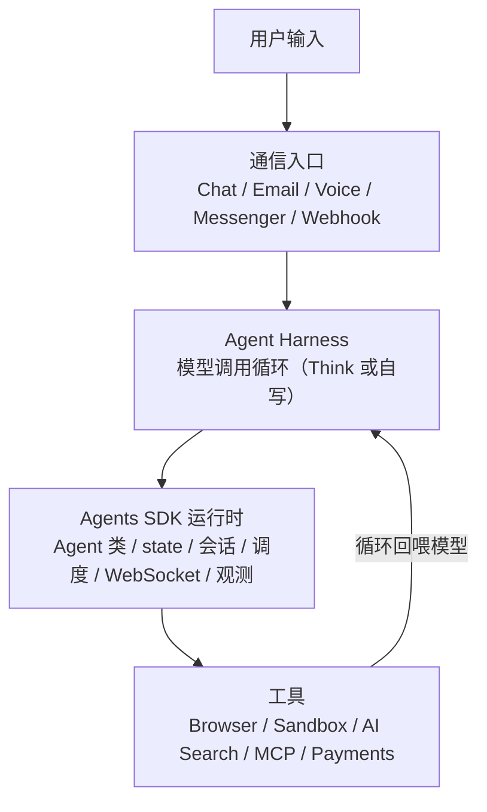

来源：[Cloudflare Agents 官网](https://agents.cloudflare.com/)、[Agents 开发文档](https://developers.cloudflare.com/agents/)、[cloudflare/agents](https://github.com/cloudflare/agents)。

---

#### 与同类工具的定位差异

几样东西名字都带 Agent，但定位完全不同，**不是替代关系，是分工关系**。

| 工具 | 在哪跑 | 有公网入口 | 有长期状态/记忆 | 能定时 | 主线定位 |
| --- | --- | --- | --- | --- | --- |
| **Claude Code / Codex** | 你的本地终端 / IDE | 否 | 否（会话结束即止） | 否 | 本地编程 Agent，帮你在机器上写代码、改代码、跑命令 |
| **`@cloudflare/think`** | Cloudflare 边缘，全球 | **是** | **是** | **是** | 云端版 Claude Code：同样的文件系统/技能/代码执行，但长期在线、有入口、能定时 |
| **Hermes** | 托管服务 | 由产品提供 | 有 | 受限 | 开箱即用的助理产品，不写代码也能用 |
| **Pi** | 本地为主 | 否 | 本地 | 否 | Agent 工具箱 / 框架，强调可塑性和本地掌控 |
| **Cloudflare Agents（平台）** | Cloudflare 边缘，全球 | **是** | **是** | **是** | 让任意 Agent 长期在线、有入口、有状态、能定时的运行平台 |

几个关键区分：

**1. Claude Code / Codex 是本地编程 Agent，Cloudflare Agents 是在线运行平台。** Claude Code 帮你写代码，价值在这次编程任务里；关掉终端它就停了。Cloudflare Agents 解决另一头：你写完一个 Agent 之后，怎么让它长期在线、能被用户和 webhook 找到、能记住之前的对话、能按计划定时执行。两者经常配合——用 Claude Code 把 Agent 写出来，再用 Cloudflare Agents 把它部署上线。

**2. `@cloudflare/think` 是"云端版 Claude Code"，是这套体系里最值得关注的东西。** Think 是 Agents SDK 里的一个高层基类（详见下文 [Think：云端版 Claude Code](#think-云端版-claude-code)），它把 Claude Code / Codex 在本地干的事——文件读写、技能系统、沙箱代码执行——搬到了云端，并且加上了长期在线、公网入口、定时任务、部署恢复。本地用 Claude Code 造 Agent，部署上去的 Agent 本身也可以是"云端 Claude Code"。

**3. Hermes 是成品助理，Cloudflare Agents 是运行平台。** Hermes 把"个人助理"这件事做完了，你开箱就用，但形态受产品边界限制。Cloudflare Agents 不替你定义助理长什么样，它给你公网入口、持久状态、定时调度、工具调用，助理本身是你自己设计的。

**4. Pi 是可改造的工具箱，Cloudflare Agents 是上线交付的平台。** 两者都强调"自己造"，但 Pi 偏本地掌控，Cloudflare Agents 偏交付和长期运行。Think 的设计明确致敬了 Pi（见 [think 包 README](https://github.com/cloudflare/agents/tree/main/packages/think)），可以理解为 Pi 的理念 + Cloudflare 的运行平台。

一句话定位：本地写代码用 Claude Code / Codex；要现成助理用 Hermes；要在本地自己造 Agent 用 Pi；要**让 Agent 长期在线、有入口、有状态、能定时**，用 Cloudflare Agents。

---

#### Think：云端版 Claude Code

`@cloudflare/think` 是 Agents SDK 里的一个高层基类，也是这套体系里最重磅的东西。它本质是"云端版 Claude Code / Codex"——把本地编程 Agent 的核心能力搬到了云端，再加上了长期在线、公网入口、定时任务、部署恢复。

#### 与 Claude Code / Codex 的能力对照

| 能力 | Claude Code / Codex（本地） | `@cloudflare/think`（云端） |
| --- | --- | --- |
| 文件读写 / 编辑 / grep | 本地文件系统 | `this.workspace` 虚拟文件系统，`read/write/edit/grep/bash` 自动给模型用 |
| Agent Skills | opencode 同格式的技能目录 | **同格式**的 Agent Skills，`activate_skill` / `read_skill_resource` / `run_skill_script` |
| 会话记忆 | 本次会话 | Session context blocks，持久记忆，重启不丢 |
| 执行命令 | 你手动敲 | `getScheduledTasks()`，"every day at 08:00" 这种 DSL，到点自己跑 |
| 运行位置 | 你的终端 | 部署完有公网 URL，能接 Telegram（Slack/Discord 在路上）+ Email + Webhook |
| 生命周期 | 关了就停 | 空闲休眠、来活唤醒、**部署/重启/驱逐能恢复在跑的对话** |
| 调用工具 | 一步步调 | 一步步调，或用 `codemode` 让模型直接写 TypeScript 跑沙箱里 |
| 扩展工具 | 你手动装 | extensions：模型自己写新工具代码、加载成沙箱 Worker、下一轮就能用 |

核心区别：Claude Code / Codex 是你本地的工具，关了就停；Think 是部署在 Cloudflare 上的，长期在线、有公网入口、能按计划定时执行、部署或重启能恢复在跑的对话。**本地用 Claude Code 造 Agent → 部署的 Agent 本身也可以是云端 Claude Code（Think）**，这是 AI 编程时代的新组合。

#### 基类选型

不是所有需求都该用 Think。官方在 [Agents 文档首页](https://developers.cloudflare.com/agents/) 给了一张选型表，按你的需求选基类：

| 你在构建 | 用什么 | 为什么 |
| --- | --- | --- |
| 有状态的后端逻辑、实时同步、自定义协议 | [`Agent`](https://developers.cloudflare.com/agents/api-reference/agents-api/) | 核心类：state、WebSocket、调度、SQL、子 Agent。对聊天和 LLM 没有预设 |
| 你自己掌控循环和流的聊天 UI | [`AIChatAgent`](https://developers.cloudflare.com/agents/api-reference/chat-agents/) | 薄聊天协议适配器，接 `useAgentChat`，循环和响应你自己写 |
| 持久的通用推理 Agent | [`Think`](https://developers.cloudflare.com/agents/api-reference/think/) | 自带 agentic loop、session、工具、记忆、压缩、恢复、多渠道投递 |
| 语音 Agent（语音进语音出） | [Voice mixins](https://developers.cloudflare.com/agents/api-reference/voice/) | `withVoice` 加实时 STT/TTS、打断、对话持久化 |
| 持久的多步骤流程（不是聊天） | [Workflows](https://developers.cloudflare.com/agents/api-reference/run-workflows/) | 长时运行、可重试的步骤编排 |

拿不准时：要原始构建块用 `Agent`，要一个已经把难活干完的聊天/推理 Agent 用 `Think`。

#### 内置工程能力

这些是手写容易出错、Think 已经内置的部分，也是判断"该不该用 Think"的依据：

- **Durable turns**：在跑的 LLM 对话能扛过 Durable Object 驱逐和部署，恢复执行而不是静默丢失。
- **Recovery-aware delivery**：回复快照成 `accepted`/`streaming`/`completed`，重启时重放没流完的答案、发安全的中断提示，不会重复发半截回复。
- **Durable submissions**：webhook 和 RPC 调用方带幂等键提交一个 turn，稍后查状态，不用一直占着请求。
- **Sessions**：树状历史，支持分支、压缩、全文检索，而不只是一个消息列表。
- **Human-in-the-loop**：一个 turn 能为审批或浏览器端工具暂停，稍后恢复，不会变成卡死的请求。
- **Messengers**：接 Telegram（Slack/Discord 在路上），每个 Chat SDK 线程跑在自己的 Think 子 Agent 里，避免上下文串线。
- **Workspace + Skills + Code execution**：虚拟文件系统、Agent Skills 目录、`codemode` 沙箱执行——云端 Claude Code 的那套能力。

#### 项目初始化

一条命令：

```bash
npm create think -- --template personal-assistant
```

六个模板可选（详见下文 [适用场景](#适用场景)）：`personal-assistant` / `coding-agent` / `customer-support` / `business-workflow` / `webhook-agent` / `basic`。拉下来改 `getModel` / `getSystemPrompt` / `getTools` / `getScheduledTasks` 四个方法就能上线。

> Think 目前标记为 Experimental，API 稳定但毕业前可能调整。详见 [Think 文档](https://developers.cloudflare.com/agents/api-reference/think/) 和 [think 包 README](https://github.com/cloudflare/agents/tree/main/packages/think)。

---

#### 适用场景

官方的 [think-starters](https://github.com/cloudflare/agents/tree/main/think-starters) 正好是一份场景菜单——六个模板对应六类典型用例，每个都是"一条命令拉下来、改改就能用"的起点。按你的需求对号入座：

think-starters 之外，还有三类典型场景有对应的官方实现：

**📧 邮件助理。** Cloudflare 官方开源的 [Agentic Inbox](https://github.com/cloudflare/agentic-inbox) 是一个完整的自托管邮件客户端，跑在 Workers 上：收信走 Email Routing，每个邮箱一个独立 Durable Object + SQLite，AI Agent 有 9 个邮件工具，能读 inbox、搜会话、起草回复。邮件是最典型的长期个人工作流——收信、分类、总结、起草、定时清理。

**👁️ 网页巡检。** 官方 [Browser Agent](https://developers.cloudflare.com/agents/examples/browser-agent/) 能浏览网页、检查页面、截图、调试前端。适合写一个实用小工具：每天自动检查你的网站有没有挂、页面有没有报错、截图有没有异常。

**🎙️ 语音 Agent。** SDK 的 [Voice mixins](https://developers.cloudflare.com/agents/api-reference/voice/)（`withVoice`）提供实时 STT/TTS、打断、对话持久化。适合做语音助手、电话客服这类语音进语音出的场景。

按"真实工作流"而非"聊天框"来选场景，是长期跑得下去的关键——下文 [生产运行要点](#生产运行要点) 第一条会展开。

来源：[think-starters](https://github.com/cloudflare/agents/tree/main/think-starters)、[awesome-agents](https://github.com/cloudflare/awesome-agents)、[Agents examples](https://developers.cloudflare.com/agents/examples/chat-agent/)。

---

#### 需求编写方法

#### 需求模板

给 AI 编程工具下需求时，把这六项说清楚，它就能准确出手：

1. **选哪个 starter**：从 [think-starters](https://github.com/cloudflare/agents/tree/main/think-starters) 六个里选一个起点，或从 [agents-starter](https://github.com/cloudflare/agents-starter) 起。说清用哪个。
2. **接什么入口**：Telegram / Slack / Discord / Email / Webhook / 纯网页聊天，选一个。入口决定 Agent 怎么被"找到"。
3. **要什么工具**：列出 Agent 要能调什么——查 GitHub、读文档、发邮件、调某个 API。工具是 Agent 的手脚。
4. **什么定时**：有没有要定时跑的任务？是"每天 8 点发 digest"还是"webhook 来了处理"？定时任务说清频率和内容。
5. **什么记忆**：要不要持久记忆？记住用户偏好、历史决策、长期上下文？说清记什么、记多久。
6. **用什么模型**：Workers AI（不要 API key，便宜）还是外部 provider（OpenAI / Anthropic，质量高但贵）。独立开发者优先 Workers AI 起步。

#### 官方文档投喂

AI 编程工具写得好不好，很看它能不能读到准确的官方资料。喂的时候用这三个：

- **[Agents LLMs.txt](https://developers.cloudflare.com/agents/llms.txt)**：官方给 AI 准备的文档索引，让 AI 先发现所有页面。把这个丢给 AI 工具，它能自己找到需要的 API 页。
- **对应的 think-starter 源码**：比如做个人助理，把 [personal-assistant starter](https://github.com/cloudflare/agents/tree/main/think-starters/personal-assistant) 的 `agent.ts` 丢给 AI，让它照着改。
- **[Think 文档](https://developers.cloudflare.com/agents/api-reference/think/)**：用 Think 时必喂，讲清 lifecycle hooks、session、scheduled tasks、messengers 这些关键概念。

#### 完整需求示例

```
用 @cloudflare/think 的 personal-assistant starter 做一个 Telegram 个人助理。

入口：Telegram（用 @cloudflare/think/messengers/telegram）
模型：Workers AI（@cf/moonshotai/kimi-k2.7-code），不要外部 API key
工具：
  - 查 GitHub：调 GitHub API 拿我最近一天的 commits
  - 总结链接：用户发一个 URL，Agent fetch 后用模型总结
  - 检查网页：fetch 一个 URL 看状态码和内容有没有变
定时：每天早上 9 点（Asia/Shanghai）总结我昨天的 GitHub 提交，发到 Telegram
记忆：记住我的 GitHub 用户名、Telegram chat id、关注的网页列表
权限：只读 + 定时发消息，不要任何写操作
部署：wrangler deploy 到我的 Cloudflare 账号

参考：
- think-starters/personal-assistant 的 agent.ts
- Think 文档的 getScheduledTasks 和 messengers 部分
- Agents LLMs.txt：https://developers.cloudflare.com/agents/llms.txt
```

这样的需求丢给 Codex / Claude Code，它能从拉 starter、改 agent、接 Telegram、配定时、到部署一条龙做完。你要做的是审它写出来的代码、确认定时任务幂等、盯第一周的账单。

---

#### 参考项目与生态

生态已经比早期丰富很多，按下面顺序看，正好是从入门到真实产品。

#### 官方入口

- [cloudflare/agents](https://github.com/cloudflare/agents)（推荐 SDK 源）：Agents SDK 本体，包含 `agents`、`@cloudflare/ai-chat`、`@cloudflare/think`、`@cloudflare/codemode`、`@cloudflare/voice` 等多个包。所有概念的源头。
- [cloudflare/agents-starter](https://github.com/cloudflare/agents-starter)（推荐入门）：三命令 starter，流式聊天、双端工具、human-in-the-loop、调度、vision 全接好。**默认用 Workers AI，不需要 API key。**
- [think-starters](https://github.com/cloudflare/agents/tree/main/think-starters)（推荐场景起点）：六个场景模板——`personal-assistant` / `coding-agent` / `customer-support` / `business-workflow` / `webhook-agent` / `basic`。每个都是"一条命令拉下来、改改就能用"的起点。
- [Cloudflare Agents 文档](https://developers.cloudflare.com/agents/)：概念、API、examples、tools、通信入口全在这里。

#### think-starters 六个模板

详见上文 [适用场景](#适用场景)。每个模板的命令是 `npm create think -- --template <名字>`，拉下来改 `getModel` / `getSystemPrompt` / `getTools` / `getScheduledTasks` 即可。

#### awesome-agents 收录项目

[cloudflare/awesome-agents](https://github.com/cloudflare/awesome-agents) 官方收录的社区/官方 Agent：

**1. [discord-agent](https://github.com/cloudflare/awesome-agents/blob/main/agents/discord-agent)（个人助理案例）** —— 住在 Discord DM 里的个人 AI Agent，跟你一对一。持久记忆（persona + user profile 两个记忆块，重启不丢）、自我编辑记忆（用 `memoryInsert`/`memoryReplace` 工具改自己的记忆）、滚动上下文（超过 50 条触发摘要）、MCP 集成、Web dashboard。

**2. [cloudflare-docs-discord-bot](https://github.com/cloudflare/awesome-agents/blob/main/agents/cloudflare-docs-discord-bot)（文档助手案例）** —— Discord bot，用自然语言问 Cloudflare 文档问题。Agents SDK + Cloudflare Docs MCP（做 RAG 检索）+ Workers AI，用 Durable Object state 存每个频道的聊天历史。

**3. [slack agent](https://github.com/cloudflare/awesome-agents/blob/main/agents/slack)（团队/社群助手案例）** —— 回复私信和频道 mention、维护 thread 上下文，一个部署服务多个 Slack workspace，每个 workspace 有独立隔离的 Agent 实例和存储。

**4. whatsapp agent** —— awesome-agents 新收录的 WhatsApp 集成。

#### 进阶案例

[Agents examples](https://developers.cloudflare.com/agents/examples/chat-agent/) 文档区有 30+ 完整示例，挑最像真实产品的几个重点看：

**5. [Agentic Inbox](https://github.com/cloudflare/agentic-inbox)（最像真实产品）** —— Cloudflare 官方开源的自托管邮件客户端，整个跑在 Workers 上。收信走 Email Routing，每个邮箱一个独立 Durable Object + SQLite，附件放 R2，AI Agent 有 9 个邮件工具。最适合证明"Cloudflare Agents 不只是聊天 demo，能做真实产品"。

**6. [Email Agent](https://developers.cloudflare.com/agents/examples/email-agent/)（邮件工作流基础）** —— 官方文档讲 Agents 如何收发邮件、路由 inbound、处理 follow-up。想做邮件助理，先看这个打基础，再看 Agentic Inbox 看完整产品。

**7. [Browser Agent](https://developers.cloudflare.com/agents/examples/browser-agent/)（网页巡检案例）** —— 能浏览网页、检查页面、截图、调试前端。官方明确：简单抓取直接 `fetch()` 就行，别滥用 Browser。

#### 生产化部署

**8. [auth0-lab/cloudflare-agents-starter](https://github.com/auth0-lab/cloudflare-agents-starter)（安全登录案例）** —— Auth0 官方实验室做的 starter，带 Auth0 登录流程、API 和 WebSocket 的 JWT 校验、按用户隔离数据。个人助理千万别裸奔——先做登录和权限。

#### 复杂行为设计参考

**9. [anthropic-patterns](https://github.com/cloudflare/agents/tree/main/guides/anthropic-patterns)（Agent 模式指南）** —— 基于 Anthropic 研究实现的五种 Agent 模式：Prompt Chaining、Routing、Parallelization、Orchestrator-Workers、Evaluator-Optimizer。每种都是一个可运行的 Durable Object demo。设计复杂 Agent 行为时，把这个丢给 AI 编程工具参考。

**10. [human-in-the-loop 指南](https://github.com/cloudflare/agents/tree/main/guides/human-in-the-loop)（人工审批模式）** —— `needsApproval`、`onToolCall`、`addToolApprovalResponse` 三种人工介入模式。做有写操作的 Agent 时必看。

来源：[awesome-agents](https://github.com/cloudflare/awesome-agents)、[agents-starter](https://github.com/cloudflare/agents-starter)、[think-starters](https://github.com/cloudflare/agents/tree/main/think-starters)、[agentic-inbox](https://github.com/cloudflare/agentic-inbox)、[auth0-lab/cloudflare-agents-starter](https://github.com/auth0-lab/cloudflare-agents-starter)、[Agents examples](https://developers.cloudflare.com/agents/examples/chat-agent/)。

---

#### 生产运行要点

七条，按"AI 编程工具不会主动替你判断"的视角组织。这些是它帮你把代码写好、部署好之后，长期跑得稳不稳的关键。

**1. 不要从通用聊天框开始，直接从一个真实工作流开始。** 通用聊天框会让你陷入"和 ChatGPT 有什么区别"的泥潭。给 AI 编程工具下需求时，直接挑一个具体的长期工作流：每天检查 GitHub + 文档更新 + 发摘要、定时提醒、保存链接并总结、检查网页是否更新。具体到能说出"它每天帮我做 X"，价值立刻清晰。

**2. 一个用户 / 一个项目 / 一个邮箱 / 一个 Slack workspace，对应一个 Agent 实例。** 这正好契合 Agents 的 durable identity 和独立状态设计。不要把所有人塞进一个全局 Agent（会变成瓶颈，参考主手册 [Durable Objects 避坑](/#为什么所有请求塞进一个-do-就成瓶颈)），按实体分片。

**3. 个人助理先做只读，再加写操作。** 先让它总结、提醒、监控、整理——这些错了也无害。后面再让它发邮件、改 issue、操作业务系统。能力分阶段放开，比一上来全权委托安全得多。给 AI 下需求时明确写"只读"。

**4. 高风险动作必须人工确认。** `agents-starter` 和 Think 都支持 `needsApproval` 审批工具。发邮件、改 issue、付款、删数据这类不可逆操作，先等确认再执行。和 [Queues 的逐条 ack](/#非幂等操作怎么避免重复执行) 是一个思路：幂等 + 显式确认。

**5. 长任务交给 Workflows，别塞进 Agent。** Agents 适合实时通信和状态管理；Workflows 适合**超过 30 秒、多步骤、需要重试、等待外部事件或人工审批**的流程。Agent 做"协调和入口"，Workflows 做"重活"。详见 [Run Workflows](https://developers.cloudflare.com/agents/runtime/execution/run-workflows/)。给 AI 下需求时，如果任务很长，明确说"用 Workflow 跑"。

**6. 网页自动化不要滥用 Browser。** 需要 DOM、截图、前端调试、JS 渲染内容时用 Browser Agent；普通抓取直接 `fetch()`。Browser Run 按浏览器时间计费，能用 `fetch` 拿到的内容走 Browser 是浪费。和主手册 [Browser Rendering](/#browser-rendering) 同一个原则。

**7. 盯住成本：按 CPU 时间算，但按量无上限。** Workers Paid 最低 $5/月；Agent 在等模型/休眠时不计 CPU 费——这是"挂着不动很便宜"的来源。但 Paid 下超额度会**自动按量计费，没有硬开关**。给 AI 下需求时让它开 Smart Placement、用 Hibernation、给单次请求设 CPU 上限。模型能 Workers AI 就别无脑上外部大模型，差价很大。详见下文 [成本与计费](#成本与计费)。

---

#### 成本与计费

Cloudflare Agents 没有单独的计费项——**按它底层用到的资源算**：Workers 请求、Workers CPU 时间、Durable Objects 请求和时长、DO SQLite 存储、Workers AI Neurons、R2（附件）、Email Sending。这些额度在主手册 [计费与额度](/#_3-计费与额度) 一节有完整对照，这里只点出和 Agent 相关的几条：

- **Free 能先试**：Workers 10 万请求/天、Durable Objects 10 万请求/天 + 1.3 万 GB-s/天、Workers AI 1 万 Neurons/天、DO SQLite 5 GB。跑个个人助理的 demo 和低频使用，Free 大概率够。
- **$5/月起的生产线**：Workers 1000 万请求/月、3000 万 CPU ms/月、Durable Objects 100 万请求/月 + 40 万 GB-s/月，外加能开 Containers、Email Sending、DO KV 后端。
- **关键卖点是"按 CPU 时间不是按在线时长"**：Agent 在等模型、等用户、休眠时不烧 CPU 费，配合 DO Hibernation，一个挂着不动的个人助理月账单可以很低。
- **报错型安全线**：Workers、D1、Durable Objects、Workers AI 在额度内超了会报错停止、不扣钱（Free）；升到 Paid 后这些变为按量自动计费，需要主动设防。
- **Workers AI 是大头变量**：1 万 Neurons/天 demo 够用，上量必升 Paid 且按 $0.011/千 Neurons 走，没有开关。模型选择直接决定成本。

> 最后提醒：升到 Paid = 失去 Free 的"超了报错、不扣钱"自动刹车。详细口径、超额价格、计费示例见主手册 [Paid ($5/月) 完整额度对比](/#paid-5-月-完整额度对比) 和 [成本控制](/#成本控制)。

来源：[Workers 定价](https://developers.cloudflare.com/workers/platform/pricing/)、[Durable Objects 定价](https://developers.cloudflare.com/durable-objects/platform/pricing/)、[Agents 文档](https://developers.cloudflare.com/agents/)。

---

#### 完整需求示例

把全篇收敛成一份能直接丢给 Codex / Claude Code 的需求文档。

做一个个人长期工作流助手，功能三件：

1. **每天定时提醒**（调度）
2. **保存链接并总结**（state + 调模型 + SQL 历史）
3. **检查一个网页是否更新**（`fetch` + 调度）

```
用 @cloudflare/think 的 personal-assistant starter 做一个个人长期工作流助手。

入口：纯网页聊天（先不接 Messenger，后续可加 Telegram）
模型：Workers AI（@cf/moonshotai/kimi-k2.7-code），不要外部 API key

功能（三件）：
1. 每天定时提醒
   - 用 getScheduledTasks 声明：每天 09:00（Asia/Shanghai）跑一次
   - 内容：检查我的 GitHub 昨天的 commits，总结成一条消息 broadcast 给前端
   - GitHub 用户名从 state 里读，初始为空，用户聊天时设置

2. 保存链接并总结
   - 工具 saveLink：用户发一个 URL，Agent fetch 后用模型总结，存进 this.sql 的 links 表
   - 工具 listLinks：列出已保存的链接和总结

3. 检查网页是否更新
   - 工具 watchPage：用户给一个 URL，Agent 存进 state.watchlist，fetch 一次存 hash
   - 定时任务：每天 10:00 遍历 watchlist，fetch 每个 URL 算 hash，和上次不同就 broadcast 提醒

记忆：
  - state（实时同步前端）：{ githubUser, watchlist: [{url, lastHash}] }
  - this.sql（历史查询）：links 表（url, summary, created_at）、reminders 表（content, created_at）

权限：只读 + 定时 broadcast，不要任何外部写操作
幂等：定时任务用 idempotencyKey，重复触发不重跑
部署：wrangler deploy 到我的 Cloudflare 账号

参考资源：
- think-starters/personal-assistant 的 agent.ts
- Think 文档：https://developers.cloudflare.com/agents/api-reference/think/
  重点看 getScheduledTasks、configureSession、workspace
- Agents LLMs.txt：https://developers.cloudflare.com/agents/llms.txt
- 主手册避坑：https://chendahuang.com/playbook/cloudflare/#为什么所有请求塞进一个-do-就成瓶颈
```

四步走，对应这篇的结构：

- **第一步**：把这份需求丢给 Codex / Claude Code，让它拉 personal-assistant starter、改 `agent.ts`、部署上去。
- **第二步**：本地 `npm run dev` 跑起来，验证三个功能——聊天设 GitHub 用户名、发链接看总结、加一个 watchlist 看第二天 10 点有没有提醒。
- **第三步**：接一个真实入口，比如 Telegram——加 `getMessengers()` 返回 telegram provider，抄 [discord-agent](https://github.com/cloudflare/awesome-agents/blob/main/agents/discord-agent) 的入口范式。
- **第四步**：加安全和边界——抄 [auth0-lab starter](https://github.com/auth0-lab/cloudflare-agents-starter) 做登录、给 watchPage 加幂等、盯第一周账单。

做完这三件事，你就拥有了一个**便宜、省服务器、能长期跑、有公网入口、有状态、有任务能力**的云端个人助理——这就是 Cloudflare Agents 价值的最小证明。

---

#### 官方资源

| 资源 | 用法 |
| --- | --- |
| [Cloudflare Agents 官网](https://agents.cloudflare.com/) | 产品定位与价值，四步管线视角 |
| [Agents 开发文档](https://developers.cloudflare.com/agents/) | 概念、API、examples、tools、通信入口、observability |
| [Think 文档](https://developers.cloudflare.com/agents/api-reference/think/) | 云端版 Claude Code：agentic loop、session、tools、memory、recovery、messengers |
| [Agents LLMs.txt](https://developers.cloudflare.com/agents/llms.txt) | 喂给 AI 编程工具的文档索引，让 AI 先发现所有页面 |
| [cloudflare/agents](https://github.com/cloudflare/agents) | Agents SDK 源码，含 agents / ai-chat / think / codemode / voice 等包 |
| [cloudflare/agents-starter](https://github.com/cloudflare/agents-starter) | 三命令入门 starter，能力地图，默认 Workers AI |
| [think-starters](https://github.com/cloudflare/agents/tree/main/think-starters) | 六个场景模板：personal-assistant / coding-agent / customer-support / business-workflow / webhook-agent / basic |
| [cloudflare/awesome-agents](https://github.com/cloudflare/awesome-agents) | 官方收录的 Agent 项目池（discord-agent / docs-discord-bot / slack / whatsapp） |
| [cloudflare/agentic-inbox](https://github.com/cloudflare/agentic-inbox) | 最像真实产品的自托管邮件客户端 Agent |
| [auth0-lab/cloudflare-agents-starter](https://github.com/auth0-lab/cloudflare-agents-starter) | 带 Auth0 登录的生产化 starter |
| [anthropic-patterns 指南](https://github.com/cloudflare/agents/tree/main/guides/anthropic-patterns) | 五种 Agent 模式：Chaining / Routing / Parallelization / Orchestrator-Workers / Evaluator |
| [human-in-the-loop 指南](https://github.com/cloudflare/agents/tree/main/guides/human-in-the-loop) | needsApproval / onToolCall / addToolApprovalResponse 三种人工介入模式 |
| [Run Workflows](https://developers.cloudflare.com/agents/runtime/execution/run-workflows/) | Agent + Workflows 组合，长任务该交给谁 |
| [Workers 定价](https://developers.cloudflare.com/workers/platform/pricing/) | Agent 底层资源的额度与价格 |

---


## 8. 域名

Cloudflare 只管 DNS 托管，不管买卖域名。域名在哪买、买什么后缀、买完怎么把 NS 指到 Cloudflare、要不要备案、要不要跨境转移——这一段单独拎成一篇子页讲清楚：比价的坑（**首年价 ≠ 续费价**）、各 TLD 的实务定位、改 NS 步骤、国内 vs 国外的差异、域名转移流程，以及 Cloudflare Registrar 不支持的后缀怎么兜底。

一句话记住：**注册商去便宜的地方买（比续费价）、DNS 永远托管到 Cloudflare**，这两个动作可以拆开做。

详细内容见在线子页：[域名购买、托管与转移](https://chendahuang.com/playbook/cloudflare/domain)

### 域名详细内容（节选自子页）

#### 买域名前先比价

域名是按年续费的长期资产，**注册商报的"价格"通常只是首年促销价，续费价才是你长期付的钱**。这是新手最大、最常见的坑。

#### 首次价 vs 续费价：三种价格要分清

注册商定价一般长这样：

- **首年促销价（first-year promo）**：新注册第一年很便宜，甚至 1 美元、9 块人民币。常见于 .com / .net / .xyz / .icu / .top。看价格别只看这一栏。
- **续费价（renewal price）**：第二年起按正常价续费，通常是首年价的 3–10 倍。这是你真正长期成本。
- **转入价（transfer-in price）**：把域名从别家转过来时的价格，通常等于"1 年续费价 + 转移操作"。转移成功后注册期限自动延长 1 年，所以这一步等于"提前续费"。

还要注意三类隐性成本：

- **WHOIS 隐私保护**（WHOIS Privacy / Redaction）：有的注册商按年收（早年 GoDaddy 收费），现在多数免费，但有例外。务必确认。Cloudflare、Porkbun、Spaceship、Namecheap 都免费。
- **DNS 托管费**：DNS 解析本身绝大多数免费，但部分注册商把"高级 DNS"当付费功能。你最终会上 Cloudflare 托管 DNS，这一项对你不构成成本。
- **转移 / 续费锁**：自动续费默认开启，部分注册商靠这个赚"忘记取消"的钱。建议关掉自动续费，到期前手动续，避免被溢价 .ai / .io 这种高价注册商套住。
- **汇率与币种**：境外注册商以美元 / 欧元结算，加上发卡行外汇手续费，实际价格比标价贵 1%–3%。.ai 这种 $70+/年的后缀，差额要算进总成本。

**比价永远比"续费价"那一栏，别被首年价骗了。**

#### 推荐的比价网站

| 工具 | 地址 | 用法 |
| --- | --- | --- |
| **Domcomp** | [domcomp.com](https://www.domcomp.com/) | 老牌域名比价站，按后缀列出主流注册商的首年价 + 续费价 + 转入价，一眼看清坑 |
| **TLD-List** | [tld-list.com](https://tld-list.com/) | 按后缀比较全球注册商价格，覆盖大量冷门 TLD，标了续费价和免费 WHOIS |
| **DomainTyper** | [domaintyper.com](https://domaintyper.com/) | 边输边查可用性，同时侧栏列出多家注册商价格，适合快速试名 |
| **Instant Domain Search** | [instantdomainsearch.com](https://instantdomainsearch.com/) | 实时可用性查询，速度快，可对比价格区间 |
| **IANA TLD 报告** | [iana.org/domains/root/db](https://www.iana.org/domains/root/db) | 查某个后缀的权威注册局（registry）和注册规则，搞不清归谁管时来这看 |
| **Cloudflare Registrar 价格页** | [developers.cloudflare.com/registrar](https://developers.cloudflare.com/registrar/) | Cloudflare 自己列出支持后缀的"成本价"，作为续费价基准线最直观 |

实务做法：**Domcomp / TLD-List 查首年+续费价 → IANA 查注册局规则 → Cloudflare Registrar 页核对成本基准线**。

#### 推荐注册商

| 注册商 | 特点 | 适合 |
| --- | --- | --- |
| **Cloudflare Registrar** | 续费成本价（批零价 + 0 加价），不赚续费差价；支持的 TLD 有限 | 长期持有的核心域名，能转进来就转进来 |
| **Spaceship**（推荐） | Namecheap 旗下新品牌，首年促销多、续费价低、WHOIS 隐私免费、支持后缀广 | 新注册、不想折腾 Cloudflare 不支持的后缀 |
| **Porkbun** | 价格低、界面清爽、WHOIS 隐私免费、支持 .ai / .io 等 | .ai / .io 这类 Cloudflare 不一定支持的后缀 |
| **Namecheap** | 老牌低价，稳定可靠 | 通用注册 |
| **阿里云 / 腾讯云**（国内） | 必须实名，价格中等，支持 .cn / .com.cn / .中国 | 需要备案的国内业务 |
| **GoDaddy** | 名气大但续费贵、 upsell 多 | 不推荐 |

个人项目优先级建议：**Cloudflare Registrar 续费成本最低 → Spaceship / Porkbun 注册覆盖面广 → 国内备案场景转阿里云/腾讯云。**

---

#### 域名后缀（TLD）怎么选

后缀不仅是外观，它会带来不同的**价格结构、注册规则、备案要求、安全和声誉影响**。常用后缀的实务定位：

| 后缀 | 注册局 / 管辖 | 典型价格（首年 / 续费，美元） | 适合 | 注意 |
| --- | --- | --- | --- | --- |
| **.com** | Verisign（美国） | $10 / $10 | 通用、商业、所有项目首选 | 最稳、流动性最好、二手市场大；买不到理想名字时考虑买二手 |
| **.net** | Verisign | $12 / $13 | 技术类、社区 | 是 .com 的退而求其次，别当首选 |
| **.org** | PIR | $10 / $11 | 非营利、开源项目 | 商业用途可能被质疑，不要乱用 |
| **.io** | 英国印度洋领地注册局 | $30 / $35 | 技术创业、SaaS、工具 | 续费偏贵；2024 年查戈斯群岛主权移交后，英国政府与毛里求斯已达成保留 .io 注册局的协议，**短期不受影响**，注册局续签中，长期持有需关注政策 |
| **.ai** | Anguilla 注册局 | $70 起 / $70 起，**最少买 2 年** | AI 产品、AI 创业公司 | 价格高、最低注册期 2 年规则各家执行略有差异；声誉好但贵 |
| **.app** / **.dev** / **.page** / **.day** / **.ing** 等 Google 注册局后缀 | Google | $12–$20 | 开发者、产品落地页 | **强制 HTTPS**（HSTS preload），没配 HTTPS 证书前页面打不开 |
| **.xyz** | Genesis / Generation X | $1 / $11 | 实验、临时项目、个人玩具 | 首年极便宜但**垃圾邮件/钓鱼声誉差**，做正经产品慎用 |
| **.co** | Colombia 注册局 | $20 / $25 | 创业、短域名替代 .com | "company" 联想，但续费比 .com 贵 |
| **.me** | Montenegro | $5/$20 | 个人主页、简历 | 首年促销多，续费价跳得明显 |
| **.sh** | St. Helena | $50 / $50 | shell / 命令行工具项目 | 贵但情怀满分，看个人偏好 |
| **.tech** | Radix | $5 / $45 | 技术博客、公司 | 首年极低、续费暴涨，典型坑 |
| **.cn** / **.com.cn** / **.中国** | CNNIC（中国） | ¥30 / ¥35 起 | 国内业务、备案 | **必须实名认证**；要在国内服务器上跑必须备案；境外注册商购买 .cn 也需 CNNIC 实名 |
| **.top** / **.icu** / **.live** / **.fun** 等 | 各国 | $1 / $5–$30 | 临时/实验 | 首年极便宜，SEO 与邮件声誉普遍差，谨慎做主品牌 |

几个实务判断：

- **能 .com 就 .com**：用户记得住、邮箱不进垃圾箱、二手转卖容易。理想名字被占时去二手市场（aftermarket）买，常用平台：Dan.com、Sedo、Afternic、Namesilo aftermarket。
- **AI / 技术创业走 .ai 或 .dev**：品牌识别度强，但 .ai 价格高、最少 2 年起，预算有限就先用 .com + 子路径。
- **.dev / .app / .page 这类 Google 后缀强制 HTTPS**：没部署好证书就配 NS 到 Cloudflare，站点会直接打不开。提前确认 Cloudflare 已出 Universal SSL。
- **避坑**：后缀首年价越低、续费价跳得越猛的，越是"续费套利"型注册商套路。看 Domcomp 续费价那一列。
- **续费日历提醒**：境外高价后缀（.ai / .io / .tech 等）建议**关掉自动续费**，用日历提醒在到期前 1 个月手动续；避免某天发现被按原价扣了 $80 还退不回来。
- **.cn / .中国 走国内**：涉及实名和备案，下一节国内 vs 国外专门讲。

---

#### 买完之后托管到 Cloudflare

域名买在哪不重要，**DNS 解析托管在哪才决定 CDN、SSL、WAF 这些功能能不能用**。把域名托管到 Cloudflare，意思是把"权威域名服务器（Authoritative Nameservers）"改成 Cloudflare 分配给你的那一对，之后所有 DNS 查询都由 Cloudflare 回答。

#### 为什么要托管到 Cloudflare

- 免费 CDN、免费 Universal SSL、免费基础 WAF/DDoS 防护、免费 DNS 解析。
- DNS 托管本身不收费，**你也不必在 Cloudflare Registrar 买域名**，别的注册商买的域名一样可以托管过来。
- 后续绑 Workers、Pages、R2 自定义域名、Email Routing，都要求域名先托管在 Cloudflare。

#### 在 Cloudflare 买域名 vs 别处买但托管到 CF

很多人把这两件事混在一起。其实它们是两个独立动作：

| 你在哪买域名 | 是否能托管到 CF DNS | 续费由谁收 | 适合 |
| --- | --- | --- | --- |
| **Cloudflare Registrar** | 自动托管（无需改 NS） | CF，按 ICANN 批零成本价，最便宜 | CF 支持的后缀 + 长期持有的核心域 |
| **Spaceship / Porkbun / Namecheap 等** | 需改 NS 到 CF（三步流程） | 原注册商 | CF 不支持的后缀（.ai / .io / .sh 等），或想保留多家注册商 |
| **阿里云 / 腾讯云** | 需改 NS 到 CF（需实名 + 短信验证） | 原注册商 | 国内备案场景 |

记住：**DNS 托管 ≠ 域名买卖**。CF Registrar 支持的后缀能省续费差价，不支持的就在别处买、DNS 照样托管到 CF。

#### 整体流程（三步）

1. 在 Cloudflare 控制台 **Add a site**，填入你的根域名（`example.com`），选择 Free 计划。
2. Cloudflare 会扫描你当前 DNS 并自动导入解析记录，然后给你分配两个 NS，例如 `sofia.ns.cloudflare.com` / `tom.ns.cloudflare.com`。
3. 回到**注册商后台**，把那两条老 NS 删掉、换成 Cloudflare 的两条，保存。等 5 分钟到 48 小时全球生效，Cloudflare 控制台会显示 "Active"。

#### 改域名服务器（NS）具体步骤

按注册商分别说一下，每家后台 UI 不同但路径类似：

**Cloudflare Registrar**：买的就在 Cloudflare，添加站点时会自动设好，无需手动改。

**Spaceship**：My Account → 域名列表 → 选中域名 → **Nameservers** → Custom nameservers → 填入 Cloudflare 给的两条 → 保存。

**Porkbun**：Domain Management → 选中域名 → **Edit Nameservers** → 选 Custom → 填两条 → Save。

**Namecheap**：Domain List → Manage → **Nameservers** → Custom DNS → 填入 → Save（绿色勾）。

**阿里云**：域名控制台 → 域名管理 → DNS 修改 → 把默认的 `dns*.hichina.com` 改成 Cloudflare 两条 → 提交，需短信验证码确认。

**腾讯云**：域名管理 → 选中域名 → DNS 服务器 → 修改 → 填入 → 保存，需短信验证。

#### 国内注册商改 NS 的注意点

- 部分注册商要求**实名认证通过后**才能改 NS，没实名的域名修改会被拦下。先去把实名搞完。
- 修改 NS 需要**短信验证码确认**，且变更后通常不能再频繁修改（防滥用），错改一两次可能锁几小时。
- `.cn` 域名改 NS 到 Cloudflare 是否合规：DNS 托管本身合规没问题，但**网站要面向国内正式运营还要备案**，备案时填的接入服务商和 NS 解析的提供商不是一回事，不影响备案本身；但**服务器在国内**会被接入商拦截。境外服务器 + Cloudflare NS 是常态。
- NS 修改全球生效最长 48 小时，但国内递归 DNS 缓存可能更长，耐心等。用 [dnschecker.org](https://dnschecker.org/) 看全球传播情况。

#### 灰云 vs 橙云（托管后的第一个选择）

DNS 记录配好之后，Cloudflare 后台每条记录旁边有个云图标：

- **橙云（Proxied）**：流量走 Cloudflare 全球网络，享受 CDN/WAF/SSL/DDoS。国内访问质量"看运气"。
- **灰云（DNS only）**：只走 Cloudflare DNS，直接指向你的源站 IP（可以是国内服务器或国内 CDN）。

国内源站或国内 CDN 指向场景就设灰云；海外加速、Workers/Pages 自定义域名场景必须橙云。一条一条切换即可，不是全局开关。详见主手册 [国内访问 → 橙云 vs 灰云](/#橙云-vs-灰云)。

#### DNSSEC：托管后建议立刻开

DNSSEC 给 DNS 解析加密码签名，防止解析被中间人篡改、域名被劫持。Cloudflare 全程免费。

开法：

1. Cloudflare 控制台 → 你的域名 → **DNS** → **Settings** → **DNSSEC** → **Enable DNSSEC**。
2. CF 自动生成 DS 记录，弹窗里给你 key tag / algorithm / digest type / digest。
3. 把这些参数填回**注册商后台的 DNSSEC 配置页**（多数注册商叫 "DS records" 或 "DNSSEC"）。
4. 等待全球传播（最长 48 小时），用 [dnschecker.org](https://dnschecker.org/) 查 `DS` 记录是否已全球可见。

开完后所有权威解析都带有 RRSIG 签名，递归解析器（如 1.1.1.1、8.8.8.8）会自动校验。**这一步是免费的"域名防伪"，强烈建议开**。注意：开 DNSSEC 期间不要再去改 NS，否则可能进入"签名失败"状态导致解析异常。

---

#### 国内买 vs 国外买

很多开发者在这件事上纠结，直接上对比表：

| 维度 | 国内注册商（阿里云 / 腾讯云 / 华为云 / 西部数码） | 国外注册商（Cloudflare / Spaceship / Porkbun / Namecheap） |
| --- | --- | --- |
| 实名认证 | **强制**，注册后必须实名（个人身份证或企业证件）才能解析 | 不需要 |
| ICP 备案 | **可在境内注册商做备案**（工信部批复的注册服务单位） | **不能备案**：Namecheap / Cloudflare / Porkbun / Spaceship / Name.com / GoDaddy 等多数不在工信部批复名单里 |
| 服务器在国内的合规 | 备案后可正常解析 80/443 | 服务器在国内但没备案 → 被接入商拦截 |
| 服务器在境外 | 无需备案 | 无需备案，访问看线路 |
| `.cn` / `.com.cn` / `.中国` | 直接买，实名后可解析 | 可买但多数仍要 CNNIC 实名（部分注册商不卖 .cn） |
| 支付 | 支付宝 / 微信 / 银联 | 信用卡 / PayPal，少数支持支付宝（Namecheap 支持） |
| 价格 | 中等，常有新人活动 | 首年促销多、续费大多更便宜 |
| WHOIS 隐私 | 部分收费，部分默认不公开（.cn 强制不公开） | 主流注册商免费 |
| 续费稳定性 | 监管下稳定，但价格回升 | 视注册局和汇率而定 |
| 客服 | 中文 / 工单 / 电话 | 英文 / 工单 / 部分有中文（Namecheap 无） |
| 域名转移出去 | 实名通过即可拿 EPP 码转出 | 拿 EPP 码即可转出 |
| 适合 | 国内正式经营、需要备案、企业业务 | 海外为主、个人项目、不打算备案 |

#### 结论

- **你要在国内服务器上跑网站并对公众开放**：必须备案 → **只能在工信部批复的境内注册商处买域名**（阿里云 / 腾讯云 / 华为云 / 西部数码）。境外域名要备案，得先把域名**转入**境内注册商。
- **你服务器在境外（含 Cloudflare）**：不需要备案，**强烈建议直接在境外买**：Cloudflare Registrar 续费成本价、Spaceship / Porkbun 价格低+WHOIS 隐私免费，体验和成本都更优。
- **域名本身会不会因为"没备案"被墙**：不会。被墙是内容问题，不是域名备案问题。境外服务器 + 未备案域名 + Cloudflare 代理是大量个人项目、文档站、开源项目的常态。
- **企业面向大陆正式运营**：绕不开备案，这是法律问题，详见主手册 [国内访问 → 备案这件事](/#备案这件事)。

---

#### 域名转移（Registrar Transfer）

域名转移 = 把域名从一个注册商换到另一个注册商。常见动机：续费太贵、要备案（境外转境内）、想统一在 Cloudflare 拿成本价续费。

#### 转移基本流程（5 步）

1. **解锁域名**：当前注册商后台找 "Transfer lock" / "Registrar lock" 关掉。
2. **拿 EPP Auth Code**（也叫 Authorization Code / 转移密码）：后台可自助获取，部分需工单。
3. **在新注册商发起转移**：输入域名 + EPP 码 + 付款（转移费通常 = 1 年续费价）。转移成功后注册期**自动延长 1 年**。
4. **确认转移**：发起后旧注册商会发邮件问是否同意（默认 5 天到期自动同意），CC 联系人邮箱里有链接可主动确认加速。
5. **等待 5–7 天**：转移完成，DNS 不受影响（NS 不会因转移而改变，除非你手动改）。

#### 注意事项

- **60 天锁**：注册后 60 天内、刚改过注册人信息 60 天内、刚转移进来 60 天内，都不能再次转移。这是 ICANN 规则，所有注册商统一。
- **续费宽限期**：域名过期后还有 0–45 天 "Renewal Grace Period"，期间可续费不解锁转移；超过进入 "Redemption Period"（赎回期，价格 $80+ 才能救回来），更超过就进入待删除，需要重新抢注。别拖到过期再转移。
- **特殊 TLD 转移规则不同**：
  - `.uk` / `.co.uk` 用 **IPS Tag** 而非 EPP 码，改 IPS Tag 到新注册商即可。
  - `.ca` 加拿大注册局有特别规则。
  - `.eu` 不能跨注册局转，只能在 EURid 体系内。
  - `.cn` 在境外注册商之间转移受 CNNIC 实名规则限制，部分不允许。
- **转入 Cloudflare Registrar**：转移成功后**续费按 Cloudflare 成本价**，长期持有"刚需"型域名建议转进来。但 Cloudflare Registrar **不支持所有 TLD**，转移前查支持列表（[支持的后缀清单](https://developers.cloudflare.com/registrar/)）。不支持的后缀（如部分 .ai、.sh）只能留在原注册商续费。

#### 国内 ↔ 境外互转的注意事项

- **境外 → 国内**（要备案）：常见操作。境外的 Namecheap / Cloudflare 域名拿 EPP 码，在新注册商（阿里云/腾讯云）发起转入，转入后域名在境内注册商名下，可走备案。转入会被要求实名认证。
- **国内 → 境外**（不要备案、省钱、统一管理）：拿 EPP 码发起转移。但**国内注册商可能以"实名审核未通过/正在备案"等理由限制转移**，极端情况要走工单。建议在域名到期前留出 1–2 个月缓冲。
- **转移期间 DNS 不中断**：NS 记录不会因为注册商变更而自动改，继续用原 Cloudflare NS。但要确保新注册商不会偷偷改回默认 NS（个别会），转移完成后第一时间核对 NS 仍是 Cloudflare 的两条。

#### 域名转移 vs 域名过户：两件不同的事

新手最容易混的两个概念：

| | 域名转移（Registrar Transfer） | 域名过户（Ownership Transfer） |
| --- | --- | --- |
| 做什么 | 换注册商 | 换持有人（owner） |
| 标志 | EPP Auth Code + 新注册商发起 | 改注册人信息 / 内部 push / 账户间转移 |
| 影响续费 | 影响，转移成功后按新注册商价续费 | 不影响，仍是原注册商 |
| 影响 DNS | 不影响（NS 不变） | 不影响 |
| ICANN 60 天锁 | 改注册人信息后 60 天内**禁止转移注册商**（部分注册商可豁免） | 过户后 60 天内**不能再改注册人信息**（部分注册商可豁免） |
| 常见场景 | 续费太贵、想统一在 CF、要备案 | 域名卖给别人、转给公司主体 |

**转移 = 换店续费；过户 = 换主人**。先把所有权稳住（过户），再决定是否换注册商（转移），两个动作不要同时进行，以免同时踩两个 60 天锁。

---

#### 搬不进 Cloudflare 怎么办

两种情况导致域名没法走标准 NS 托管：

#### 1. 注册商不允许改 NS（少见但有）

少数国内注册商的 `.cn` 域名或特殊后缀，强制使用其默认 NS，或改 NS 流程极麻烦。应对：

- **转出到允许改 NS 的注册商**（阿里云允许、Spaceship 允许），转完再改 NS。
- 实在改不了 → 用 **CNAME 接入**：保留原 NS，但把 `www` / 业务子域 CNAME 到 Cloudflare 给的 hostname（部分子域功能如 Workers 自定义域名支持 CNAME 接入，但根域 `@` 仍需 NS 接入）。CNAME 接入属于 Cloudflare 进阶能力（部分功能受限），优先还是想办法改 NS。

#### 2. Cloudflare Registrar 不支持该后缀

不影响 DNS 托管：**你在任何注册商买的域名，都能托管到 Cloudflare DNS**。Registrar 支不支持只影响"能不能在 Cloudflare 直接续费"。Cloudflare 不支持的 .ai / .sh / .io 等后缀，**在原注册商续费、DNS 照样托管到 Cloudflare**，这是很多人日常的做法。

#### 兜底方案

DNS 托管 ≠ 域名买卖。两个动作可以拆开：**注册商买便宜的地方买（比续费价）、DNS 永远托管到 Cloudflare**。能做到这一步，无论后缀贵贱、备案与否、国内国外，都能找到合理路径。

---

#### 官方资源

| 资源 | 用法 |
| --- | --- |
| [Cloudflare Registrar 文档](https://developers.cloudflare.com/registrar/) | 查 Cloudflare Registrar 支持的后缀、转入流程、限制 |
| [Cloudflare DNS 文档](https://developers.cloudflare.com/dns/) | 查 DNS 记录类型、NS 配置、解析排查 |
| [Cloudflare 域名转移指南](https://developers.cloudflare.com/registrar/get-started/transfer-to-cloudflare/) | 把域名转入 Cloudflare Registrar 的官方步骤 |
| [Domcomp](https://www.domcomp.com/) | 域名比价（首年 / 续费 / 转入） |
| [TLD-List](https://tld-list.com/) | 后缀价格与免费 WHOIS 对照 |
| [IANA Root Zone Database](https://www.iana.org/domains/root/db) | 查每个 TLD 的注册局和规则 |
| [ICANN Lookup](https://lookup.icann.org/) | 查域名注册商、注册期、到期日等公共信息 |

---

## 官方资源

| 资源 | 用法 |
| --- | --- |
| [Workers Best Practices](https://developers.cloudflare.com/workers/best-practices/workers-best-practices/) | 查 Workers 官方最佳实践 |
| [Workers Examples](https://developers.cloudflare.com/workers/examples/) | 找单点功能示例 |
| [create-cloudflare](https://developers.cloudflare.com/pages/get-started/c3/) | 用官方脚手架创建新项目 |
| [Workers Bindings](https://developers.cloudflare.com/workers/runtime-apis/bindings/) | 查 D1、R2、KV、Queues、AI 等绑定写法 |
| [Workers Limits](https://developers.cloudflare.com/workers/platform/limits/) | 查 CPU、subrequests、包大小、静态资源等平台限制 |
| [Wrangler](https://developers.cloudflare.com/workers/wrangler/) | 查本地开发、资源管理和部署命令 |
| [Pages](https://developers.cloudflare.com/pages/) | 查静态站和 Pages Functions 部署方式 |
| [China Network](https://developers.cloudflare.com/china-network/) | 查中国大陆网络和 ICP 相关要求 |
| [Cloudflare Support](https://developers.cloudflare.com/support/) | 查错误码、DNS、TLS、缓存和源站排查 |
| [Log Explorer](https://developers.cloudflare.com/logs/log-explorer/) | 查跨产品日志查询能力 |
| [AI Gateway](https://developers.cloudflare.com/ai-gateway/) | 查模型调用观测、缓存和日志策略 |
| [cloudflare/templates](https://github.com/cloudflare/templates) | 找官方起步模板 |
| [cloudflare/agents](https://github.com/cloudflare/agents) | 看 Agents SDK 官方示例 |
| [Cloudflare Pricing](https://developers.cloudflare.com/workers/platform/pricing/) | 查最新定价和免费额度 |
