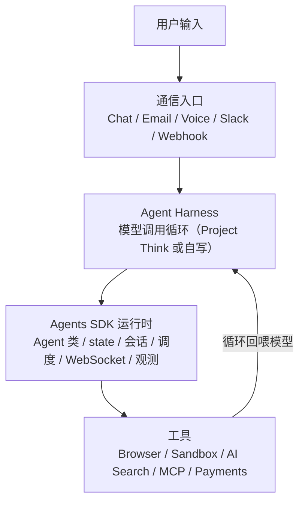

<script setup>
import { Bot, Server, Clock, Brain, Link, Sparkles, Workflow, Mail, Eye, Cpu, Network, BrainCircuit, Coins, Rocket, GitBranch, CircleCheck, BotMessageSquare, Plug, Code, FileText } from '@lucide/vue'
</script>

<section class="onepage-hero">
  <p class="onepage-kicker">Cloudflare Agents</p>
  <h1 class="onepage-title">不用服务器，跑一个长期在线的个人 AI 助手</h1>
  <p class="onepage-subtitle">Cloudflare Agents 是给 AI Agent 准备的「云端办公室」——有公网入口、有状态、有记忆、能定时干活、能调用工具，空闲时休眠、需要时唤醒。这篇讲清它和 Claude Code / Codex / Hermes / Pi 的区别，以及普通人怎么低成本跑一个长期在线的个人 AI 工作流。</p>
</section>

<div class="quick-grid">
  <a href="#它到底是什么"><div class="card-icon"><Bot /></div><div class="card-body"><strong>它到底是什么</strong><span>给 Agent 的云端办公室</span></div></a>
  <a href="#和那些工具的区别在哪"><div class="card-icon"><Network /></div><div class="card-body"><strong>区别在哪</strong><span>对比 Claude Code / Codex / Hermes / Pi</span></div></a>
  <a href="#它独特在哪价值在哪"><div class="card-icon"><Sparkles /></div><div class="card-body"><strong>独特与价值</strong><span>公网入口、状态、记忆、定时</span></div></a>
  <a href="#普通人能拿来做什么"><div class="card-icon"><BrainCircuit /></div><div class="card-body"><strong>能做什么</strong><span>个人助理、文档助手、邮件、Repo 管家</span></div></a>
  <a href="#十分钟跑起来一个长期在线助手"><div class="card-icon"><Rocket /></div><div class="card-body"><strong>快速上手</strong><span>agents-starter 三条命令</span></div></a>
  <a href="#最小可跑代码"><div class="card-icon"><Code /></div><div class="card-body"><strong>最小代码</strong><span>Agent 类 / state / 调度 / 调模型</span></div></a>
  <a href="#抄哪些项目能直接用"><div class="card-icon"><GitBranch /></div><div class="card-body"><strong>可抄项目</strong><span>官方 starter 与 awesome-agents</span></div></a>
  <a href="#最佳实践"><div class="card-icon"><CircleCheck /></div><div class="card-body"><strong>最佳实践</strong><span>七条长期跑得稳的经验</span></div></a>
  <a href="#成本和计费"><div class="card-icon"><Coins /></div><div class="card-body"><strong>成本和计费</strong><span>$5 起，按 CPU 时间算</span></div></a>
  <a href="#官方资源"><div class="card-icon"><Link /></div><div class="card-body"><strong>官方资源</strong><span>文档、模板、项目池</span></div></a>
</div>

## 它到底是什么

一句话：**Cloudflare Agents 是给 AI Agent 准备的「云端办公室」。**

Claude Code、Codex 像「会写代码的员工」，Hermes 像「包装好的个人助理」，Pi 像「可以自己改造的 Agent 工具箱」。Cloudflare Agents 做的是把这些 Agent 真正「上岗」：

- **公网入口**：Agent 部署完就有 URL，能被外部访问、被 webhook 打到、被聊天客户端连上。
- **有状态、有记忆**：每个 Agent 实例有自己的 durable identity、本地 SQLite 存储、实时连接，会话状态在重启和休眠后不丢。
- **能定时干活**：内置调度，支持延迟、定点、cron 三种定时方式，到点自动唤醒执行。
- **能调用工具**：Browser、Sandbox（代码执行）、AI Search、MCP、Payments，以及邮件收发。
- **空闲时休眠、需要时唤醒**：底层是 Durable Objects，没活的时候可以从内存里赶出去不计时长费，来消息时自动唤醒重跑构造函数。

技术底座是 Cloudflare 的 [Agents SDK](https://github.com/cloudflare/agents)，底层跑在 [Durable Objects](https://developers.cloudflare.com/durable-objects/) 上，部署一次就由 Cloudflare 全球网络承载，官方说能扩到「数千万个实例」。它把 Agent 从「本地 demo」变成「能长期在线服务用户的产品」。

<Workflow class="cat-icon" /> 这是它的四层结构，理解了这四层就知道一个 Agent 长什么样：



来源：[Cloudflare Agents 官网](https://agents.cloudflare.com/)、[Agents 开发文档](https://developers.cloudflare.com/agents/)、[cloudflare/agents](https://github.com/cloudflare/agents)。

---

## 和那些工具的区别在哪

这是这篇最该讲清楚的部分。这几样东西名字都带 Agent，但定位完全不同，**不是替代关系，是分工关系**。

| 工具 | 像什么 | 在哪跑 | 有公网入口吗 | 有长期状态/记忆吗 | 能定时干活吗 | 主线定位 |
| --- | --- | --- | --- | --- | --- | --- |
| **Claude Code / Codex** | 会写代码的员工 | 你的本地终端 / IDE | 否 | 否（会话结束即止） | 否 | 本地编程 Agent，帮你在机器上写代码、改代码、跑命令 |
| **Hermes** | 包装好的个人助理 | 托管服务 | 由产品提供 | 有 | 受限 | 开箱即用的助理产品，不写代码也能用 |
| **Pi** | 可以自己改造的 Agent 工具箱 | 本地为主 | 否 | 本地 | 否 | Agent 工具箱 / 框架，强调可塑性和本地掌控 |
| **Cloudflare Agents** | Agent 的云端办公室 | Cloudflare 边缘，全球 | **是，部署即有 URL** | **是，durable + SQLite** | **是，内置调度** | 让任意 Agent 长期在线、有入口、有状态、能定时的运行平台 |

几个关键区分：

**1. Claude Code / Codex 是「本地编程 Agent」，Cloudflare Agents 是「在线服务 Agent」。** Claude Code 帮你写代码，它的价值在你**这次编程任务**里；你关掉终端，它就停了，没有公网入口、没有长期状态。Cloudflare Agents 解决的是另一头：你写完一个 Agent 之后，怎么让它**长期在线**，能被用户、邮件、Slack、webhook 找到，能记住之前的对话，能每天到点干活。两者经常配合——用 Claude Code 把 Agent 写出来，再用 Cloudflare Agents 把它部署上线。

**2. Hermes 是「成品助理」，Cloudflare Agents 是「你自己的助理的运行平台」。** Hermes 帮你把「个人助理」这件事做完了，你开箱就用，但形态受产品边界限制。Cloudflare Agents 不替你定义助理长什么样，它给你办公楼、工位、门牌号、定时闹钟和工具间，助理本身是你自己设计的——做文档助手、邮件助理、Repo 管家都行。想要「成品」就 Hermes，想要「自己的、能上线的」就 Cloudflare Agents。

**3. Pi 是「可改造的工具箱」，Cloudflare Agents 是「上线交付的平台」。** 两者都强调「自己造」，但 Pi 偏本地掌控和可塑性，Cloudflare Agents 偏**交付和长期运行**：公网入口、durable 状态、定时任务、全球部署、按 CPU 计费。Pi 造的是工具，Cloudflare Agents 让造好的工具真正上岗。

**一句话定位**：本地写代码用 Claude Code / Codex；要现成助理用 Hermes；要在本地自己造 Agent 用 Pi；要**让 Agent 长期在线、有入口、有状态、能定时**，用 Cloudflare Agents。最适合做个人助理、文档助手、AI 客服、学习助教、GitHub Repo 管家，独立开发者很值得看。

---

## 它独特在哪、价值在哪

把区别落到能力上，Cloudflare Agents 真正打动人的是这几条，每条都直接对应「本地 demo 做不到、它做得到」：

**<Link class="svc-icon" /> 有公网入口。** Agent 部署完就是一个 URL，能接 webhook、能被聊天客户端连、能嵌进网页。本地 demo 永远卡在「怎么让别人访问到」这一步，Cloudflare 这一步是免费的。

**<Brain class="svc-icon" /> 有长期状态和记忆。** 每个 Agent 实例有 durable identity 和本地 SQLite 存储，会话状态、聊天历史、用户偏好在重启和休眠后都不丢。你不用自己搭数据库、不用自己管「上次聊到哪了」。

**<Clock class="svc-icon" /> 能定时干活。** `this.schedule()` 支持「60 秒后」「某个具体时间」「`0 8 * * *` 这种 cron」三种方式，任务存进 SQLite、底层用 Durable Object alarms 唤醒。提醒、日报、定时巡检这类「到点自己跑」的活，本地电脑得一直开着，这里天然支持。

**<Server class="svc-icon" /> 空闲休眠、需要唤醒。** 底层 Durable Objects 支持 Hibernation：没活的时候从内存里赶出去，不计 duration 费，WebSocket 连接保持打开，来消息自动唤醒。这是「长期在线又便宜」的关键。

**<Plug class="svc-icon" /> 工具齐全。** Browser（网页巡检/截图）、Sandbox（安全代码执行）、AI Search（语义检索）、MCP（接外部 API）、Payments、邮件收发，都是现成能调的。

**<Cpu class="svc-icon" /> 按 CPU 时间计费，不是按在线时长。** Agent 在等模型返回、等用户回复、休眠的时候都不算 CPU 费。一个挂着不动的个人助理，账单可以很低。

**价值很直接**：把 Agent 从本地 demo，变成能长期在线服务用户的产品。普通人不想买服务器、不想本地电脑一直开着，就把长期工作流丢到 Cloudflare 上跑——便宜、有公网入口、有状态、能定时。

来源：[cloudflare/agents](https://github.com/cloudflare/agents)、[Agents 开发文档](https://developers.cloudflare.com/agents/)、[Durable Objects WebSocket best practices](https://developers.cloudflare.com/durable-objects/best-practices/websockets/)。

---

## 普通人能拿来做什么

按「真实工作流」而非「聊天框」来分，这些是 Cloudflare Agents 最自然的落点：

<div class="scenario-grid">
  <a href="#抄哪些项目能直接用" class="scenario-card"><strong><BotMessageSquare /> 个人助理</strong><span>住在 Discord / Slack 私信里的长期助手，有持久记忆、到点提醒、上下文管理</span></a>
  <a href="#抄哪些项目能直接用" class="scenario-card"><strong><FileText /> 文档助手</strong><span>把这本手册、macOS / Codex Playbook 做成问答 Agent，用户直接问、Agent 查文档答</span></a>
  <a href="#抄哪些项目能直接用" class="scenario-card"><strong><Mail /> 邮件助理</strong><span>收信、分类、总结、起草回复、定时清收件箱，最典型的长期个人工作流</span></a>
  <a href="#抄哪些项目能直接用" class="scenario-card"><strong><Bot /> AI 客服</strong><span>多轮对话 + 工具调用 + 会话状态，一个部署服务多个客户/工作区</span></a>
  <a href="#抄哪些项目能直接用" class="scenario-card"><strong><GitBranch /> GitHub Repo 管家</strong><span>webhook 进来总结 issue、每天发项目 digest、高风险操作人工确认</span></a>
  <a href="#抄哪些项目能直接用" class="scenario-card"><strong><Eye /> 学习助教 / 网页巡检</strong><span>定时检查网站有没有挂、页面有没有报错、截图有没有异常</span></a>
</div>

来源：[awesome-agents 项目列表](https://github.com/cloudflare/awesome-agents)、[Agents examples](https://developers.cloudflare.com/agents/examples/chat-agent/)。

---

## 十分钟跑起来一个长期在线助手

入门第一站是 [cloudflare/agents-starter](https://github.com/cloudflare/agents-starter)。它已经把该有的都接好了，**默认用 Workers AI，不需要先配 OpenAI API Key**，三条命令就能跑。

```bash
npx create-cloudflare@latest --template cloudflare/agents-starter
cd agents-starter && npm install
npm run dev
```

跑起来你就能在一个页面里看到 agents-starter 体现的 Cloudflare Agents 全部基本价值：

- **流式 AI 聊天** —— 基于 Workers AI，边生成边出字。
- **server-side 工具**（自动执行）和 **client-side 工具**（浏览器执行）—— 两种工具调用范式都示范了。
- **human-in-the-loop 审批** —— 标了 `needsApproval` 的工具会等你确认才执行。
- **定时任务** —— 一次性、延迟、cron 三种调度都有示例。
- **图片输入（vision）** —— 拖拽/粘贴/点击传图给支持视觉的模型。
- **WebSocket 自动重连 + 消息持久化** —— 断线重连不丢上下文。

把这个 starter 当成「Cloudflare Agents 能力地图」：聊天、工具、定时、人工确认、状态持久化，一次看全。改一改 prompt 和工具，就是你的第一个个人助理。

来源：[cloudflare/agents-starter](https://github.com/cloudflare/agents-starter)、[Agents quick start](https://developers.cloudflare.com/agents/getting-started/)。

---

## 最小可跑代码

看懂三件事就够上手：**Agent 类**、**state**、**调度 + 调模型**。

### 1. Agent 类：一个 Agent 的骨架

一个 Agent 就是继承 `Agent` 的一个类，配 `name` 和若干方法。

```ts
import { Agent } from "agents";

// 一个长期在线的「个人工作流」助手
export class PersonalAgent extends Agent<Env> {
  // 初始 state：实时同步给所有连接的客户端
  initialState = { typing: [], unreadCount: 0, lastRun: "" };

  // 收到 WebSocket 消息时
  async onMessage(connection, message) {
    const { prompt } = JSON.parse(message);
    await this.handle(prompt, connection);
  }
}
```

### 2. state：实时同步的 UI 状态 + 本地 SQL 历史

Cloudflare Agents 把存储分成两层，别混用：

- **`this.state` / `this.setState()`** —— 实时同步给所有 WebSocket 客户端的 UI 状态，自动落本地 SQLite、自动广播、自动触发 `onStateChanged`。放小的、实时要给前端看的东西：计数器、打字状态、活跃会话。要求 JSON 可序列化，日期用 ISO 字符串别用 `Date`。
- **`this.sql`** —— 每个 Agent 自带的本地 SQLite，零延迟，用标签模板。放历史的、要查询的大块数据：消息历史、链接库、任务日志。

```ts
// 实时 UI 状态：写完自动广播给前端
this.setState({ ...this.state, unreadCount: this.state.unreadCount + 1 });

// 本地 SQL：可查询的历史数据
const recent = this.sql`
  SELECT * FROM messages ORDER BY created_at DESC LIMIT ${limit}
`;
```

官方建议：**state 放小、放实时；SQL 放大、放历史。**

### 3. 调度：让 Agent 到点自己干活

`this.schedule()` 三种用法，任务存进 SQLite、底层用 Durable Object alarms 唤醒，重启不丢：

```ts
// 60 秒后跑一次 sendReminder
await this.schedule(60, "sendReminder", { message: "看邮件" });

// 指定时间跑
await this.schedule(new Date("2026-06-25T09:00:00Z"), "morningDigest", {});

// 每天 8 点跑（cron，自动续期，幂等）
await this.schedule("0 8 * * *", "dailyDigest", {});
```

回调就是 Agent 类上**同名的方法**，到点 SDK 会带着 payload 调它；方法不存在会抛异常。`cron` 默认幂等（同 callback + cron + payload 去重），延迟/定点任务要自己加 `{ idempotent: true }`。

### 4. 调模型：Workers AI 默认，也能换 OpenAI / Anthropic

Agents SDK 底层用 [Vercel AI SDK](https://sdk.vercel.ai/)（`ai` 包），provider 可换。Workers AI 直接用 `ai` binding，**不要 API key**：

```ts
import { streamText } from "ai";
import { createWorkersAI } from "workers-ai-provider";

async function handle(this: PersonalAgent, prompt: string, conn) {
  const workersai = createWorkersAI({ binding: this.env.AI });
  const result = streamText({ model: workersai("@cf/zai-org/glm-4.7-flash"), prompt });
  for await (const chunk of result.textStream) {
    conn.send(JSON.stringify({ type: "chunk", content: chunk }));
  }
  conn.send(JSON.stringify({ type: "done" }));
}
```

换外部 provider 只要换 adapter：OpenAI 用 `@ai-sdk/openai` 的 `openai("gpt-4o")`，Anthropic 用 `@ai-sdk/anthropic`。不想用 AI SDK 也可以直接 `this.env.AI.run(...)`。

来源：[State](https://developers.cloudflare.com/agents/runtime/lifecycle/state/)、[Schedule tasks](https://developers.cloudflare.com/agents/runtime/execution/schedule-tasks/)、[Using AI models](https://developers.cloudflare.com/agents/runtime/operations/using-ai-models/)。

---

## 抄哪些项目能直接用

Cloudflare Agents 生态还早，第三方成品不算多，但**官方 starter、examples、awesome-agents 里已经有一批能直接抄架构的案例**。按下面顺序看，正好是从入门到真实产品。

### 官方入口

- [cloudflare/agents](https://github.com/cloudflare/agents)（推荐 SDK 源）：Agents SDK 本体，每个 Agent 有自己的 state、storage、lifecycle，支持实时通信、定时任务、AI 调用、MCP、Workflows，空闲休眠、需要唤醒，按用户/会话/房间粒度创建很多实例。所有概念的源头。
- [cloudflare/agents-starter](https://github.com/cloudflare/agents-starter)（推荐入门）：上文那个三命令 starter，流式聊天、双端工具、human-in-the-loop、调度、vision 全接好。
- [cloudflare/awesome-agents](https://github.com/cloudflare/awesome-agents)（推荐项目池）：官方收录的社区/官方 Agent 合集，目前收了三个可直接参考的项目（见下）。
- [Cloudflare Agents 文档](https://developers.cloudflare.com/agents/)：概念、API、examples、tools、通信入口全在这里。

### awesome-agents 里的三个项目

这是目前 `cloudflare/awesome-agents` 收录的全部 Agent，每一个都值得抄：

**1. [discord-agent](https://github.com/cloudflare/awesome-agents/blob/main/agents/discord-agent)（个人助理案例）** —— 一个住在 Discord DM 里的个人 AI Agent，跟你一对一，不在服务器频道里。特性：持久记忆（persona + user profile 两个记忆块，重启不丢）、**自我编辑记忆**（用 `memoryInsert`/`memoryReplace` 工具改自己的记忆）、滚动上下文（超过 50 条触发摘要、砍掉最旧的 70%）、MCP 集成、Web dashboard。底层 Durable Objects：`DiscordGateway` 管 WebSocket 连接，`MyAgent` 管记忆和消息。默认走 OpenRouter 的 `moonshotai/kimi-k2-0905`，可换 Claude Sonnet 4 / GPT-4o / Workers AI。

> 这个最适合讲「普通人的价值」：不想买服务器、不想本地电脑一直开，就把长期工作流放到 Cloudflare 上跑。

**2. [cloudflare-docs-discord-bot](https://github.com/cloudflare/awesome-agents/blob/main/agents/cloudflare-docs-discord-bot)（文档助手案例）** —— 一个 Discord bot，用自然语言问 Cloudflare 文档问题。技术栈：Agents SDK + **Cloudflare Docs MCP**（注意：这里 MCP 是做 RAG 检索，不是当可调用工具）+ Workers AI（默认 Qwen 2.5 Coder 32B，可换 GPT-4o-mini），用 Durable Object state 存每个频道的聊天历史，`/reset` 清上下文。`/ask` 问问题、`/help` 看用法、`/reset` 清历史。

> 这个是「文档助手」方向的最佳参考——也是这本 Playbook 最该学的范式：把 Cloudflare / macOS / Codex / AI Coding Playbook 各做成一个问答 Agent，用户不用翻目录直接问，Agent 查文档答，还能记录大家最常问什么。

**3. slack agent（团队/社群助手案例）** —— [awesome-agents](https://github.com/cloudflare/awesome-agents) 里收录的 Slack Agent，能回复私信和频道 mention、维护 thread 上下文，**一个部署服务多个 Slack workspace，每个 workspace 有独立隔离的 Agent 实例和存储**。官方文档版见 [Slack agent](https://developers.cloudflare.com/agents/examples/slack-agent/)。

> 适合「给社群或小团队做个 AI 助手」：群里有人问、Agent 查上下文答，每天整理频道摘要。

### 官方 examples 文档里的进阶案例

[Agents examples](https://developers.cloudflare.com/agents/examples/chat-agent/) 文档区有完整的官方示例，挑最像真实产品的两个重点看：

**4. [Agentic Inbox](https://github.com/cloudflare/agentic-inbox)（最像真实产品）** —— Cloudflare 官方开源的**自托管邮件客户端**，整个跑在 Cloudflare Workers 上。收信走 Cloudflare Email Routing，**每个 mailbox 一个独立 Durable Object + SQLite**，附件放 R2，AI Agent 有 9 个邮件工具，能读 inbox、搜会话、起草回复（默认 `@cf/moonshotai/kimi-k2.5`）。架构图清楚：Browser → Hono Worker → MailboxDO（SQLite + R2）+ EmailAgent DO（AIChatAgent + Workers AI）。

> 这个最适合证明「Cloudflare Agents 不只是聊天 demo，能做真实产品」。邮件是最典型的长期个人工作流：收信、分类、总结、起草回复、定时处理。

**5. [Email Agent](https://developers.cloudflare.com/agents/examples/email-agent/)（邮件工作流基础）** —— 官方文档讲 Agents 如何收发邮件、路由 inbound、处理 follow-up。需要 Cloudflare EmailService 接入域名、配 outbound email binding、把 inbound mail 路由到 Worker。想做邮件助理，先看这个打基础，再看 Agentic Inbox 看完整产品。

**6. [Browser Agent](https://developers.cloudflare.com/agents/examples/browser-agent/)（网页巡检案例）** —— 官方 Browser Agent 能浏览网页、检查页面、截图、调试前端，通过 Browser Run 工具让模型写 JS 调 Chrome DevTools Protocol。官方明确：适合查 DOM、样式、accessibility tree、网络瀑布、console errors、截图、性能分析；**简单抓取直接 `fetch()` 就行，别滥用 Browser**。

> 适合写个实用小教程：「每天自动检查我的网站有没有挂、页面有没有报错、截图有没有异常。」普通人和独立开发者都懂的长期工作流。

### 生产化必看

**7. [auth0-lab/cloudflare-agents-starter](https://github.com/auth0-lab/cloudflare-agents-starter)（安全登录案例）** —— Auth0 官方实验室做的 Cloudflare Agents starter，带 Auth0 登录流程、API 和 WebSocket 的 JWT 校验、按用户隔离数据。带 client chat app + Agent。

> 个人助理千万别裸奔——先做登录和权限。生产化注意事项看这个。

### 最新模板方向

[cloudflare/agents releases](https://github.com/cloudflare/agents/releases) 里近期加了两个适合教程后半段的 starter：

- **webhook-agent** —— 接 inbound webhook，用 durable、idempotent submission 处理。典型：GitHub webhook 来了，Agent 总结 issue。
- **business-workflow** —— back-office operations agent，带人工审批和 scheduled digest。典型：每天定时发项目 digest，高风险操作先走人工确认。

> 这两个最有「长期工作流」的味道。

来源：[awesome-agents](https://github.com/cloudflare/awesome-agents)、[agents-starter](https://github.com/cloudflare/agents-starter)、[agentic-inbox](https://github.com/cloudflare/agentic-inbox)、[auth0-lab/cloudflare-agents-starter](https://github.com/auth0-lab/cloudflare-agents-starter)、[Agents examples](https://developers.cloudflare.com/agents/examples/chat-agent/)。

---

## 最佳实践

七条，按「普通人低成本跑一个长期在线的个人 AI 工作流」来组织。

**1. 不要从通用聊天框开始，直接从一个真实工作流开始。** 通用聊天框会让你陷入「和 ChatGPT 有什么区别」的泥潭。直接挑一个具体的长期工作流：每天检查 GitHub + 文档更新 + 发摘要、定时提醒、保存链接并总结、检查网页是否更新。具体到能说出「它每天帮我做 X」，价值立刻清晰。

**2. 一个用户 / 一个项目 / 一个邮箱 / 一个 Slack workspace，都可以对应一个 Agent。** 这正好契合 Agents 的 durable identity 和独立状态设计。不要把所有人塞进一个全局 Agent（会变成瓶颈，参考主手册 [Durable Objects 避坑](/#为什么所有请求塞进一个-do-就成瓶颈)），按实体分片，一个 Agent 实例管一个对象的长期状态。

**3. 个人助理先做只读，再加写操作。** 先让它总结、提醒、监控、整理——这些错了也无害。后面再让它发邮件、改 issue、操作业务系统。能力分阶段放开，比一上来全权委托安全得多。

**4. 高风险动作必须人工确认。** `agents-starter` 已经有 `needsApproval` 审批工具，直接拿来讲。发邮件、改 issue、付款、删数据这类不可逆操作，先等确认再执行。和 [Queues 的逐条 ack](/#非幂等操作怎么避免重复执行) 是一个思路：幂等 + 显式确认。

**5. 长任务交给 Workflows，别塞进 Agent。** Agents 适合实时通信和状态管理；Workflows 适合**超过 30 秒、多步骤、需要重试、等待外部事件或人工审批**的流程。Agent 做「协调和入口」，Workflows 做「重活」，两者可以组合——Queue/Agent 做缓冲入口，为每条消息起一个 Workflow 实例做复杂处理。详见主手册 [Workflows](/#workflows) 和 [Queues vs Workflows](/#queues-和-workflows-怎么选)，以及 [Run Workflows](https://developers.cloudflare.com/agents/runtime/execution/run-workflows/)。

**6. 网页自动化不要滥用 Browser。** 需要 DOM、截图、前端调试、JS 渲染内容时用 Browser Agent；普通抓取直接 `fetch()`。Browser Run 按浏览器时间计费，能用 `fetch` 拿到的内容走 Browser 是浪费。和主手册 [Browser Rendering](/#browser-rendering) 同一个原则：能用服务端模板直接生成的内容，不必上浏览器渲染。

**7. 盯住成本：按 CPU 时间算，但按量无上限。** Workers Paid 最低 $5/月，包含 Workers、Pages Functions、KV、Hyperdrive、Durable Objects 使用量，以及每月 1000 万请求、3000 万 CPU ms；Workers Free 也能先试。Agent 在等模型/休眠时不计 CPU 费——这是「挂着不动很便宜」的来源。但 Paid 下超额度会**自动按量计费**，没有硬开关。建议：开 Smart Placement 让 Agent 跑在工具附近省跳数；长连接用 Hibernation（参考主手册 [WebSocket 长连接怎么省费](/#websocket-长连接怎么省费)）；给单次请求设 CPU 上限防一个 bug 吃光额度（见主手册 [成本控制](/#成本控制)）。模型能 Workers AI 就别无脑上外部大模型，差价很大。

---

## 成本和计费

Cloudflare Agents 没有单独的计费项——**按它底层用到的资源算**：Workers 请求、Workers CPU 时间、Durable Objects 请求和时长、DO SQLite 存储、Workers AI Neurons、R2（附件）、Email Sending。这些额度在主手册 [计费与额度](/#_3-计费与额度) 一节有完整对照，这里只点出和 Agent 相关的几条：

- **Free 能先试**：Workers 10 万请求/天、Durable Objects 10 万请求/天 + 1.3 万 GB-s/天、Workers AI 1 万 Neurons/天、DO SQLite 5 GB。跑个个人助理的 demo 和低频使用，Free 大概率够。
- **$5/月起的生产线**：Workers 1000 万请求/月、3000 万 CPU ms/月、Durable Objects 100 万请求/月 + 40 万 GB-s/月，外加能开 Containers、Email Sending、DO KV 后端。
- **关键卖点是「按 CPU 时间不是按在线时长」**：Agent 在等模型、等用户、休眠时不烧 CPU 费，配合 DO Hibernation，一个挂着不动的个人助理月账单可以很低。
- **报错型安全线**：Workers、D1、Durable Objects、Workers AI 在额度内超了会报错停止、不扣钱（Free）；升到 Paid 后这些变为按量自动计费，需要主动设防。
- **Workers AI 是大头变量**：1 万 Neurons/天 demo 够用，上量必升 Paid 且按 $0.011/千 Neurons 走，没有开关。模型选择直接决定成本。

> 最后提醒：升到 Paid = 失去 Free 的「超了报错、不扣钱」自动刹车。详细口径、超额价格、计费示例见主手册 [Paid ($5/月) 完整额度对比](/#paid-5-月-完整额度对比) 和 [成本控制](/#成本控制)。

来源：[Workers 定价](https://developers.cloudflare.com/workers/platform/pricing/)、[Durable Objects 定价](https://developers.cloudflare.com/durable-objects/platform/pricing/)、[Agents 文档](https://developers.cloudflare.com/agents/)。

---

## 一个最小教程：个人长期工作流助手

把上面收敛成一篇最容易让普通人心动、让开发者看懂独特性的入门。功能只做三件：

1. **每天定时提醒**（调度）
2. **保存链接并总结**（state + 调模型 + SQL 历史）
3. **检查一个网页是否更新**（`fetch` + 调度）

四步走，对应这篇的结构：

- **第一步**：跑 `agents-starter`，看到聊天、工具、定时任务、人工确认、状态持久化——认识能力地图。
- **第二步**：改成 Personal Agent，做提醒、链接整理、网页监控——落地到「自己的工作流」。
- **第三步**：接一个真实入口，比如 Discord、Slack、Email、Webhook——让 Agent 真正「上岗」，有公网入口能被找到。入口范式抄 [discord-agent](https://github.com/cloudflare/awesome-agents/blob/main/agents/discord-agent) 和 [Email Agent](https://developers.cloudflare.com/agents/examples/email-agent/)。
- **第四步**：加安全和边界，比如登录（抄 [auth0-lab starter](https://github.com/auth0-lab/cloudflare-agents-starter)）、只读权限、人工确认、任务日志——从 demo 走向长期可靠。

做完这三件事，你就拥有了一个**便宜、省服务器、能长期跑、有公网入口、有状态、有任务能力**的云端个人助理——这就是 Cloudflare Agents 独特性的最佳证明。

---

## 官方资源

| 资源 | 用法 |
| --- | --- |
| [Cloudflare Agents 官网](https://agents.cloudflare.com/) | 产品定位与价值，四步管线视角 |
| [Agents 开发文档](https://developers.cloudflare.com/agents/) | 概念、API、examples、tools、通信入口、observability |
| [Agents LLMs.txt](https://developers.cloudflare.com/agents/llms.txt) | 喂给 AI 的文档索引，让 AI 先发现所有页面 |
| [cloudflare/agents](https://github.com/cloudflare/agents) | Agents SDK 源码与概念说明 |
| [cloudflare/agents-starter](https://github.com/cloudflare/agents-starter) | 三命令入门 starter，能力地图 |
| [cloudflare/awesome-agents](https://github.com/cloudflare/awesome-agents) | 官方收录的 Agent 项目池（discord-agent / docs-discord-bot / slack） |
| [cloudflare/agentic-inbox](https://github.com/cloudflare/agentic-inbox) | 最像真实产品的自托管邮件客户端 Agent |
| [auth0-lab/cloudflare-agents-starter](https://github.com/auth0-lab/cloudflare-agents-starter) | 带 Auth0 登录的生产化 starter |
| [cloudflare/agents releases](https://github.com/cloudflare/agents/releases) | webhook-agent / business-workflow 等新模板 |
| [Run Workflows](https://developers.cloudflare.com/agents/runtime/execution/run-workflows/) | Agent + Workflows 组合，长任务该交给谁 |
| [Workers 定价](https://developers.cloudflare.com/workers/platform/pricing/) | Agent 底层资源的额度与价格 |
