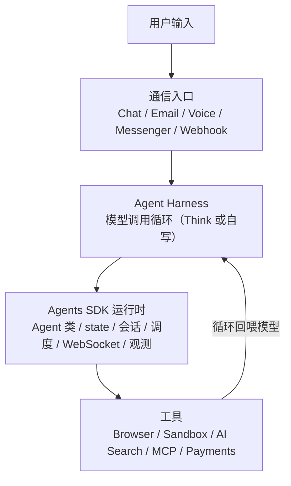

<script setup>
import { Network, Cpu, Brain, BrainCircuit, Code, GitBranch, CircleCheck, Coins, Rocket, Link, User, Terminal, TrendingUp } from '@lucide/vue'
</script>

<section class="onepage-hero">
  <p class="onepage-kicker">Cloudflare Playbook</p>
  <h1 class="onepage-title">Cloudflare Agents</h1>
  <p class="onepage-subtitle">让 AI Agent 长期在线的运行平台——你的 Agent 常住云端，24 小时在线、能记住、能主动。</p>
</section>

<div class="quick-grid">
  <a href="#产品定位"><div class="card-icon"><Network /></div><div class="card-body"><strong>产品定位</strong><span>长期在线的 Agent 运行平台</span></div></a>
  <a href="#与同类工具的定位差异"><div class="card-icon"><Cpu /></div><div class="card-body"><strong>与同类工具的定位差异</strong><span>Claude Code / Codex / Think 的分工</span></div></a>
  <a href="#think-云端版-claude-code"><div class="card-icon"><Brain /></div><div class="card-body"><strong>Think：云端版 Claude Code</strong><span>把 Claude Code 搬到云端</span></div></a>
  <a href="#适用场景"><div class="card-icon"><BrainCircuit /></div><div class="card-body"><strong>适用场景</strong><span>工作向 + 生活向 对号入座</span></div></a>
  <a href="#一个人以前做不到现在能做到"><div class="card-icon"><User /></div><div class="card-body"><strong>一个人能做什么</strong><span>从租 VPS 到月 $5 上线一个在线 Agent</span></div></a>
  <a href="#本地--云端agent-时代的协作工作流"><div class="card-icon"><Terminal /></div><div class="card-body"><strong>本地 ↔ 云端协作</strong><span>人在本地改，Agent 在云端跑</span></div></a>
  <a href="#从自用到收费"><div class="card-icon"><TrendingUp /></div><div class="card-body"><strong>从自用到收费</strong><span>自用 → 朋友用 → 收钱的进阶路径</span></div></a>
  <a href="#需求编写方法"><div class="card-icon"><Code /></div><div class="card-body"><strong>需求编写方法</strong><span>不会写代码也能用：会写需求就行</span></div></a>
  <a href="#参考项目与生态"><div class="card-icon"><GitBranch /></div><div class="card-body"><strong>参考项目与生态</strong><span>starter、examples、awesome-agents</span></div></a>
  <a href="#生产运行要点"><div class="card-icon"><CircleCheck /></div><div class="card-body"><strong>生产运行要点</strong><span>七条容易漏的边界条件 + 账单翻车姿势</span></div></a>
  <a href="#成本与计费"><div class="card-icon"><Coins /></div><div class="card-body"><strong>成本与计费</strong><span>$5 起，按 CPU 时间算 + 免费额度换算</span></div></a>
  <a href="#完整需求示例"><div class="card-icon"><Rocket /></div><div class="card-body"><strong>完整需求示例</strong><span>可直接丢给 AI 的需求文档</span></div></a>
  <a href="#官方资源"><div class="card-icon"><Link /></div><div class="card-body"><strong>官方资源</strong><span>文档、模板、项目池</span></div></a>
</div>

## 产品定位

Cloudflare Agents 是 Cloudflare 的 AI Agent 运行平台。底层是 [Durable Objects](https://developers.cloudflare.com/durable-objects/)——一种有持久状态、能休眠唤醒、按实例隔离的边缘计算单元（可以理解成"每个 Agent 独占一个带本地数据库的小进程，没活时会被赶出内存，来活时自动重建"）。你在它上面跑一个 Agent，这个 Agent 就具备五项本地 demo 做不到的能力：

- **公网入口**：部署完就是一个 URL，能被外部访问、被 webhook 打到、被聊天客户端连上。
- **持久状态与记忆**：每个 Agent 实例有自己的 durable identity（一个不会变的身份 ID）和本地 SQLite，会话状态、聊天历史、用户偏好在重启和休眠后都不丢。
- **定时执行**：内置调度，支持延迟、定点、cron 三种方式，任务存进 SQLite、到点自动唤醒。
- **工具调用**：Browser（网页巡检/截图）、Sandbox（代码执行）、AI Search、MCP、Payments，以及邮件收发。
- **空闲休眠、按需唤醒**：没活的时候从内存里赶出去不计时长费，来消息时自动唤醒重跑构造函数。这是"长期在线又便宜"的来源。

部署一次就由 Cloudflare 全球网络承载，官方说能扩到数千万个实例。

技术栈是 [Agents SDK](https://github.com/cloudflare/agents)，底层跑在 Durable Objects 上。SDK 现在已经长成一个完整生态（见下文 [Think：云端版 Claude Code](#think-云端版-claude-code) 和 [参考项目与生态](#参考项目与生态)），不只是早期的裸 Agent 类。

官网把一个 Agent 的结构归纳成四层，理解这四层就知道它长什么样：



来源：[Cloudflare Agents 官网](https://agents.cloudflare.com/)、[Agents 开发文档](https://developers.cloudflare.com/agents/)、[cloudflare/agents](https://github.com/cloudflare/agents)。

---

## 与同类工具的定位差异

几样东西名字都带 Agent，但定位完全不同，**不是替代关系，是分工关系**。

| 工具 | 在哪跑 | 有公网入口 | 有长期状态/记忆 | 能定时 | 主线定位 |
| --- | --- | --- | --- | --- | --- |
| **Claude Code / Codex** | 你的本地终端 / IDE | 否 | 否（会话结束即止） | 否 | 本地编程 Agent，帮你在机器上写代码、改代码、跑命令 |
| **`@cloudflare/think`** | Cloudflare 边缘，全球 | **是** | **是** | **是** | 云端版 Claude Code：同样的文件系统/技能/代码执行，但长期在线、有入口、能定时 |
| **Hermes** | 托管服务 | 由产品提供 | 有 | 受限 | 开箱即用的助理产品，不写代码也能用 |
| **Pi** | 本地为主 | 否 | 本地 | 否 | Agent 工具箱 / 框架，强调可塑性和本地掌控 |
| **Cloudflare Agents（平台）** | Cloudflare 边缘，全球 | **是** | **是** | **是** | 让任意 Agent 长期在线、有入口、有状态、能定时的运行平台 |

表格已经把定位讲清楚了，下面只补几条表格看不出来的判断：

**Claude Code / Codex 和 Cloudflare Agents 经常配合着用。** Claude Code 帮你写代码，价值在这次编程任务里，关掉终端就停了；Cloudflare Agents 解决另一头——你写完一个 Agent 之后，怎么让它长期在线、能被用户和 webhook 找到、能记住之前的对话、能按计划定时执行。用 Claude Code 把 Agent 写出来，再用 Cloudflare Agents 部署上线，是一条很自然的链路。

**`@cloudflare/think` 是这套体系里最值得展开讲的部分。** Think 是 Agents SDK 里的一个高层基类（详见下文 [Think：云端版 Claude Code](#think-云端版-claude-code)），它把 Claude Code / Codex 在本地干的事——文件读写、技能系统、沙箱代码执行——搬到了云端，再加长期在线、公网入口、定时任务、部署恢复。本地用 Claude Code 造 Agent，部署上去的 Agent 本身也可以是"云端 Claude Code"。

**Hermes 和 Cloudflare Agents 的区别是"成品"和"原料"。** Hermes 把"个人助理"这件事做完了，开箱就用，形态受产品边界限制；Cloudflare Agents 不替你定义助理长什么样，给你公网入口、持久状态、定时调度、工具调用，助理本身你自己设计。不想写代码、想要现成助理，选 Hermes；愿意自己造、想要形态自由，选 Cloudflare Agents。

**Pi 和 Cloudflare Agents 都强调"自己造"，但一个偏本地，一个偏交付。** Pi 偏本地掌控，Cloudflare Agents 偏长期在线运行。Think 的设计明确致敬了 Pi（见 [think 包 README](https://github.com/cloudflare/agents/tree/main/packages/think)），可以理解成 Pi 的理念 + Cloudflare 的运行平台。

---

## Think：云端版 Claude Code

> Think 目前标记为 Experimental，API 稳定但毕业前可能调整。下面的判断建立在这个前提上：选型时把它当"值得押注但要做好 API 可能变"的东西，详见 [Think 文档](https://developers.cloudflare.com/agents/api-reference/think/) 和 [think 包 README](https://github.com/cloudflare/agents/tree/main/packages/think)。

`@cloudflare/think` 是 Agents SDK 里的一个高层基类。它本质是"云端版 Claude Code / Codex"——把本地编程 Agent 的核心能力搬到了云端，再加长期在线、公网入口、定时任务、部署恢复。

### 与 Claude Code / Codex 的能力对照

| 能力 | Claude Code / Codex（本地） | `@cloudflare/think`（云端） |
| --- | --- | --- |
| 文件读写 / 编辑 / grep | 本地文件系统 | `this.workspace` 虚拟文件系统，`read/write/edit/grep/bash` 自动给模型用 |
| Agent Skills | opencode 同格式的技能目录 | **同格式**的 Agent Skills，`activate_skill` / `read_skill_resource` / `run_skill_script` |
| 会话记忆 | 本次会话 | Session context blocks，持久记忆，重启不丢 |
| 定时 / 调度 | 无（关了就停） | `getScheduledTasks()`，"every day at 08:00" 这种 DSL，到点自己跑 |
| 运行位置 | 你的终端 | 部署完有公网 URL，能接 Telegram（Slack/Discord 在路上）+ Email + Webhook |
| 生命周期 | 关了就停 | 空闲休眠、来活唤醒、**部署/重启/驱逐能恢复在跑的对话** |
| 调用工具 | 一步步调 | 一步步调，或用 `codemode` 让模型直接写 TypeScript 跑沙箱里 |
| 扩展工具 | 你手动装 | extensions：模型自己写新工具代码、加载成沙箱 Worker、下一轮就能用 |

Claude Code / Codex 是你本地的工具，关了就停；Think 是部署在 Cloudflare 上的，长期在线、有公网入口、能按计划定时执行、部署或重启能恢复在跑的对话。**本地用 Claude Code 造 Agent → 部署的 Agent 本身也可以是云端 Claude Code（Think）**。

### 基类选型

不是所有需求都该用 Think。官方在 [Agents 文档首页](https://developers.cloudflare.com/agents/) 给了一张选型表，按你的需求选基类：

| 你在构建 | 用什么 | 为什么 |
| --- | --- | --- |
| 有状态的后端逻辑、实时同步、自定义协议 | [`Agent`](https://developers.cloudflare.com/agents/api-reference/agents-api/) | 核心类：state、WebSocket、调度、SQL、子 Agent。对聊天和 LLM 没有预设 |
| 你自己掌控循环和流的聊天 UI | [`AIChatAgent`](https://developers.cloudflare.com/agents/api-reference/chat-agents/) | 薄聊天协议适配器，接 `useAgentChat`，循环和响应你自己写 |
| 持久的通用推理 Agent | [`Think`](https://developers.cloudflare.com/agents/api-reference/think/) | 自带 agentic loop、session、工具、记忆、压缩、恢复、多渠道投递 |
| 语音 Agent（语音进语音出） | [Voice mixins](https://developers.cloudflare.com/agents/api-reference/voice/) | `withVoice` 加实时 STT/TTS、打断、对话持久化 |
| 持久的多步骤流程（不是聊天） | [Workflows](https://developers.cloudflare.com/agents/api-reference/run-workflows/) | 长时运行、可重试的步骤编排 |

拿不准时：要原始构建块用 `Agent`，要一个已经把难活干完的聊天/推理 Agent 用 `Think`。

**反过来也要说一句：如果你的需求就是"调一次 LLM 回答个问题"，别上 Think。** Think 自带 session、recovery、调度、多渠道投递，这些都要付 DO 时长费和维护成本。一次性的问答用裸 `Worker` + `AI` binding 就够了，上 Think 是杀鸡用牛刀。Think 的价值在"长期在线、有状态、要恢复"这三件事上，缺一不可时才值得。

### 内置工程能力

这些是手写容易出错、Think 已经内置的部分，也是判断"该不该用 Think"的依据：

- **Durable turns**：在跑的 LLM 对话能扛过 Durable Object 驱逐和部署，恢复执行而不是静默丢失。自己写长期在线 Agent，部署一次就把用户正在跑的对话丢了，是最常见的返工来源。
- **Recovery-aware delivery**：回复快照成 `accepted`/`streaming`/`completed`，重启时重放没流完的答案、发安全的中断提示，不会重复发半截回复。自己写最容易出的 bug 就是重启后把半截回复又发一遍，用户看到两条重复消息。
- **Durable submissions**：webhook 和 RPC 调用方带幂等键提交一个 turn，稍后查状态，不用一直占着请求。webhook 重试是常态，没幂等键会重复处理同一个事件。
- **Sessions**：树状历史，支持分支、压缩、全文检索，而不只是一个消息列表。对话一长，线性列表既占 token 又没法检索，压缩和分支是省 token 的关键。
- **Human-in-the-loop**：一个 turn 能为审批或浏览器端工具暂停，稍后恢复，不会变成卡死的请求。有写操作的 Agent 不加这个，审批就只能靠人盯，请求会一直挂着超时。
- **Messengers**：接 Telegram（Slack/Discord 在路上），每个 Chat SDK 线程跑在自己的 Think 子 Agent 里，避免上下文串线。一个 Agent 服务多个人时，不隔离就会把 A 的对话漏给 B。
- **Workspace + Skills + Code execution**：虚拟文件系统、Agent Skills 目录、`codemode` 沙箱执行——云端 Claude Code 的那套能力。下面单独讲 `codemode` 和 `extensions`，因为这是 Think 区别于"调一次 LLM"的本质。

### codemode 和 extensions：Agent 自己给自己写代码

这两项是 Think 最有"Agent 时代"特征的能力，单独拎出来讲：

**`codemode`** —— 平时调工具是"模型说要调 X，运行时执行 X 返回结果"。`codemode` 是另一条路：模型直接写一段 TypeScript，运行时把它丢进沙箱 Worker 跑，返回执行结果。好处是遇到"现有工具凑不出来"的临时逻辑，模型不用等你加工具，自己写一段就能跑。这是"Agent 能写代码"而不只是"Agent 能调工具"的分界线。

**`extensions`** —— 更进一步：模型写一段新工具的代码，运行时把它加载成沙箱 Worker，**下一轮对话这个新工具就能用了**。意味着 Agent 在跑的过程中能自己长出新能力，不是写死在部署时的工具集里。这是"Agent 自己写自己"的最小形态。

对独立开发者来说，这两个能力意味着你不用一开始就把所有工具想全——先部署一个最小 Agent，让它自己根据需要长工具。

### 项目初始化

一条命令：

```bash
npm create think -- --template personal-assistant
```

六个模板可选（详见下文 [适用场景](#适用场景)）：`personal-assistant` / `coding-agent` / `customer-support` / `business-workflow` / `webhook-agent` / `basic`。拉下来改 `getModel` / `getSystemPrompt` / `getTools` / `getScheduledTasks` 四个方法就能上线。

---

## 适用场景

官方的 [think-starters](https://github.com/cloudflare/agents/tree/main/think-starters) 是一份场景菜单——六个模板对应六类典型用例，每个都是"一条命令拉下来、改改就能用"的起点。先看工作向的六个官方模板：

<div class="scenario-grid">
  <a href="#think-云端版-claude-code" class="scenario-card"><strong>💬 Personal Assistant</strong><span>有持久记忆、能定时主动执行的个人助理。典型：每天早上总结你的 GitHub 提交发到 Telegram</span></a>
  <a href="#think-云端版-claude-code" class="scenario-card"><strong>💻 Coding Agent</strong><span>云端编程 Agent，有虚拟文件系统、技能系统、沙箱代码执行。典型：让用户在网页里跟一个"云端 Claude Code"对话</span></a>
  <a href="#think-云端版-claude-code" class="scenario-card"><strong>🎧 Customer Support</strong><span>客服 Agent，带订单查询工具和转人工技能。典型：电商网站的 AI 客服</span></a>
  <a href="#think-云端版-claude-code" class="scenario-card"><strong>✅ Business Workflow</strong><span>带人工审批的后台操作 Agent。典型：退款超过 $100 要人工确认、每天发运营 digest</span></a>
  <a href="#think-云端版-claude-code" class="scenario-card"><strong>🔗 Webhook Agent</strong><span>幂等处理外部 webhook 事件。典型：GitHub webhook 进来总结 issue、重复 POST 不重跑</span></a>
  <a href="#think-云端版-claude-code" class="scenario-card"><strong>🤖 Basic</strong><span>最小聊天 Agent，流式响应、消息持久化、断线恢复。适合作为自定义起点</span></a>
</div>

### 给自己造的实用小工具（自我自动化）

上面六个偏"做产品"。独立开发者用 Think 最高频的其实是给自己造工具——盯自己的东西、自动化自己的琐事。这一类官方模板没专门做，但用 `personal-assistant` 或 `basic` 起手都行：

- **盯自己几个项目的 uptime**：定时 fetch 自己部署的几个站点，挂了发 Telegram。
- **每天总结自己的 GitHub 活动**：拉自己昨天所有 repo 的 commits/PRs/issues，发一条 digest。
- **盯网页更新**：学校官网、抢购页、某人的博客，定时算 hash，变了就提醒（下面完整需求示例就是这个）。
- **自动处理自己邮箱里某类邮件**：账单到了归档+总结、订阅邮件汇总成一条、特定发件人来了立刻转发。
- **RSS/订阅源降噪**：把一堆订阅源拉进来，AI 过一遍只把和兴趣相关的发给你。
- **盯一个数字**：汇率、股价、某个 API 的剩余额度，到阈值提醒。

这一类的共同点：**是给自己用的长期工作流，不是聊天框**。部署完它每天自己跑，你只在它提醒你时看一眼。这是 Think"长期在线 + 定时 + 有状态"三个能力同时用上的场景，也是最贴独立开发者日常的场景。

### 生活向场景（给不写代码的人）

如果你不是开发者，想用 AI 帮自己处理生活里的事，这些是能直接对号入座的：

- **盯快递/订单**：下单后自动盯物流状态，有进展发条消息。
- **盯学校/幼儿园通知**：官网一有新通知就提醒，不用自己每天刷。
- **总结订阅邮件**：newsletter 订了一堆没空看，让 Agent 每周汇总成一条。
- **家庭备忘**：记家人的生日、缴费日、保险续期，提前提醒。
- **买菜/家务轮值**：按周期提醒谁该做什么，能记住轮到谁了。
- **盯一个活动开抢**：演唱会、抢票、限时优惠，页面一变就提醒。

生活向场景的入口选 Telegram 或微信（通过第三方桥）最顺手——你已经天天开着它，Agent 发的消息你能立刻看到。你不需要会写代码，把上面任意一条写成需求丢给 Claude Code / Codex，它能照着 [需求编写方法](#需求编写方法) 帮你做出来。

### 官方实现对应的三类场景

think-starters 之外，还有三类典型场景有对应的官方实现：

**📧 邮件助理。** Cloudflare 官方开源的 [Agentic Inbox](https://github.com/cloudflare/agentic-inbox) 是一个完整的自托管邮件客户端，跑在 Workers 上：收信走 Email Routing，每个邮箱一个独立 Durable Object + SQLite，AI Agent 有 9 个邮件工具，能读 inbox、搜会话、起草回复。邮件是最典型的长期个人工作流——收信、分类、总结、起草、定时清理。

**👁️ 网页巡检。** 官方 [Browser Agent](https://developers.cloudflare.com/agents/examples/browser-agent/) 能浏览网页、检查页面、截图、调试前端。适合写一个实用小工具：每天自动检查你的网站有没有挂、页面有没有报错、截图有没有异常。

**🎙️ 语音 Agent。** SDK 的 [Voice mixins](https://developers.cloudflare.com/agents/api-reference/voice/)（`withVoice`）提供实时 STT/TTS、打断、对话持久化。适合做语音助手、电话客服这类语音进语音出的场景。

选场景时按"真实工作流"挑，别从"通用聊天框"起手——下文 [生产运行要点](#生产运行要点) 第一条会展开。

来源：[think-starters](https://github.com/cloudflare/agents/tree/main/think-starters)、[awesome-agents](https://github.com/cloudflare/awesome-agents)、[Agents examples](https://developers.cloudflare.com/agents/examples/chat-agent/)。

---

## 一个人，以前做不到现在能做到

这一节是给独立开发者看的。Cloudflare Agents 真正的价值不在"又一个跑 LLM 的地方"，而在"一个人现在能做到以前只有团队才做的事"。

**以前做一个 24 小时在线的 Agent 要什么：** 租一台 VPS 或小服务器、写守护进程保证它不挂、自己搭 cron 跑定时任务、自己用文件或数据库存对话状态、自己接 webhook 处理入口、自己处理重启后状态恢复、自己管 SSL 和域名、月底盯着服务器账单。这些活加起来，往往比写 Agent 本身还多。一个人做兼职项目，光是"让它稳定在线"这一摊就能耗掉所有精力。

**现在用 Cloudflare Agents + Think：** 一个 Workers + Think 基类，公网入口、持久状态、定时调度、重启恢复、休眠唤醒全内置。你只写 Agent 本身的逻辑（`getModel` / `getSystemPrompt` / `getTools` / `getScheduledTasks` 四个方法），剩下平台兜底。月 $5 起，挂着不动几乎不花钱（按 CPU 时间算，不是按在线时长）。

**一个长期在线、能被外部找到、能记住对话、能按计划干活的 Agent，从团队级工程降到了一个人一个下午就能上线的程度。** 以前你想到一个 Agent 点子，卡在"谁来保证它 24h 在线"这一步就放弃了；现在这一步被平台吃掉了。

再往前一步：因为 Agent 能长期在线、能定时、能调用工具，它开始能**替代你的一部分例行工作**——不是帮你回答问题，是替你干活。每天盯网站、每周汇总邮件、每次 GitHub 有动静帮你分类、每次有账单帮你归档。这些事以前要么自己手动做，要么雇人做，现在可以部署一个 Agent 让它自己跑。

---

## 本地 ↔ 云端：Agent 时代的协作工作流

Agent 时代出现了一个新的协作结构：**人在本地写代码，Agent 在云端长期跑**。这不是"部署完就走"的传统模式，而是两条线一直配合。

**第一条线：本地 Claude Code ↔ 云端 Think 的开发循环。**

```
本地 Claude Code 写/改 agent.ts
        ↓ wrangler deploy
云端 Think 长期在线跑（有状态、定时、接 Telegram）
        ↓ 出问题 / 想加功能
本地 Claude Code 改代码 → 重新 deploy → 云端恢复在跑的对话
```

关键点：**Think 的 Durable turns 让你重新部署时不会打断用户正在进行的对话**。传统部署是"停服务 → 换代码 → 启动"，在线 Agent 这么干会丢用户对话。Think 帮你把在跑的 turn 快照下来，部署完恢复执行。所以这个循环可以高频跑——发现 bug 立刻改、立刻部署，不用担心打断用户。

**第二条线：Agent 在云端自己写代码（codemode / extensions）。**

这是上一节 [codemode 和 extensions](#codemode-和-extensionsagent-自己给自己写代码) 讲的：Agent 遇到现有工具凑不出来的逻辑，自己写 TypeScript 跑沙箱；甚至自己写新工具代码、加载进运行时，下一轮就能用。这条线里**本地开发者只做 review**，写代码的是云端 Agent 自己。

两条线合起来，Agent 时代的开发模式变成：

- **人在本地**：写 Agent 的骨架、定 system prompt、审 Agent 自己写的代码、决定要不要让某个 extension 上线。
- **Agent 在云端**：长期在线服务用户、定时干活、遇到能力空白自己补、出问题被本地重新部署修复。

两条线合起来，人的角色偏向"定方向、审结果"，写代码的不只是你——Agent 在云端也会自己写、自己扩。这和"本地跑一次 LLM 拿个回答"已经不是一回事。

---

## 从自用到收费

独立开发者的真实路径不是"做完一个 Agent 就结束"，而是从自用慢慢走到能收费。这条路径上每一步该加什么：

**第一步：自用。** 不加登录、不接多渠道，纯网页聊天或 Telegram 单人用。目标是自己用得顺手、验证这个工作流真的有价值。这一步用 Free 额度大概率够，见 [成本与计费](#成本与计费)。

**第二步：给朋友用。** 加按用户分片——一个用户一个 Agent 实例（见 [生产运行要点](#生产运行要点) 第 2 条），状态和记忆互不干扰。入口还是 Telegram 或网页。这一步开始要处理"多个人的状态隔离"和"谁能访问"。

**第三步：加安全和登录。** 别裸奔。抄 [auth0-lab/cloudflare-agents-starter](https://github.com/auth0-lab/cloudflare-agents-starter) 做 Auth0 登录、API 和 WebSocket 的 JWT 校验、按用户隔离数据。这一步是"自用玩具"和"能给别人用的产品"的分界线。

**第四步：收钱。** Agents SDK 自带 Payments 工具，能接 Cloudflare 的计费。把"能用什么功能"和"付了多少钱"挂钩——免费层只读 + 每天 N 次，付费层放开写操作和定时任务。这一步要盯成本（见 [账单翻车姿势](#账单翻车姿势)），别让一个用户的循环 bug 把你的 Workers AI 额度跑爆。

**第五步：监控和稳定性。** 开 Observability（wrangler.jsonc 里 `observability.enabled: true`），盯请求量、CPU 时间、错误率。给单次请求设 CPU 上限，给定时任务设幂等键。到这一步才算"在线产品"。

这条路径的每一步都有官方 starter 或文档兜着，不用从零造。独立开发者的优势是能从第一步快速走到第五步——每一步只加必要的东西，不提前做第三步才需要的登录和计费。

---

## 需求编写方法

### 不会写代码能用吗

能。**你会写需求就行，写代码的事交给 AI 编程工具**（Claude Code、Codex、Cursor 等）。

你不需要懂 TypeScript、不需要懂 Durable Objects、不需要懂 wrangler。你需要做的是把下面六项说清楚，然后把这份需求 + 官方文档链接丢给 AI 编程工具，它会拉模板、改代码、部署一条龙做完。你要做的是审它写出来的代码、确认定时任务幂等、盯第一周账单——这些在 [生产运行要点](#生产运行要点) 里讲了。

如果你完全不想碰命令行，连 `wrangler deploy` 也可以让 AI 工具帮你跑（它会读你的 Cloudflare 账号配置）。你只需要有一个 Cloudflare 账号。

### 需求模板

给 AI 编程工具下需求时，把这六项说清楚，它就能准确出手：

1. **选哪个 starter**：从 [think-starters](https://github.com/cloudflare/agents/tree/main/think-starters) 六个里选一个起点，或从 [agents-starter](https://github.com/cloudflare/agents-starter) 起。说清用哪个。
2. **接什么入口**：Telegram / Slack / Discord / Email / Webhook / 纯网页聊天，选一个。入口决定 Agent 怎么被"找到"。普通人建议从 Telegram 起——你已经天天开着它。
3. **要什么工具**：列出 Agent 要能调什么——查 GitHub、读文档、发邮件、调某个 API。工具是 Agent 的手脚。
4. **什么定时**：有没有要定时跑的任务？是"每天 8 点发 digest"还是"webhook 来了处理"？定时任务说清频率和内容。
5. **什么记忆**：要不要持久记忆？记住用户偏好、历史决策、长期上下文？说清记什么、记多久。
6. **用什么模型**：Workers AI（不要 API key，便宜）还是外部 provider（OpenAI / Anthropic，质量高但贵）。独立开发者优先 Workers AI 起步——见 [成本与计费](#成本与计费)，差价很大。

### 官方文档投喂

AI 编程工具写得好不好，很看它能不能读到准确的官方资料。喂的时候用这三个：

- **[Agents LLMs.txt](https://developers.cloudflare.com/agents/llms.txt)**：官方给 AI 准备的文档索引，让 AI 先发现所有页面。把这个丢给 AI 工具，它能自己找到需要的 API 页。
- **对应的 think-starter 源码**：比如做个人助理，把 [personal-assistant starter](https://github.com/cloudflare/agents/tree/main/think-starters/personal-assistant) 的 `agent.ts` 丢给 AI，让它照着改。
- **[Think 文档](https://developers.cloudflare.com/agents/api-reference/think/)**：用 Think 时必喂，讲清 lifecycle hooks、session、scheduled tasks、messengers 这些关键概念。

### 完整需求示例

```
用 @cloudflare/think 的 personal-assistant starter 做一个 Telegram 个人助理。

入口：Telegram（用 @cloudflare/think/messengers/telegram）
模型：Workers AI（@cf/moonshotai/kimi-k2.7-code），不要外部 API key
工具：
  - 查 GitHub：调 GitHub API 拿我最近一天的 commits
  - 总结链接：用户发一个 URL，Agent fetch 后用模型总结
  - 检查网页：fetch 一个 URL 看状态码和内容有没有变
定时：每天早上 9 点（Asia/Shanghai）总结我昨天的 GitHub 提交，发到 Telegram
记忆：记住我的 GitHub 用户名、Telegram chat id、关注的网页列表
权限：只读 + 定时发消息，不要任何写操作
部署：wrangler deploy 到我的 Cloudflare 账号

参考：
- think-starters/personal-assistant 的 agent.ts
- Think 文档的 getScheduledTasks 和 messengers 部分
- Agents LLMs.txt：https://developers.cloudflare.com/agents/llms.txt
```

这样的需求丢给 Codex / Claude Code，它能从拉 starter、改 agent、接 Telegram、配定时、到部署一条龙做完。你要做的是审它写出来的代码、确认定时任务幂等、盯第一周的账单。

---

## 参考项目与生态

生态已经比早期丰富很多，按下面顺序看，正好是从入门到真实产品。

### 官方入口

- [cloudflare/agents](https://github.com/cloudflare/agents)（推荐 SDK 源）：Agents SDK 本体，包含 `agents`、`@cloudflare/ai-chat`、`@cloudflare/think`、`@cloudflare/codemode`、`@cloudflare/voice` 等多个包。所有概念的源头。
- [cloudflare/agents-starter](https://github.com/cloudflare/agents-starter)（推荐入门）：三命令 starter，流式聊天、双端工具、human-in-the-loop、调度、vision 全接好。**默认用 Workers AI，不需要 API key。**
- [think-starters](https://github.com/cloudflare/agents/tree/main/think-starters)（推荐场景起点）：六个场景模板——`personal-assistant` / `coding-agent` / `customer-support` / `business-workflow` / `webhook-agent` / `basic`。每个都是"一条命令拉下来、改改就能用"的起点。
- [Cloudflare Agents 文档](https://developers.cloudflare.com/agents/)：概念、API、examples、tools、通信入口全在这里。

### think-starters 六个模板

详见上文 [适用场景](#适用场景)。每个模板的命令是 `npm create think -- --template <名字>`，拉下来改 `getModel` / `getSystemPrompt` / `getTools` / `getScheduledTasks` 即可。

### awesome-agents 收录项目

[cloudflare/awesome-agents](https://github.com/cloudflare/awesome-agents) 官方收录的社区/官方 Agent：

**1. [discord-agent](https://github.com/cloudflare/awesome-agents/blob/main/agents/discord-agent)（个人助理案例）** —— 住在 Discord DM 里的个人 AI Agent，跟你一对一。持久记忆（persona + user profile 两个记忆块，重启不丢）、自我编辑记忆（用 `memoryInsert`/`memoryReplace` 工具改自己的记忆）、滚动上下文（超过 50 条触发摘要）、MCP 集成、Web dashboard。

**2. [cloudflare-docs-discord-bot](https://github.com/cloudflare/awesome-agents/blob/main/agents/cloudflare-docs-discord-bot)（文档助手案例）** —— Discord bot，用自然语言问 Cloudflare 文档问题。Agents SDK + Cloudflare Docs MCP（做 RAG 检索）+ Workers AI，用 Durable Object state 存每个频道的聊天历史。

**3. [slack agent](https://github.com/cloudflare/awesome-agents/blob/main/agents/slack)（团队/社群助手案例）** —— 回复私信和频道 mention、维护 thread 上下文，一个部署服务多个 Slack workspace，每个 workspace 有独立隔离的 Agent 实例和存储。

**4. whatsapp agent** —— awesome-agents 新收录的 WhatsApp 集成。

### 进阶案例

[Agents examples](https://developers.cloudflare.com/agents/examples/chat-agent/) 文档区有 30+ 完整示例，挑最像真实产品的几个重点看：

**5. [Agentic Inbox](https://github.com/cloudflare/agentic-inbox)（最像真实产品的官方案例）** —— Cloudflare 官方开源的自托管邮件客户端，整个跑在 Workers 上。收信走 Email Routing，每个邮箱一个独立 Durable Object + SQLite，附件放 R2，AI Agent 有 9 个邮件工具。想看"Cloudflare Agents 能不能做真实产品而不只是聊天 demo"，看这个。

**6. [Email Agent](https://developers.cloudflare.com/agents/examples/email-agent/)（邮件工作流基础）** —— 官方文档讲 Agents 如何收发邮件、路由 inbound、处理 follow-up。想做邮件助理，先看这个打基础，再看 Agentic Inbox 看完整产品。

**7. [Browser Agent](https://developers.cloudflare.com/agents/examples/browser-agent/)（网页巡检案例）** —— 能浏览网页、检查页面、截图、调试前端。官方明确：简单抓取直接 `fetch()` 就行，别滥用 Browser。

### 生产化部署

**8. [auth0-lab/cloudflare-agents-starter](https://github.com/auth0-lab/cloudflare-agents-starter)（安全登录案例）** —— Auth0 官方实验室做的 starter，带 Auth0 登录流程、API 和 WebSocket 的 JWT 校验、按用户隔离数据。从自用走到给朋友用，先做登录和权限——见上文 [从自用到收费](#从自用到收费) 第三步。

### 复杂行为设计参考

**9. [anthropic-patterns](https://github.com/cloudflare/agents/tree/main/guides/anthropic-patterns)（Agent 模式指南）** —— 基于 Anthropic 研究实现的五种 Agent 模式：Prompt Chaining、Routing、Parallelization、Orchestrator-Workers、Evaluator-Optimizer。每种都是一个可运行的 Durable Object demo。设计复杂 Agent 行为时，把这个丢给 AI 编程工具参考。

**10. [human-in-the-loop 指南](https://github.com/cloudflare/agents/tree/main/guides/human-in-the-loop)（人工审批模式）** —— `needsApproval`、`onToolCall`、`addToolApprovalResponse` 三种人工介入模式。做有写操作的 Agent 时必看。

来源：[awesome-agents](https://github.com/cloudflare/awesome-agents)、[agents-starter](https://github.com/cloudflare/agents-starter)、[think-starters](https://github.com/cloudflare/agents/tree/main/think-starters)、[agentic-inbox](https://github.com/cloudflare/agentic-inbox)、[auth0-lab/cloudflare-agents-starter](https://github.com/auth0-lab/cloudflare-agents-starter)、[Agents examples](https://developers.cloudflare.com/agents/examples/chat-agent/)。

---

## 生产运行要点

七条，按"AI 编程工具不会主动替你判断"的视角组织。这些是它帮你把代码写好、部署好之后，长期跑得稳不稳的事。

**1. 不要从通用聊天框开始，直接从一个真实工作流开始。** 通用聊天框会让你陷入"和 ChatGPT 有什么区别"的泥潭。给 AI 编程工具下需求时，直接挑一个具体的长期工作流：每天检查 GitHub + 文档更新 + 发摘要、定时提醒、保存链接并总结、检查网页是否更新。具体到能说出"它每天帮我做 X"，价值立刻清晰。上文 [给自己造的实用小工具](#给自己造的实用小工具工作向自我自动化) 和 [生活向场景](#生活向场景给不写代码的人) 列了一批现成的。

**2. 一个用户 / 一个项目 / 一个邮箱 / 一个 Slack workspace，对应一个 Agent 实例。** Agents 的 durable identity 和独立状态本来就是按实例隔离设计的，顺着用就行。不要把所有人塞进一个全局 Agent——会变成瓶颈，参考主手册 [Durable Objects 避坑](/#为什么所有请求塞进一个-do-就成瓶颈)。

**3. 个人助理先做只读，再加写操作。** 先让它总结、提醒、监控、整理——这些错了也无害。后面再让它发邮件、改 issue、操作业务系统。能力分阶段放开，比一上来全权委托安全得多。给 AI 下需求时明确写"只读"。

**4. 高风险动作必须人工确认。** `agents-starter` 和 Think 都支持 `needsApproval` 审批工具。发邮件、改 issue、付款、删数据这类不可逆操作，先等确认再执行。和 [Queues 的逐条 ack](/#非幂等操作怎么避免重复执行) 是一个思路：幂等 + 显式确认。

**5. 长任务交给 Workflows，别塞进 Agent。** Agents 适合实时通信和状态管理；Workflows 适合**超过 30 秒、多步骤、需要重试、等待外部事件或人工审批**的流程。Agent 做"协调和入口"，Workflows 做"重活"。详见 [Run Workflows](https://developers.cloudflare.com/agents/runtime/execution/run-workflows/)。给 AI 下需求时，如果任务很长，明确说"用 Workflow 跑"。

**6. 网页自动化不要滥用 Browser。** 需要 DOM、截图、前端调试、JS 渲染内容时用 Browser Agent；普通抓取直接 `fetch()`。Browser Run 按浏览器时间计费，能用 `fetch` 拿到的内容走 Browser 是浪费。和主手册 [Browser Rendering](/#browser-rendering) 同一个原则。

**7. 盯住成本：按 CPU 时间算，但按量无上限。** Workers Paid 最低 $5/月；Agent 在等模型/休眠时不计 CPU 费——这是"挂着不动很便宜"的来源。但 Paid 下超额度会**自动按量计费，没有硬开关**。给 AI 下需求时让它开 Smart Placement、用 Hibernation、给单次请求设 CPU 上限。模型能 Workers AI 就别无脑上外部大模型，差价很大。详见下文 [成本与计费](#成本与计费)。

### 账单翻车姿势

上面第 7 条说"按量无上限"，下面是几种真实的失控场景，部署完最容易踩：

- **定时任务死循环。** `getScheduledTasks` 写错，调度触发后又调度自己，一个任务每分钟翻倍 spawned。几天后 Workers AI Neurons 跑爆。对策：每个定时任务加幂等键，调度间隔写死下限，别让模型自己决定下次什么时候跑。
- **外部大模型当默认。** 图省事用 OpenAI/Anthropic 当默认模型，用户一多 token 费直接线性涨。对策：默认 Workers AI，只在明确需要质量的任务上用外部模型，且给单次调用设 token 上限。
- **Browser 滥用。** 本可以 `fetch` 的抓取用了 Browser Agent，按浏览器秒计费，巡检一多账单全是 Browser Run。对策：见第 6 条，先 `fetch`，真需要 DOM 再上 Browser。
- **忘了开 Hibernation。** DO 不休眠就一直计 GB-s（时长费），一个挂着不动的 Agent 也能跑出几十刀。对策：确认 DO 配置开了 Hibernation，Think 默认是开的，自己写 `Agent` 子类要检查。
- **Free → Paid 升级后失去刹车。** Free 下超额度是报错停止、不扣钱；升到 Paid 后变成自动按量计费。对策：升 Paid 当天就设 billing alert 和单次请求 CPU 上限，别等月底账单才发现。

这几种都是"部署完忘了盯"导致的，不是写错代码。第一周每天看一眼账单和请求量，比事后排查省事得多。

---

## 成本与计费

Cloudflare Agents 没有单独的计费项——**按它底层用到的资源算**：Workers 请求、Workers CPU 时间、Durable Objects 请求和时长、DO SQLite 存储、Workers AI Neurons、R2（附件）、Email Sending。这些额度在主手册 [计费与额度](/#_3-计费与额度) 一节有完整对照，这里只点出和 Agent 相关的几条：

- **Free 能先试**：Workers 10 万请求/天、Durable Objects 10 万请求/天 + 1.3 万 GB-s/天、Workers AI 1 万 Neurons/天、DO SQLite 5 GB。
- **$5/月起的生产线**：Workers 1000 万请求/月、3000 万 CPU ms/月、Durable Objects 100 万请求/月 + 40 万 GB-s/月，外加能开 Containers、Email Sending、DO KV 后端。
- **关键卖点是"按 CPU 时间不是按在线时长"**：Agent 在等模型、等用户、休眠时不烧 CPU 费，配合 DO Hibernation，一个挂着不动的个人助理月账单可以很低。
- **报错型安全线**：Workers、D1、Durable Objects、Workers AI 在额度内超了会报错停止、不扣钱（Free）；升到 Paid 后这些变为按量自动计费，需要主动设防。
- **Workers AI 是大头变量**：1 万 Neurons/天 demo 够用，上量必升 Paid 且按 $0.011/千 Neurons 走，没有开关。模型选择直接决定成本。

### 免费额度能撑多大

光看数字（10 万请求/天、1 万 Neurons/天）没体感，换算成实际能跑什么：

- **一个自用的 Telegram 个人助理**：每天你发几条消息 + 每天一次定时总结 GitHub。消息量个位数到几十条，每次调用一次模型。Free 额度大概率够，甚至远用不完。
- **盯 3-5 个网页的监控 Agent**：每天定时 fetch 几次算 hash，变了才调模型总结。大部分 fetch 不调模型，Free 够。
- **每天汇总一次邮件**：一天一次模型调用，Free 绰绰有余。
- **开始给朋友用（5-10 人）**：请求量上来了，但只要不是高频聊天，Free 可能还够；一旦有人在群里高频对话，Workers AI Neurons 是第一个会撞墙的，这时候考虑升 Paid。

判断标准：**只要不是多人高频聊天，Free 基本够用**。撞墙的顺序通常是 Workers AI Neurons → DO 请求 → DO 时长。第一个月盯一下这三个的用量曲线，就知道什么时候该升 Paid。

### 升 Paid 要知道的事

> 升到 Paid = 失去 Free 的"超了报错、不扣钱"自动刹车。升的当天就设 billing alert 和单次请求 CPU 上限。详细口径、超额价格、计费示例见主手册 [Paid ($5/月) 完整额度对比](/#paid-5-月-完整额度对比) 和 [成本控制](/#成本控制)。

来源：[Workers 定价](https://developers.cloudflare.com/workers/platform/pricing/)、[Durable Objects 定价](https://developers.cloudflare.com/durable-objects/platform/pricing/)、[Agents 文档](https://developers.cloudflare.com/agents/)。

---

## 完整需求示例

把全篇收敛成一份能直接丢给 Codex / Claude Code 的需求文档。

做一个个人长期工作流助手，功能三件：

1. **每天定时提醒**（调度）
2. **保存链接并总结**（state + 调模型 + SQL 历史）
3. **检查一个网页是否更新**（`fetch` + 调度）

```
用 @cloudflare/think 的 personal-assistant starter 做一个个人长期工作流助手。

入口：纯网页聊天（先不接 Messenger，后续可加 Telegram）
模型：Workers AI（@cf/moonshotai/kimi-k2.7-code），不要外部 API key

功能（三件）：
1. 每天定时提醒
   - 用 getScheduledTasks 声明：每天 09:00（Asia/Shanghai）跑一次
   - 内容：检查我的 GitHub 昨天的 commits，总结成一条消息 broadcast 给前端
   - GitHub 用户名从 state 里读，初始为空，用户聊天时设置

2. 保存链接并总结
   - 工具 saveLink：用户发一个 URL，Agent fetch 后用模型总结，存进 this.sql 的 links 表
   - 工具 listLinks：列出已保存的链接和总结

3. 检查网页是否更新
   - 工具 watchPage：用户给一个 URL，Agent 存进 state.watchlist，fetch 一次存 hash
   - 定时任务：每天 10:00 遍历 watchlist，fetch 每个 URL 算 hash，和上次不同就 broadcast 提醒

记忆：
  - state（实时同步前端）：{ githubUser, watchlist: [{url, lastHash}] }
  - this.sql（历史查询）：links 表（url, summary, created_at）、reminders 表（content, created_at）

权限：只读 + 定时 broadcast，不要任何外部写操作
幂等：定时任务用 idempotencyKey，重复触发不重跑
部署：wrangler deploy 到我的 Cloudflare 账号

参考资源：
- think-starters/personal-assistant 的 agent.ts
- Think 文档：https://developers.cloudflare.com/agents/api-reference/think/
  重点看 getScheduledTasks、configureSession、workspace
- Agents LLMs.txt：https://developers.cloudflare.com/agents/llms.txt
- 主手册避坑：https://chendahuang.com/playbook/cloudflare/#为什么所有请求塞进一个-do-就成瓶颈
```

四步走，对应这篇的结构：

- **第一步**：把这份需求丢给 Codex / Claude Code，让它拉 personal-assistant starter、改 `agent.ts`、部署上去。
- **第二步**：本地 `npm run dev` 跑起来，验证三个功能——聊天设 GitHub 用户名、发链接看总结、加一个 watchlist 看第二天 10 点有没有提醒。
- **第三步**：接一个真实入口，比如 Telegram——加 `getMessengers()` 返回 telegram provider，抄 [discord-agent](https://github.com/cloudflare/awesome-agents/blob/main/agents/discord-agent) 的入口范式。
- **第四步**：加安全和边界——抄 [auth0-lab starter](https://github.com/auth0-lab/cloudflare-agents-starter) 做登录、给 watchPage 加幂等、盯第一周账单。

做完这四步，你就拥有了一个便宜、省服务器、能长期跑、有公网入口、有状态、能定时的云端个人助理——这就是 Cloudflare Agents 价值的最小证明。下一步往哪走，见上文 [从自用到收费](#从自用到收费)。

---

## 官方资源

| 资源 | 用法 |
| --- | --- |
| [Cloudflare Agents 官网](https://agents.cloudflare.com/) | 产品定位与价值，四步管线视角 |
| [Agents 开发文档](https://developers.cloudflare.com/agents/) | 概念、API、examples、tools、通信入口、observability |
| [Think 文档](https://developers.cloudflare.com/agents/api-reference/think/) | 云端版 Claude Code：agentic loop、session、tools、memory、recovery、messengers |
| [Agents LLMs.txt](https://developers.cloudflare.com/agents/llms.txt) | 喂给 AI 编程工具的文档索引，让 AI 先发现所有页面 |
| [cloudflare/agents](https://github.com/cloudflare/agents) | Agents SDK 源码，含 agents / ai-chat / think / codemode / voice 等包 |
| [cloudflare/agents-starter](https://github.com/cloudflare/agents-starter) | 三命令入门 starter，能力地图，默认 Workers AI |
| [think-starters](https://github.com/cloudflare/agents/tree/main/think-starters) | 六个场景模板：personal-assistant / coding-agent / customer-support / business-workflow / webhook-agent / basic |
| [cloudflare/awesome-agents](https://github.com/cloudflare/awesome-agents) | 官方收录的 Agent 项目池（discord-agent / docs-discord-bot / slack / whatsapp） |
| [cloudflare/agentic-inbox](https://github.com/cloudflare/agentic-inbox) | 最像真实产品的自托管邮件客户端 Agent |
| [auth0-lab/cloudflare-agents-starter](https://github.com/auth0-lab/cloudflare-agents-starter) | 带 Auth0 登录的生产化 starter |
| [anthropic-patterns 指南](https://github.com/cloudflare/agents/tree/main/guides/anthropic-patterns) | 五种 Agent 模式：Chaining / Routing / Parallelization / Orchestrator-Workers / Evaluator |
| [human-in-the-loop 指南](https://github.com/cloudflare/agents/tree/main/guides/human-in-the-loop) | needsApproval / onToolCall / addToolApprovalResponse 三种人工介入模式 |
| [Run Workflows](https://developers.cloudflare.com/agents/runtime/execution/run-workflows/) | Agent + Workflows 组合，长任务该交给谁 |
| [Workers 定价](https://developers.cloudflare.com/workers/platform/pricing/) | Agent 底层资源的额度与价格 |
