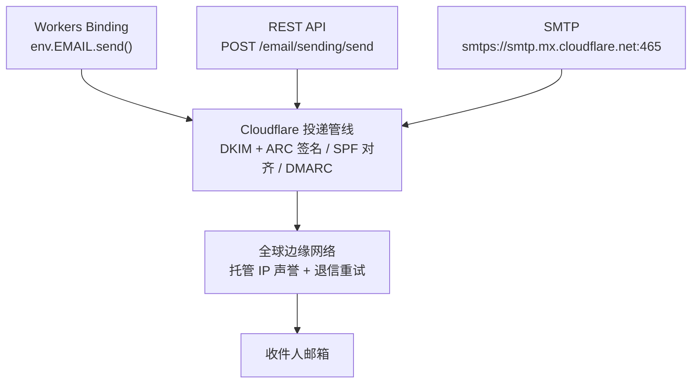
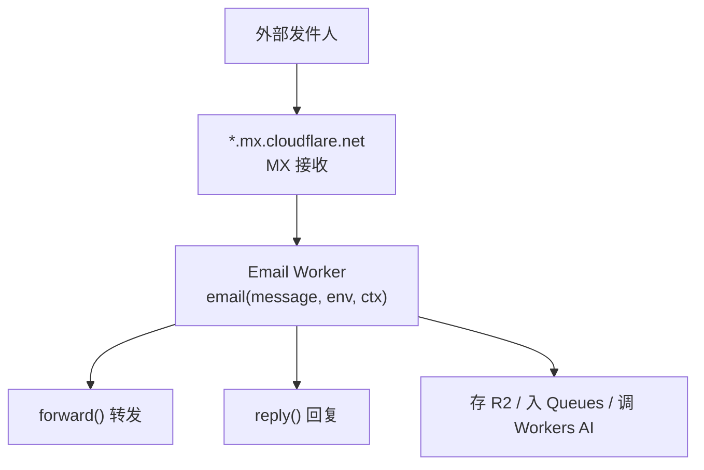

<script setup>
import { Mail, Send, Inbox, Server, Shield, Gauge, AlertTriangle, Link, Code, Database, Brain, ListFilter, Network, Lock, Eye, Ban, Workflow, Rocket } from '@lucide/vue'
</script>

<section class="onepage-hero">
  <p class="onepage-kicker">Email</p>
  <h1 class="onepage-title">Cloudflare Email</h1>
  <p class="onepage-subtitle">收发都在 Cloudflare 网络上完成——出站用 Email Sending（Workers Binding / REST API / SMTP），入站用 Email Routing + Email Workers，自动 DKIM/SPF/DMARC、托管 IP 声誉、退信自动抑制。截至 2026 年 6 月，出站为 Public Beta，入站已 GA。</p>
</section>

<div class="quick-grid">
  <a href="#产品定位"><div class="card-icon"><Mail /></div><div class="card-body"><strong>产品定位</strong><span>Sending + Routing 统一入口，Beta 现状</span></div></a>
  <a href="#三种发送方式对比"><div class="card-icon"><Send /></div><div class="card-body"><strong>三种发送方式</strong><span>Binding / REST / SMTP 怎么选</span></div></a>
  <a href="#workers-binding-发送"><div class="card-icon"><Code /></div><div class="card-body"><strong>Workers Binding</strong><span>新项目首选，无需 Key</span></div></a>
  <a href="#rest-api-发送"><div class="card-icon"><Workflow /></div><div class="card-body"><strong>REST API</strong><span>任意后端，官方 SDK</span></div></a>
  <a href="#smtp-发送"><div class="card-icon"><Server /></div><div class="card-body"><strong>SMTP</strong><span>遗留系统，仅 465 Implicit TLS</span></div></a>
  <a href="#接收-email-routing--email-workers"><div class="card-icon"><Inbox /></div><div class="card-body"><strong>接收 + Email Workers</strong><span>parse / forward / reply / 存 R2</span></div></a>
  <a href="#deliverability-自动化"><div class="card-icon"><Gauge /></div><div class="card-body"><strong>Deliverability</strong><span>退信重试、声誉、子域隔离</span></div></a>
  <a href="#bounce-与-suppression-list"><div class="card-icon"><Ban /></div><div class="card-body"><strong>Bounce 与抑制</strong><span>硬退信自动抑制、投诉处理</span></div></a>
  <a href="#dns-认证与-postmaster"><div class="card-icon"><Shield /></div><div class="card-body"><strong>DNS / Postmaster</strong><span>DKIM selector 差异、IP 段</span></div></a>
  <a href="#观测与-analytics"><div class="card-icon"><Eye /></div><div class="card-body"><strong>观测与 Analytics</strong><span>bounce rate、投递事件</span></div></a>
  <a href="#限制总表"><div class="card-icon"><ListFilter /></div><div class="card-body"><strong>限制总表</strong><span>大小、收件人、规则数</span></div></a>
  <a href="#起步路径"><div class="card-icon"><Rocket /></div><div class="card-body"><strong>起步路径</strong><span>子域 → Binding → 按需 SMTP</span></div></a>
  <a href="#官方资源"><div class="card-icon"><Link /></div><div class="card-body"><strong>官方资源</strong><span>文档、示例、SDK</span></div></a>
</div>

## 产品定位

Cloudflare Email Service 把"发信"和"收信"合并到 Dashboard 的同一个入口（**Compute → Email Service**）管理，底层共用一套 DNS、认证和投递基础设施。两个方向独立计费、独立成熟度：

| 方向 | 产品 | 状态 | 计划要求 |
| --- | --- | --- | --- |
| 出站（发送） | Email Sending | Public Beta（2026 年 6 月） | Workers **Paid** |
| 入站（接收） | Email Routing | GA | Free 和 Paid 都可用 |

一个常被忽略的免费点：**发送给你已验证的目标地址（verified destination addresses）在所有计划上都免费**，包括 Free。只有"发送给任意外部地址"才需要 Workers Paid。这意味着本地开发、自测、给团队成员发信这条链路零成本。

和 Cloudflare 其它产品的关系一句话：**Email Sending 是 Workers 的一种 binding，Email Workers 是 Email Routing 的处理程序**——两件事都长在 Workers 体系里，能直接调 R2、Queues、Workers AI、D1，不需要跨服务鉴权。

**出站（Email Sending，Public Beta，需 Workers Paid）：**



**入站（Email Routing，GA，Free 可用）：**



来源：[Email Service 概览](https://developers.cloudflare.com/email-service/)、[Email Routing](https://developers.cloudflare.com/email-routing/)。

---

## 三种发送方式对比

三种发送方式走的是**同一条投递管线**，差别只在"邮件怎么进管线"——所以附件、自定义 header、DKIM 签名这些能力三种方式都一致，区别在认证方式、集成形态和适用场景。

| 方式 | 推荐场景 | 认证 | 集成形态 | 计划 |
| --- | --- | --- | --- | --- |
| **Workers Binding** | 新 Workers 项目、Agent | 无需 Key（binding 直连） | `env.EMAIL.send()` | Paid |
| **REST API** | 任意后端（Node/Python/Go 等） | API Token（Bearer） | `POST /accounts/{id}/email/sending/send` | Paid |
| **SMTP** | 遗留系统、传统邮件客户端、不想改代码 | API Token（用户名 `api_token`） | `smtps://smtp.mx.cloudflare.net:465` | Paid |

选型判断：

- **新项目首选 Workers Binding。** 不用管 API Token 轮换和鉴权头，binding 在 wrangler 里声明完直接 `env.EMAIL.send()`，和调 R2、D1 一样自然。Agent 发邮件几乎只能走这条。
- **非 Workers 后端用 REST API。** 有官方 Node/Python/Go SDK，比手撸 SMTP 可靠。需要管 Token 权限和轮换。
- **SMTP 只在"代码改不动"时用。** 老系统、第三方邮件客户端、CMS 插件这类只能填 SMTP 参数的场景。功能不弱（附件、自定义 header 都支持），但连接方式最传统，且**只支持 465 Implicit TLS**，填 587 / 25 都连不上。

---

## Workers Binding 发送

最现代的发送方式，没有 API Token 泄漏面，binding 在 wrangler 里声明，代码里直接 `await env.EMAIL.send()`。

### 配置 binding

`wrangler.jsonc` 加一项 `send_email`：

```jsonc
{
  "send_email": [{ "name": "EMAIL" }]
}
```

### `send()` 签名与字段

```ts
interface SendEmail {
  send(message: EmailMessageBuilder): Promise<EmailSendResult>;
}

interface EmailMessageBuilder {
  to: string | EmailAddress | (string | EmailAddress)[]; // to+cc+bcc 合计 ≤ 50
  from: string | EmailAddress;
  subject: string;            // ≤ 998 字符
  html?: string;
  text?: string;
  cc?: string | EmailAddress | (string | EmailAddress)[];
  bcc?: string | EmailAddress | (string | EmailAddress)[];
  replyTo?: string | EmailAddress;   // 注意是 camelCase，不是 reply_to
  attachments?: Attachment[];         // 最多 32 个
  headers?: { [key: string]: string }; // 合计 ≤ 16 KB
}

interface EmailAddress { email: string; name?: string }

interface Attachment {
  content: string | ArrayBuffer | ArrayBufferView; // Base64 或二进制
  filename: string;
  type: string;                  // MIME 类型
  disposition: "attachment" | "inline";
  contentId?: string;            // inline 图片用
}

interface EmailSendResult { messageId: string }
```

几个容易踩的字段细节：

- **`replyTo` 是 camelCase**，写成 `reply_to` 会被忽略。没有 `custom_id` 字段（别从别的邮件服务照搬）。
- **附件必须带 `disposition`**（`"attachment"` 或 `"inline"`），内联图片还要给 `contentId` 并在 HTML 里 `cid:` 引用。
- **`to` + `cc` + `bcc` 合计 ≤ 50**，不是每个字段各 50。
- 成功返回 `{ messageId }`；失败抛 `Error`，带 `code` 和 `message` 两个属性。

### 最小示例

```ts
export default {
  async fetch(request: Request, env: Env): Promise<Response> {
    const result = await env.EMAIL.send({
      to: "user@example.com",
      from: "welcome@yourdomain.com",   // 必须是已 onboard 的发送域
      subject: "欢迎注册",
      html: "<h1>欢迎</h1><p>感谢注册。</p>",
      text: "欢迎，感谢注册。",
    });
    return Response.json({ ok: true, messageId: result.messageId });
  },
};
```

### 错误处理

`send()` 失败抛出的 `Error` 带 `code`，按 code 分支比按 message 字符串匹配稳：

```ts
try {
  await env.EMAIL.send(msg);
} catch (e: any) {
  switch (e.code) {
    case "E_SENDER_NOT_VERIFIED":  // 发送域未 onboard
    case "E_RATE_LIMIT_EXCEEDED":  // 超额
    default:                       // e.code / e.message
  }
}
```

来源：[Workers API 文档](https://developers.cloudflare.com/email-service/api/send-emails/workers-api/)、[配置 send bindings](https://developers.cloudflare.com/email-service/configuration/send-bindings/)。

---

## REST API 发送

适合不在 Workers 上跑的后端（普通 Node 服务、Python 后端、Go 服务）。官方提供 Node、Python、Go 三种 SDK。

### 端点与鉴权

```text
POST https://api.cloudflare.com/client/v4/accounts/{account_id}/email/sending/send
Authorization: Bearer <API_TOKEN>
Content-Type: application/json
```

API Token 需要 **Email Sending: Edit** 权限。请求体字段和 Workers Binding 的 `EmailMessageBuilder` 一致（`to`/`from`/`subject`/`html`/`text`/`attachments`/`headers`/`replyTo` 等），所以两种方式可以无缝互转。

### curl 示例

```bash
curl -X POST "https://api.cloudflare.com/client/v4/accounts/$ACCOUNT_ID/email/sending/send" \
  -H "Authorization: Bearer $CF_API_TOKEN" \
  -H "Content-Type: application/json" \
  -d '{
    "to": "user@example.com",
    "from": "welcome@yourdomain.com",
    "subject": "欢迎注册",
    "html": "<h1>欢迎</h1>",
    "text": "欢迎"
  }'
```

### SDK

官方维护三语言 SDK，比手撸 HTTP 省事，错误处理也封好了：

| 语言 | SDK |
| --- | --- |
| Node | `@cloudflare/email-sending`（或 `cloudflare` 总 SDK 的 email sending 资源） |
| Python | `cloudflare` Python SDK |
| Go | `cloudflare-go` |

来源：[REST API 文档](https://developers.cloudflare.com/email-service/api/send-emails/rest-api/)、[Email Sending API 参考](https://developers.cloudflare.com/api/resources/email_sending/)。

---

## SMTP 发送

为遗留系统准备。连接参数卡得很死——**只有 465 Implicit TLS 一种**，STARTTLS、587、25、明文中继都不支持。

### 连接参数

| 项 | 值 |
| --- | --- |
| 主机 | `smtp.mx.cloudflare.net` |
| 端口 | `465`（**仅此一个**） |
| 加密 | Implicit TLS（SMTPS） |
| 不支持 | STARTTLS（587）、明文 SMTP、25 端口中继 |
| 用户名 | 字面量 `api_token`（不是邮箱、不是 Token ID） |
| 密码 | 你的 Cloudflare **API Token**（需 Email Sending: Edit） |
| SASL 机制 | `AUTH PLAIN`（优先）/ `LOGIN`（兼容老客户端） |

`AUTH PLAIN` 的 payload 是 `\0api_token\0<TOKEN>` 再 base64：

```bash
printf '\0api_token\0%s' "<API_TOKEN>" | base64
```

### 每会话限制（SMTP 特有）

| 限制 | 值 |
| --- | --- |
| RCPT TO 收件人 | 50 / 会话 |
| EHLO 宣告 SIZE | 5 MiB（5242880 字节） |
| AUTH 命令超时 | 30 秒 |
| DATA 命令超时 | 300 秒 |
| EHLO 能力 | `AUTH PLAIN LOGIN`、`SIZE 5242880`、`8BITMIME`、`ENHANCEDSTATUSCODES` |

### curl 示例

```bash
curl --ssl-reqd \
  --url "smtps://smtp.mx.cloudflare.net:465" \
  --user "api_token:<API_TOKEN>" \
  --mail-from "welcome@yourdomain.com" \
  --mail-rcpt "user@example.com" \
  --upload-file mail.txt
```

### openssl 手动测试

排查认证 / TLS 问题时手动走一遍 SMTP 会话最直观：

```bash
openssl s_client -quiet -connect smtp.mx.cloudflare.net:465 -crlf
# 连上后依次输入：
# EHLO yourdomain.com
# AUTH PLAIN <base64(\0api_token\0<TOKEN>)>
# MAIL FROM:<welcome@yourdomain.com>
# RCPT TO:<user@example.com>
# DATA
# ...邮件正文...
# <CR><LF>.<CR><LF>
# QUIT
```

### 常见错误码

| 码 | 含义 | 排查方向 |
| --- | --- | --- |
| `535 5.7.8` | 认证失败 | Token 无效 / 权限不足 / 用户名没写 `api_token` |
| `550 5.7.1` | 发送域未 onboard | MAIL FROM 的域名没在 Email Sending 里 Onboard |
| `552 5.3.4` | 超过 5 MiB | 拆附件或换 REST API（验证目标地址可达 25 MiB） |
| `452 4.5.3` | 会话收件人过多 | 超过 50 RCPT，开新会话 |
| `530 5.7.0` | 需要认证 | 没先 AUTH 就发 MAIL FROM |
| `554` | 内容被策略拒绝 | 命中内容/合规策略 |

### 语言库示例

官方在 `email-service/examples/email-sending/smtp/` 提供了 Nodemailer、Python `smtplib`、PHPMailer 等现成配置，直接抄。Nodemailer 的关键参数：

```js
const transporter = nodemailer.createTransport({
  host: "smtp.mx.cloudflare.net",
  port: 465,
  secure: true,            // Implicit TLS
  auth: { user: "api_token", pass: process.env.CF_API_TOKEN },
});
```

来源：[SMTP API 文档](https://developers.cloudflare.com/email-service/api/send-emails/smtp/)、[SMTP 示例](https://developers.cloudflare.com/email-service/examples/email-sending/smtp/)。

---

## 接收：Email Routing + Email Workers

入站这一侧由 Email Routing 负责——把发到你域名的邮件按规则交给 Email Worker 处理。已经 GA，Free 也能用。

### 入口与规则

- 统一入口：Dashboard → **Compute → Email Service**（Routing 和 Sending 在一起管理）。
- 支持自定义地址 + Catch-all 规则，**每域名最多 200 条规则**，每条把一个邮件模式映射到一个目标。
- 每账户最多 200 个目标地址（verified destination addresses），全域名共享。
- 每区域（zone）最多 30 个域名启用 Email（Routing + Sending 合计，含根域）。

### Email Worker handler

handler 是 Workers 的 `email()` 导出，签名和 `fetch()` 同级：

```ts
export default {
  async email(message, env, ctx): Promise<void> {
    // message.from / message.to / message.headers / message.raw / message.rawSize
    await message.forward("inbox@example.com");
  },
} satisfies ExportedHandler<Env>;
```

`message` 对象（`ForwardableEmailMessage`）：

| 属性/方法 | 说明 |
| --- | --- |
| `from` / `to` | envelope 收发地址 |
| `headers` | `Headers` 对象，可 `headers.get("subject")` 等 |
| `raw` | 原始 MIME 的 `ReadableStream` |
| `rawSize` | 原始字节数 |
| `canBeForwarded` | 是否可转发 |
| `setReject(reason)` | 拒收 |
| `forward(rcptTo, headers?)` | 转发到验证过的目标地址 |
| `reply(EmailMessage)` | 回复（见下） |

### 用 PostalMime 解析完整 MIME

`message.raw` 是原始 MIME 流，要用 [PostalMime](https://github.com/postalsys/postal-mime) 解出 text / html / attachments：

```ts
import PostalMime from "postal-mime";

export default {
  async email(message, env, ctx): Promise<void> {
    const email = await PostalMime.parse(message.raw);
    // email.subject / email.text / email.html / email.attachments / email.from / email.to
    await message.forward("inbox@example.com");
  },
};
```

### `reply()` 与 `forward()` 的区别

两件事不一样，别混：

| | `forward(rcptTo, headers?)` | `reply(EmailMessage)` |
| --- | --- | --- |
| 做什么 | 把原邮件转发到验证过的目标地址 | 给原发件人回一封新邮件 |
| 内容 | 原邮件原文 | 自己用 `mimetext` 构造的 MIME |
| 自定义 header | 只能加 `X-` 前缀 | 自由构造 |
| 线程化 | 否 | 是，保留 `Message-ID` 链，走同一 SMTP 会话 |

`reply()` 限制比较硬，违反就抛异常：

- 原邮件必须通过 DMARC 验证。
- **每 `email()` 事件只能 reply 一次**。
- 回复收件人必须等于原邮件发件人。
- 回复发件域必须等于收信域。
- 原邮件 `References` 头不能超过 100 条。

`reply()` 要用 `cloudflare:email` 的 `EmailMessage` 包 raw MIME，`mimetext` 需要 `nodejs_compat` flag：

```ts
import { EmailMessage } from "cloudflare:email";
import { createMimeMessage } from "mimetext";

export default {
  async email(message, env, ctx): Promise<void> {
    const subject = message.headers.get("subject") || "";
    const messageId = message.headers.get("Message-ID");

    const reply = createMimeMessage();
    if (messageId) {
      reply.setHeader("In-Reply-To", messageId);
      reply.setHeader("References", messageId);
    }
    reply.setSender(message.to);
    reply.setRecipient(message.from);
    reply.setSubject(`Re: ${subject}`);
    reply.addMessage({ contentType: "text/plain", data: "已收到，稍后处理。" });
    reply.addMessage({ contentType: "text/html", data: "<p>已收到，稍后处理。</p>" });

    await message.reply(new EmailMessage(message.to, message.from, reply.asRaw()));
  },
};
```

### 和 R2 / Queues / Workers AI 组合

Email Worker 本身就是 Worker，能直接调其它 binding，这是 Email Service 最值钱的地方：

- **附件存 R2**：PostalMime 解出 `email.attachments`，逐个 `await env.BUCKET.put(filename, content)`，原邮件再 `forward()` 到备份邮箱。
- **入 Queues 做异步处理**：邮件量大或处理慢时，handler 里 `await env.MAIL_QUEUE.send({ from, subject, raw: ... })`，消费者 Worker 慢慢处理，避免阻塞 SMTP 会话。
- **Workers AI 分类 / 总结 / 自动回复**：把 `email.text` 喂给 `env.AI.run("@cf/meta/llama-3.1-8b-instruct", { prompt: ... })`，按分类决定转发到哪个团队、生成草稿回复、或提取附件名入库。
- **Sender Rewriting**：Email Routing 转发时自动重写 envelope sender，保护 SPF（转发邮件会加两道 DKIM：`email.cloudflare.net` 的重写签名 + 收件域签名）。

来源：[Email Workers](https://developers.cloudflare.com/email-routing/email-workers/)、[Email Routing](https://developers.cloudflare.com/email-routing/)。

---

## Deliverability 自动化

投递能力是 Email Service 默认就帮你做掉的一大块，不需要自己维护 IP 声誉、退信逻辑、投诉回路。Cloudflare 自动处理：

- **DKIM 签名 + ARC**：所有出站邮件自动签名。
- **SPF / DKIM / DMARC 对齐**：保证 DMARC 通过。
- **托管 IP 声誉 + 全球边缘投递**：共享 Cloudflare 的发送基础设施，低延迟。
- **Soft bounce 指数退避重试**：邮箱满、对端临时不可用、限流 / greylisting 这类自动重试。
- **Hard bounce 立即抑制**：不存在地址、不存在域、对端永久拒绝、内容被判垃圾——不重试，直接进 suppression list。
- **ISP 投诉处理**：通过 Feedback Loop 自动收投诉并抑制相关地址。

### 推荐指标

官方给的声誉健康线，超过会影响后续投递：

| 指标 | 健康线 |
| --- | --- |
| 投递率 | > 95% |
| 硬退信率 | < 2% |
| 投诉率 | < 0.1% |

### 子域隔离

**事务邮件和营销邮件用不同子域**，让一类邮件的声誉不连累另一类。官方给的范本：

| 子域 | 用途 |
| --- | --- |
| `notifications.yourdomain.com` | 事务邮件（订单、密码重置） |
| `marketing.yourdomain.com` | 营销 / 推广 |
| `yourdomain.com` | 重要账户通信 |

营销邮件投诉率天然偏高，隔离出去才不会把订单确认邮件也拖进垃圾箱。

### 新域名 warmup

新账户有保守的每日发送配额，会随发送行为、投递率、账户信誉逐步上调。新发送域建议从小流量开始，单独 onboard，逐步放量，别一上来就批量发。

来源：[Deliverability 文档](https://developers.cloudflare.com/email-service/concepts/deliverability/)。

---

## Bounce 与 Suppression List

退信分两类，处理方式不同：

| 类型 | 含义 | 处理 |
| --- | --- | --- |
| **Soft bounce** | 临时失败（邮箱满、对端临时不可用、限流） | 指数退避自动重试 |
| **Hard bounce** | 永久失败（不存在地址 / 域、对端永久拒绝、被判垃圾） | 不重试，地址自动进 suppression list |

Suppression List 的几点规矩：

- Hard bounce 产生的抑制是自动的，保护发件声誉。
- ISP 垃圾投诉产生的抑制通过 Postmaster 集成自动入列，**这类抑制的移除受限**，防止滥用。
- 你可以手动添加 / 移除地址，但 spam 投诉类的不一定能手动移除。
- 建议每月 review 一次 suppression list，清理明显可恢复的地址。

---

## DNS、认证与 Postmaster

这一节是"为什么邮件能投递成功"的底层。Onboard 发送域时 Cloudflare 会自动加这些记录，但搞清楚它们的值和差异，排查投递问题、向收件方 IT 解释时用得上。

### DKIM selector 差异（容易混）

Email Sending 和 Email Routing 用**不同的 DKIM selector**，dig 的时候别查错：

| 产品 | DKIM selector | 查询 |
| --- | --- | --- |
| Email Sending | `cf-bounce._domainkey` | `dig TXT cf-bounce._domainkey.yourdomain.com +short` |
| Email Routing | `cf2024-1._domainkey` | `dig TXT cf2024-1._domainkey.yourdomain.com +short` |

Email Routing 转发时还会用 `email.cloudflare.net` 的重写签名，可单独查：`dig TXT cf2024-1._domainkey.email.cloudflare.net +short`。

### SPF

两边都 include 同一个目标，但配在不同层级：

| 产品 | SPF 配在哪 | 记录 |
| --- | --- | --- |
| Email Sending | `cf-bounce` 子域 | `v=spf1 include:_spf.mx.cloudflare.net ~all` |
| Email Routing | 根域 | `v=spf1 include:_spf.mx.cloudflare.net ~all` |

`_spf.mx.cloudflare.net` 底层发布的是 `v=spf1 ip4:104.30.0.0/20 ~all`。

### Outbound 主机名与 IP 段

出站 `HELO/EHLO` 用三个域名之一：`cloudflare-email.net` / `.org` / `.com`，每个都有 PTR 反解。收件方 IT 要加白名单时给这两段：

| 协议 | 段 |
| --- | --- |
| IPv4 | `104.30.0.0/19` |
| IPv6 | `2405:8100:c000::/38` |

注意：SPF 里的 `ip4` 写的是 `/20`（更窄），但官方文档化的出站前缀是 `/19`。收信侧 postmaster 如果只放行 SPF 的 /20 会漏掉部分出站 IP，官方建议直接放行 /19。

### MX（入站）

Email Routing 入站用多个 `*.mx.cloudflare.net` MX，不同优先级，例如：

```text
yourdomain.com.  IN  MX  13 amir.mx.cloudflare.net.
yourdomain.com.  IN  MX  24 isaac.mx.cloudflare.net.
yourdomain.com.  IN  MX  86 linda.mx.cloudflare.net.
```

Email Sending 单独使用时**不需要在域名上配 MX**——MX 是入站用的。

来源：[Postmaster 参考](https://developers.cloudflare.com/email-service/reference/postmaster/)、[域名配置](https://developers.cloudflare.com/email-service/configuration/domains/)。

---

## 观测与 Analytics

Dashboard 里 Email Service 提供的观测面：

- **投递指标**：bounce rate、投递成功事件、投递成功率、spam 指标。
- **事件调试**：用户反馈"没收到邮件"时，可在 Dashboard 按收件人 / 时间查投递事件，定位是 bounce、suppress 还是已投递。
- **自定义指标**：接 Workers Analytics Engine 做自己的邮件指标（按业务维度统计）。
- **告警**：可在 observability 配置里设阈值告警。

排查"邮件没收到"的标准路径：先看 Dashboard 投递事件确认是否投递成功 → 若成功则问题在收件方（垃圾箱 / ISP 策略）→ 若 bounce 看 bounce 类型 → 若在 suppression list 先确认是否该移除。

---

## 限制总表

| 限制 | 值 | 备注 |
| --- | --- | --- |
| 出站消息总大小 | 5 MiB | 含附件与 MIME 编码 |
| 出站消息（验证目标地址） | 25 MiB | 仅发给已验证地址时 |
| 入站消息大小 | 25 MiB | 超过即拒收 |
| 收件人 | 50 / 封 | to + cc + bcc 合计 |
| SMTP RCPT TO | 50 / 会话 | |
| 附件数 | 32 / 封 | |
| 自定义 header | 16 KB | 全部合计 |
| Subject | 998 字符 | RFC 5322 |
| 路由规则 | 200 / 域名 | |
| 每区域启用 Email 的域名 | 30 | Routing + Sending 合计，含根域 |
| 每账户目标地址 | 200 | 全域名共享 |
| `reply()` References | 100 条 | 超过抛异常 |
| SMTP AUTH 超时 | 30 秒 | |
| SMTP DATA 超时 | 300 秒 | |
| 每日发送配额 | 无固定值 | 新账户保守起步，随信誉增长 |

Beta 阶段还要注意：

- 发送给任意外部地址需 Workers Paid；发给已验证目标地址免费。
- 新账户每日发送限额保守，随投递率 / 信誉 / 账户状态逐步上调，**官方未公布具体数字**。
- 内容要合规：unsubscribe、反垃圾法要求，营销邮件尤其。
- Beta 阶段部分高级监控 / 告警可能仍在完善，新发送域从小流量开始。

来源：[Platform limits](https://developers.cloudflare.com/email-service/platform/limits/)。

---

## 起步路径

把全篇收敛成一条最小可上线路径：

1. **Onboard 一个子域做 Sending**（隔离风险）。Dashboard → Email Service → Email Sending，加 `notifications.yourdomain.com`，Cloudflare 自动配 DKIM / SPF。事务邮件和营销邮件分开子域。
2. **用 Workers Binding 开发核心逻辑**。`wrangler.jsonc` 加 `send_email` binding，代码里 `await env.EMAIL.send(...)`，不用管 Token。新项目最舒服的姿势。
3. **需要兼容旧系统再加 SMTP**。Nodemailer / smtplib / PHPMailer 填 `smtp.mx.cloudflare.net:465` + `api_token` + API Token。
4. **接收端用 Email Workers + AI 做智能路由**。Email Routing 规则把邮件交给 Worker，Worker 用 PostalMime 解析 → Workers AI 分类 / 总结 → 存 R2 或入 Queues → 必要时 `reply()` 或 `forward()`。

这条路径下来，收发 + 智能处理全在 Cloudflare 内闭环，无需第三方邮件服务，密钥管理也只在 Cloudflare 这一层。

---

## 官方资源

| 资源 | 用法 |
| --- | --- |
| [Email Service 概览](https://developers.cloudflare.com/email-service/) | 产品总览、三种发送方式、Beta 状态、计划要求 |
| [Email Routing](https://developers.cloudflare.com/email-routing/) | 入站接收、规则、Catch-all |
| [Email Workers](https://developers.cloudflare.com/email-routing/email-workers/) | `email()` handler、`forward()` / `reply()`、PostalMime |
| [Workers API（发送）](https://developers.cloudflare.com/email-service/api/send-emails/workers-api/) | `env.EMAIL.send()` 签名、字段、错误码 |
| [REST API（发送）](https://developers.cloudflare.com/email-service/api/send-emails/rest-api/) | 端点、鉴权、请求体 |
| [SMTP（发送）](https://developers.cloudflare.com/email-service/api/send-emails/smtp/) | 465 Implicit TLS、AUTH、错误码、示例 |
| [SMTP 示例](https://developers.cloudflare.com/email-service/examples/email-sending/smtp/) | Nodemailer / Python / PHPMailer 现成配置 |
| [配置 send bindings](https://developers.cloudflare.com/email-service/configuration/send-bindings/) | `wrangler.jsonc` 里 `send_email` 声明 |
| [域名配置](https://developers.cloudflare.com/email-service/configuration/domains/) | Onboard 发送域、自动 DNS |
| [Deliverability](https://developers.cloudflare.com/email-service/concepts/deliverability/) | 自动化项、推荐指标、子域隔离 |
| [Postmaster 参考](https://developers.cloudflare.com/email-service/reference/postmaster/) | DKIM selector、SPF、HELO、IP 段 |
| [Platform limits](https://developers.cloudflare.com/email-service/platform/limits/) | 大小、收件人、规则数等全部硬限制 |
| [Email Sending API 参考](https://developers.cloudflare.com/api/resources/email_sending/) | REST API 完整资源定义 |
| [PostalMime](https://github.com/postalsys/postal-mime) | 入站 MIME 解析库 |
